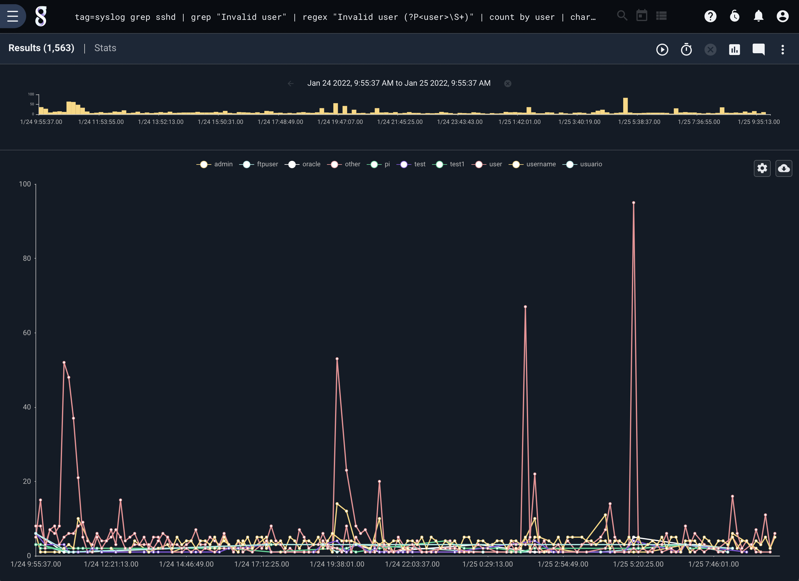
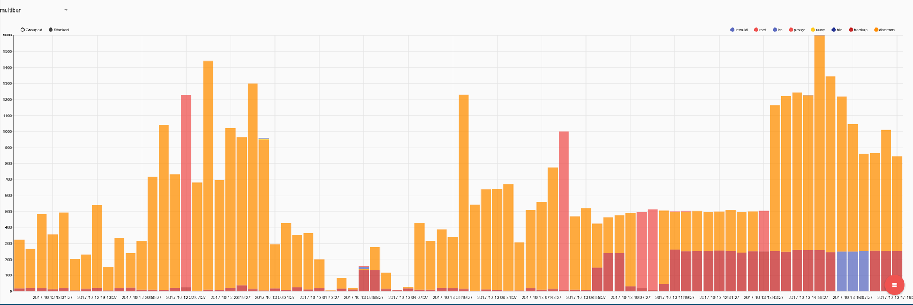
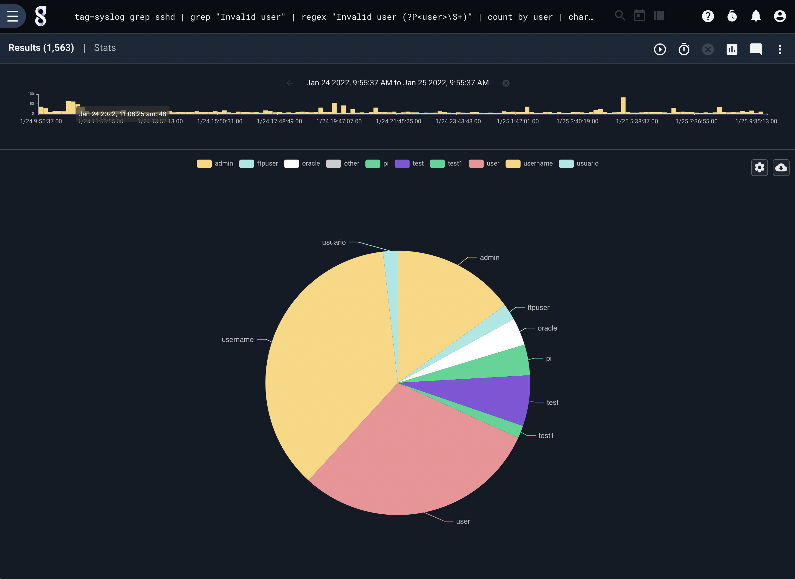
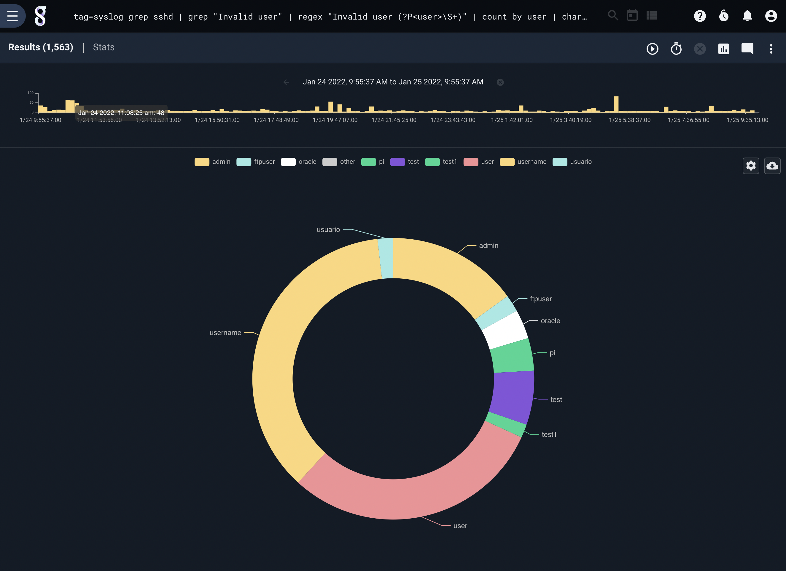
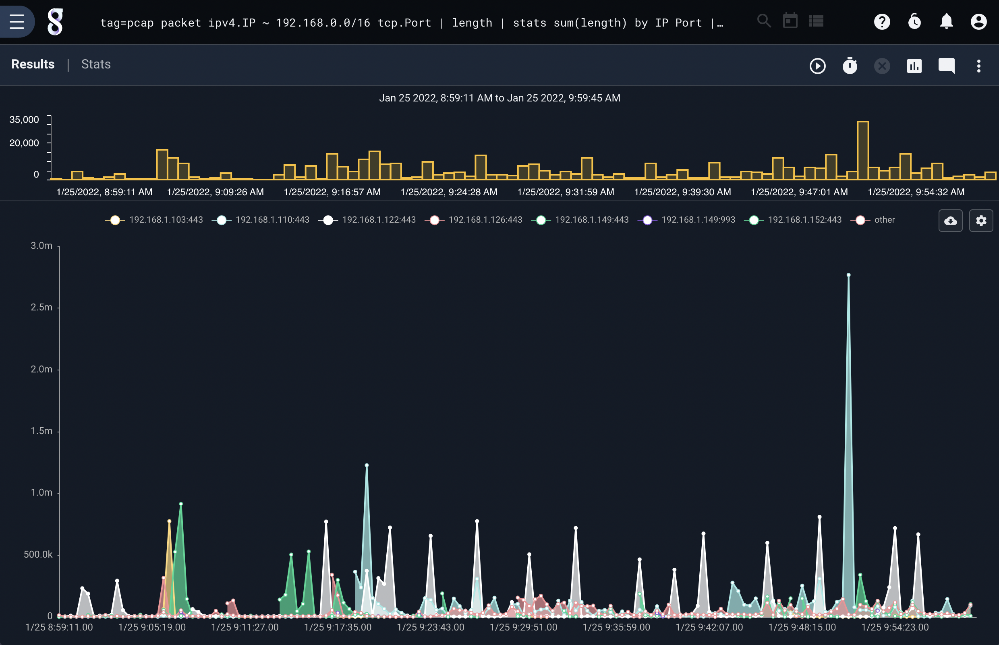
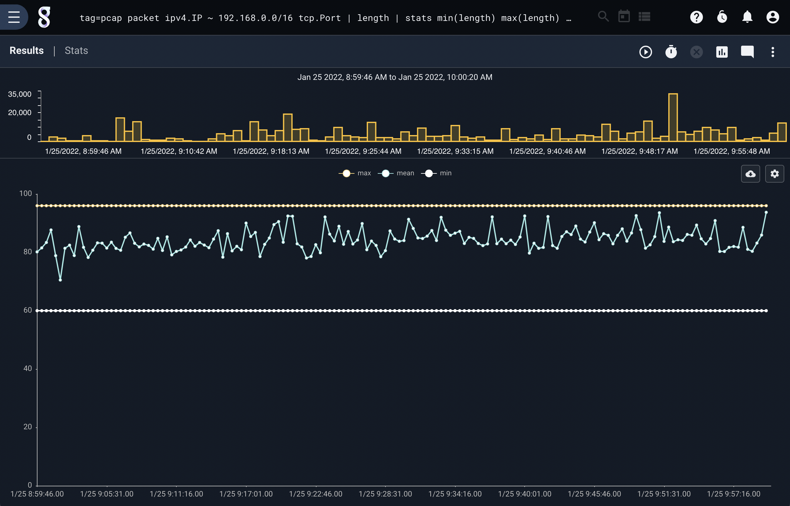
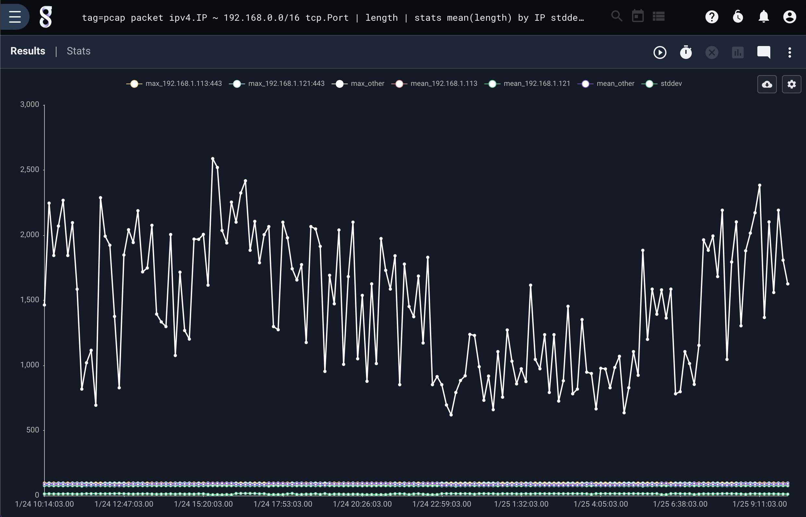
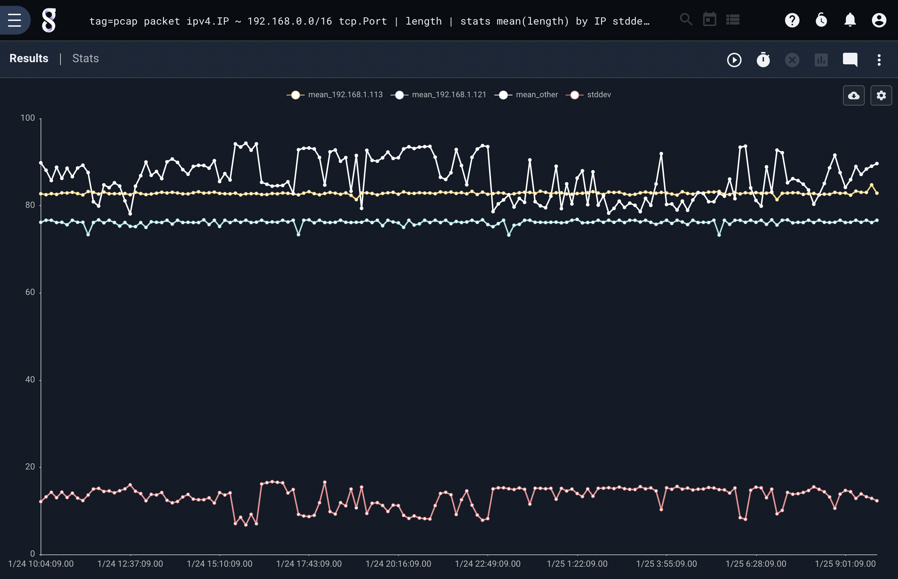
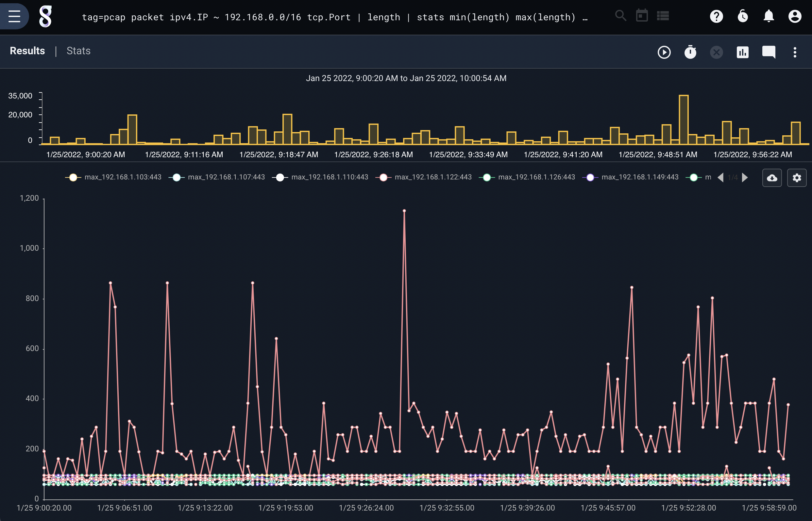

# Chart

チャートレンダラーは、傾向、数量、数、その他の数値データなどの集計結果の表示に使用されます。  チャートは、オプションの「by」パラメータを使用して列挙値をプロットします。 たとえば、名前に関連付けられた件数がある場合chart count by nameは、時間ごとの件数を示す名前ごとに線をグラフ化します。

チャートレンダラーは自動的にプロットされた線または棒グループを8つの値に制限します。さらに多くの行を見たい場合は、limit <n>引数を追加して、指定されたn値の制限を超えるまで「その他」のグループ化を導入しないようチャート作成ライブラリに指示することができます。チャート作成のためのユーザインタフェースは、折れ線チャート、面チャート、棒グラフ、円グラフ、ドーナツチャートの間の迅速な移行を可能にします。
## サンプルクエリ

次のクエリは、どのユーザー名が最も一般的にssh認証に失敗するかを示すチャートを生成します; オンラインのブルートフォース攻撃のため、 "root"が最も一般的であると予想できます。

```
tag=syslog grep sshd | grep "Failed password for" | regex "Failed\spassword\sfor\s(?P<user>\S+)" | count by user | chart count by user limit 10
```







## キー付きチャート

`chart`レンダラーはキーに基づいてデータセットを生成できます。  上記の例ではユーザーごとにカウントを生成する`user`キーを使用して、エントリの`count`をプロットしています  チャートは複数のキーをサポートしているため、複数のキー値の共通部分を使用してデータをチャート化できます。  たとえば、PCAPを使用して各IPおよびポートのデータのサイズを計算するクエリを実行できます。  クエリと結果は次のようになります:

```
tag=pcap packet ipv4.IP ~ 10.10.10.0/24 tcp.Port | length | stats sum(length) by IP Port | chart sum by IP Port
```




注:チャートはIPとポートが連結された凡例を生成することに注意してください。各合計のキーはIPとポートの共通部分です。

## 複数のチャートカテゴリ

`chart`レンダラーは、複数の独立したデータソースをプロットすることもできます。  データのストリームの最小値、最大値、平均値をプロットすることができます。  チャートでは、複数のデータグループを指定できます。

次のクエリは、時間の経過に伴うパケットの長さの`min`、`max`、および`mean`を生成し、結果を1つのグラフに表示します:

```
tag=pcap packet ipv4.IP ~ 10.10.10.0/24 tcp.Port | length | stats min(length) max(length) mean(length)| chart min max mean
```



注: 単一のチャート上の複数の値タイプはカテゴリと呼ばれます。


チャートは複数のキーとカテゴリを使用できます。  一連のキーを使用して`min`、`max`、`mean`をプロットすることは完全に受け入れられます。  このクエリは、`IP`キーと`Port`キーを使用して、パケットサイズの`min`、`max`、`mean`をプロットします。  グラフは少しビジーになる可能性がありますが、出力は引き続き有用です。

```
tag=pcap packet ipv4.IP ~ 10.10.10.0/24 tcp.Port | length | stats min(length) max(length) mean(length) by IP Port | chart min max mean by IP Port
```



## 複数のカテゴリを持つインテリジェントキーイング

`chart`レンダラーはGravwellパイプラインを使用して、複数のカテゴリーをキーイングおよび圧縮する方法を決定します。  データカテゴリを生成し、それらのキーを使用して圧縮する正しいキーを識別するのに十分なインテリジェントです。  これにより、均一なキーセットを持たない複数のカテゴリを持つ非常に複雑なチャートを生成できます。  たとえば、各IPの平均パケットサイズが必要な場合でも、すべてのパケットサイズの標準偏差が必要な場合があります。  これは、次のクエリを使用して実現できます:

```
tag=pcap packet ipv4.IP ~ 10.10.10.0/24 tcp.Port | length | stats mean(length) by IP stddev(length) | chart stddev mean by IP limit 3
```



チャートはさらに複雑なカテゴリとキーのやり取りを処理できます。ここでは、IPごとのパケット長の平均、各IPポートの最大パケット、およびすべてのパケット長の標準偏差を記録するクエリを示します。

注:すべてのカテゴリと、カテゴリに使用されるすべてのキーをカバーする単一のキーセットを提供することに注意してください。 チャートは、どのキーがどのカテゴリに移動し、*正しいことをするか*を判断します。

```
tag=pcap packet ipv4.IP ~ 10.10.10.0/24 tcp.Port | length | stats mean(length) by IP stddev(length) max(length) by IP Port | chart stddev max mean by IP Port limit 3
```



## グラフの制限とグループ化

グラフ表示レンダラーは、プロットされた線または棒グループを8つの値に自動的に制限します。  さらに多くの行を表示したい場合は、`limit  <n>`引数を追加して、指定された`n`値の制限を超えるまで`その他`のグループ化を導入しないようにチャートライブラリに指示できます。  チャートのユーザーインターフェイスにより、折れ線グラフ、面グラフ、棒グラフ、円グラフ、ドーナツグラフをすばやく切り替えることができます。  許容限度よりも多くのグループがある場合、チャートは表示されたグループにないすべてで構成される`その他`グループを生成します。  最大制限は、カテゴリのデータセットの総数を指定します。  制限が4の場合、3つのキー付きセットと1つの他のグループがあります。

チャートレンダラーは、どのデータセットが描画され、どのデータセットが`その他`グループにグループ化されるかを決定するために、すべてのクエリの開始時に事前スキャンを実行します。  チャートは、クエリのタイムスパンの1/3がカバーされるか、決定を下すのに十分なデータを受け取るまでスキャンします。  複数のデータセットが描画されている場合、チャートは必要に応じてデータの各カテゴリに別のグループを作成します。  たとえば、次のチャートパラメータ`chart foo bar baz by X`でクエリを実行している場合、`foo`、`bar`、`baz`の各カテゴリに1つずつ、3つのグループが存在する可能性があります。 
