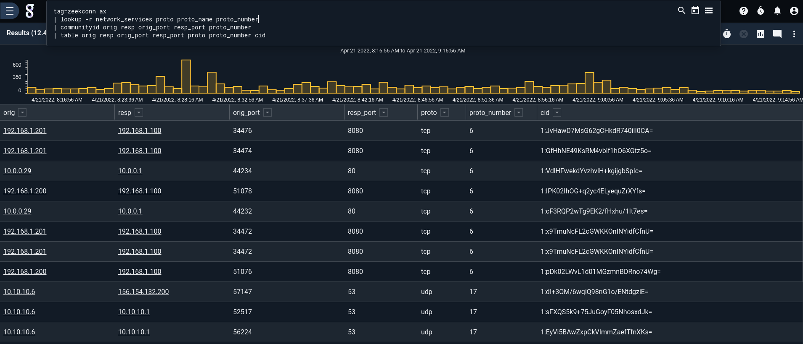
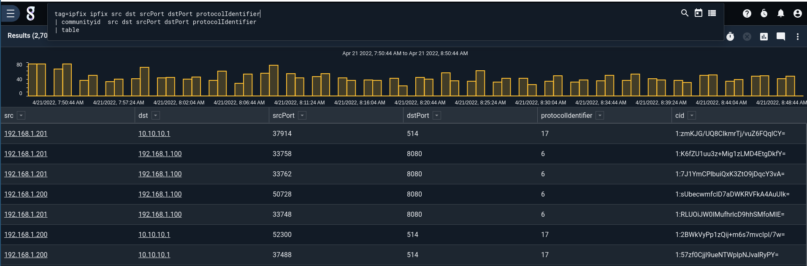
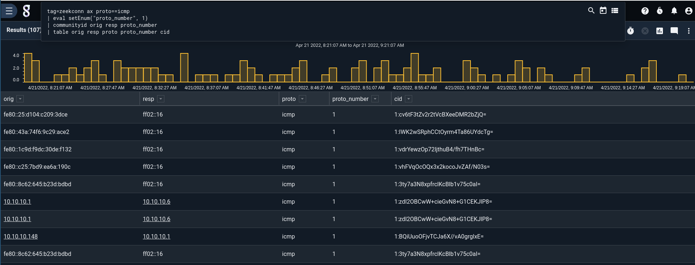

## Zeek Community ID

The `communityid` module is designed to implement the Zeek Community ID spec, which enables a cross platform identifier that can uniquely identify a given network connection between two systems.  The goal of the `communityid` module is to enable relating network flows between disparate data types.  Additional information about the Zeek Community ID specification and its intentions can be found on the [Zeek webpage](https://zeek.org/2019/07/31/an-update-on-community-id/) and the [Zeek Github Repository](https://github.com/corelight/zeek-community-id).


The syntax takes an IP:port pair with a protocol identifier and computes a hash that represents the network flow.  The ports are optional and ignored for non-TCP and non-UDP protocols.  If prots are not provided and the community ID algorithm expects them for the calculation, zero values are inserted.


```
tag=netflow netflow Src SrcPort Dst DstPort Protocol
| communityid Src Dst SrcPort DstPort Protocol
| table
```

### Community ID Usage

The ordering of source and destination ip port pairs is computed inside the algorithm, so you do not need to resolve the source or destination beforehand.  However, it is **critical** that the order of ports match the source and destination IP addresses.

Community id parameters are orderd as `<IP A> <IP B> <Port A> <Port B> <Protocol Number>` where the two port specifications are optional.

Not including port numbers is valid as well, but either both or neither of the ports can be included: `<IP A> <IP B> <Protocol Number>`.

NOTE: The `communityid` module requires the protocol number, it will not resolve a protocol name.

### Examples


#### Zeek Conn Logs

In this example we show the creating of a community ID value from traditional Zeek Conn logs.  These logs emit the protocol by name rather than number which means we need to use the `network_services` resource provided in the Gravwell Network Enrichment kit to resolve the name back to a number.  In this example we are also using the autoextractors provided in the Gravwell Zeek Kit to process the TSV Zeek logs.

```
tag=zeekconn ax
| lookup -r network_services proto proto_name proto_number
| communityid orig resp orig_port resp_port proto_number
| table orig resp orig_port resp_port proto proto_number cid
```



#### IPFix

In this example we show creating a community ID value from IPFix data, this example uses the native IP, port, and protocol values from within the IPFix datatypes.  No lookups are needed.

```
tag=ipfix ipfix src dst srcPort dstPort protocolIdentifier
| communityid  src dst srcPort dstPort protocolIdentifier
| table
```



#### ICMP Example

In this example we show creating a community ID value from a data source that may not have ports, we are using Zeek Conn logs and ICMP traffic for this example, but if you had text records of ICMP traffic they would work too.


```
tag=zeekconn ax proto==icmp
| eval setEnum("proto_number", 1)
| communityid orig resp proto_number
| table orig resp proto proto_number cid
```


