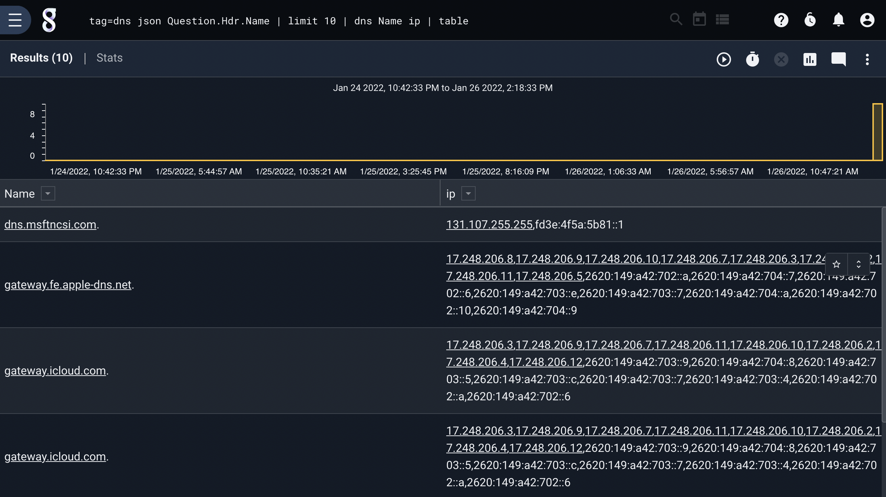
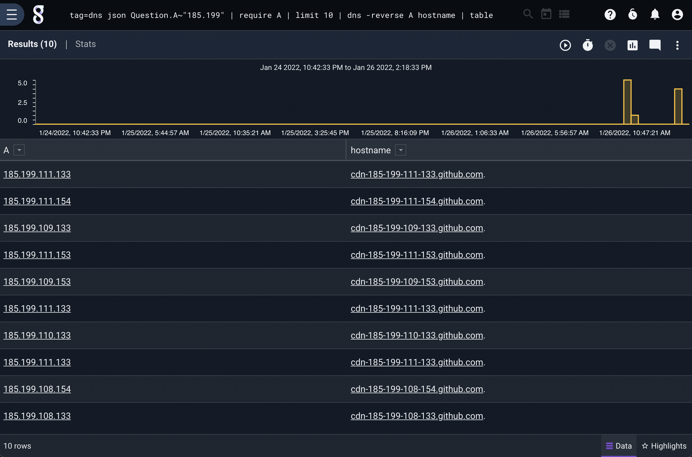

## DNS

NOTE: The `dns` module can generate an enormous amount of network traffic to your DNS resolver. DNS resolvers may ban you if you generate too many requests in a short amount of time. 

The `dns` module is used to perform DNS lookups on hostnames and store the result in an enumerated value. The `dns` module can also perform reverse lookups on IP addresses. By default the `dns` module will perform no more than 1024 lookups in a given search. This is to prevent DNS query bursts to your resolver. The module keeps a simple least recently used (LRU) cache of results, so searches with many duplicate values may be well under the lookup limit. You can adjust this limit with the `-l` flag.

The syntax simply takes one or more pairs of values, an enumerated value to perform the lookup on, and a target enumerated value to produce. For example, to perform a lookup on the EV "Computer", generating the result IP in an EV "ip":

```
tag=windows winlog Computer | dns Computer ip | table
```

Both forward and reverse lookups can generate multiple results. If a lookup generates more than one result, the output will be a comma separated value (CSV) list of strings. If the result is a single value, it will be generated in the type requested (hostnames will be strings, IP addresses will be typed IPs). 

### Supported Options

* `-reverse`: Treat the enumerated value as an IP and perform reverse lookups.
* `-l`: Set the maximum number of lookups to perform. This prevents accidental DNS query bursts to your resolver. The default value is 1024.

### Examples

In this example, we extract hostnames from a dataset, and simply do DNS lookups on each hostname:

```
tag=dns json Question.Hdr.Name | limit 10 | dns Name ip | table
```



We can also perform reverse lookups. In this example, we extract IP addresses and issue a similar query as above, but with the `-reverse` flag set:

```
tag=dns json Question.A~"185.199" | require A | limit 10 | dns -reverse A hostname | table
```


