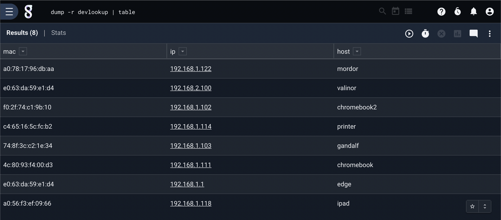
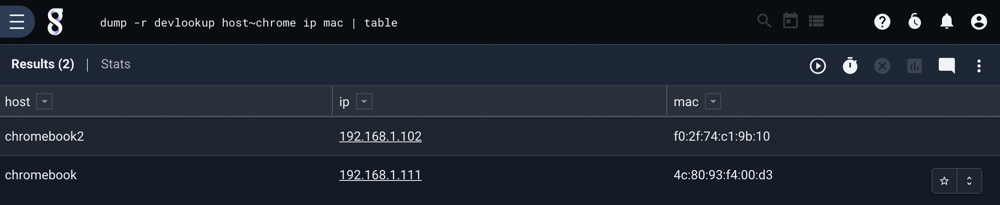
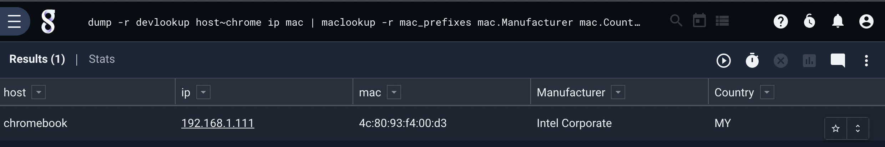

## Dump

The `dump` module is designed to treat resources as queryable data, meaning that you can inject a CSV or lookup table into the query pipeline and perform operations on the rows as if they are full fledged search entries.  Dump can be particularly useful when building dashboards and views that need to operate on data that has already been imported from some other static source or aggregated used scheduled queries.

The Gravwell search system will infer from the query whether or not it needs to engage the indexers and/or stored data.  If the `dump` module can satisfy all the enumerated value requirements and no other extraction modules are present the query will not execute on the indexers at all.  However, the dump module does support injecting values along side other data through the `-p` execution flag which is documented below.

### Supported Options

* `-r`: The “-r” option requires an argument and specifies the name or UUID of a resource to extract data from.  A resource must be specified and the current user must have read access to that resource.
* `-p`: The "-p" indicates that the dump module is injecting values along side other data and the pipeline should query the indexers.

### Filtering and Column Inclusion

The `dump` module will extract all columns from a CSV or lookup table resource if no columns are specified or if all specified columns have filters operations.  For example, `dump -r hosts hostname` means only extract the hostname column, where `dump -r hosts hostname == "ad.example.com"` means extract all columns because every column specified has a filter operation attached.  The query `dump -r hosts hostname == "ad.example.com" IP` will only extract the `hostname` and `IP` columns.

#### Supported Filter Operators

The `dump` module allows for a filtering based on equality.  If a filter is enabled that specifies equality ("equal", "not equal", "contains", "not contains") any column in a row that fails the filter specification will be not be injected into the pipeline.

| Operator | Name | Description |
|----------|------|-------------|
| == | Equal | Field must be equal
| != | Not equal | Field must not be equal
| ~ | Subset | Field contains the value
| !~ | Not Subset | Field does NOT contain the value


#### Filtering Examples

Retrieve all columns from the `hosts` resource where the `hostname` column does not equal "ad.example.com":
```
dump -r hosts hostname != "ad.example.com"
```

Retrieve only the `hostname`, `IP`, and `MAC` columns from the `hosts` resource where the hostname contains "example.com":
```
dump -r hosts hostname ~ "example.com" IP MAC
```

Retrieve all columns from the `hosts` resource where the hostname is not empty and the owning org is "finance":
```
dump -r hosts hostname != "" org=="finance"
```

### Example Queries

Dump an entire resource into the pipeline and populates the table module:

```
dump -r devlookup | table
```




Dump an entire resource where the Host column contains "Chrome"

```
dump -r devlookup Host ~ Chrome | table
```



Dump resource and operate on entries with other modules:

```
dump -r devlookup Host ~ Chrome | maclookup -r mac_prefixes MAC.Manufacturer MAC.Country | table
```


