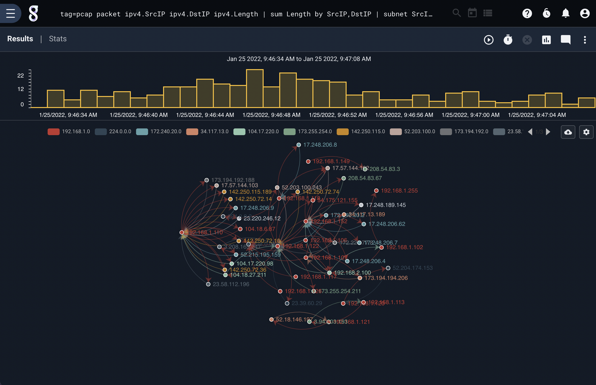
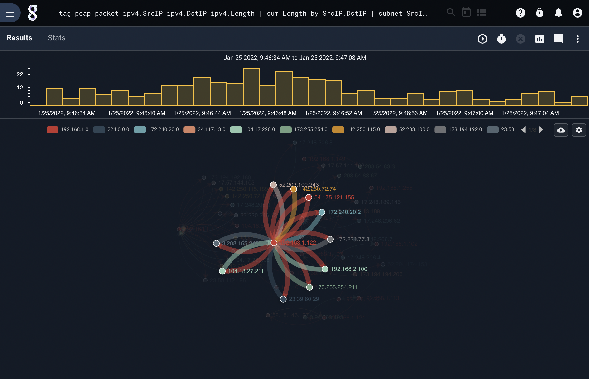
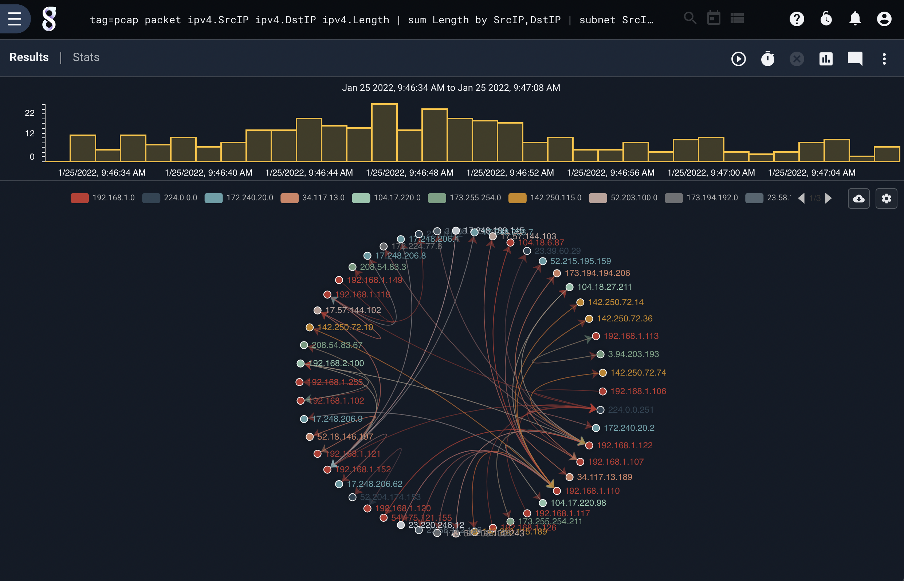

# Force Directed Graph

The force directed graph (fdg) module is used to generate a directed graph using node pairs. The fdg module accepts a weight value for the resulting edge.

## Supported Options
* `-v <enumerated value>`: Indicates that edges should be weighted as a sum of the provided enumerated value. The `-v` flag is useful in generating directed graphs where edges have weights represented by something other than a raw count.
* `-b`, `-sg <enumerated value>`, `-dg <enumerated value>`: Deprecated in 6.0. The flags are still accepted, so existing queries keep running, but they have no effect: 6.0 does not color nodes by source or destination group, and `-b` does not make edges bidirectional.

## Sample Query

One example where a force directed graph can prove useful is to identify relationships between addresses on a network. Generating a weighted force directed graph of IPV4 traffic can be accomplished with the query:

```gravwell
tag=pcap packet ipv4.SrcIP ipv4.DstIP ipv4.Length | sum Length by SrcIP DstIP | fdg -v sum SrcIP DstIP
```



Hovering the mouse over a node shows its label and the labels of its neighbors:



The options menu can enable or disable animation and change between the standard force-directed graph and a circular graph as shown below:


