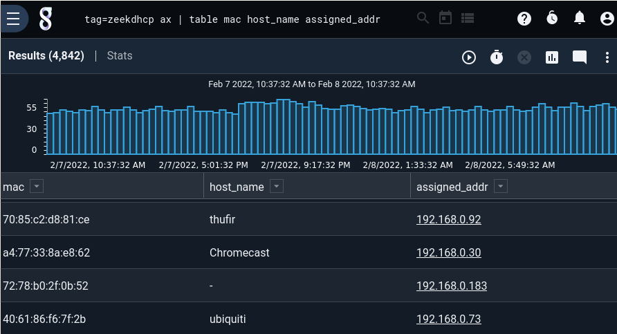
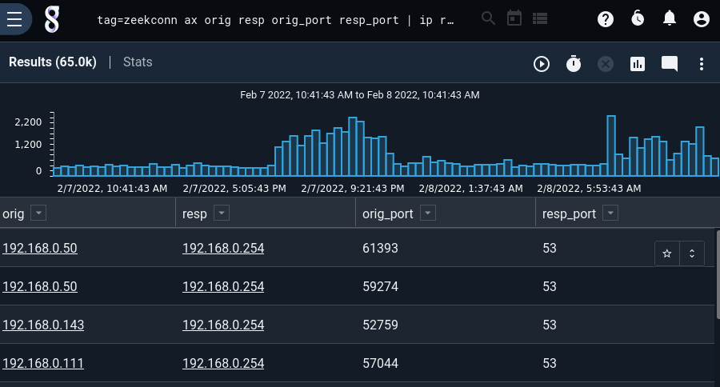
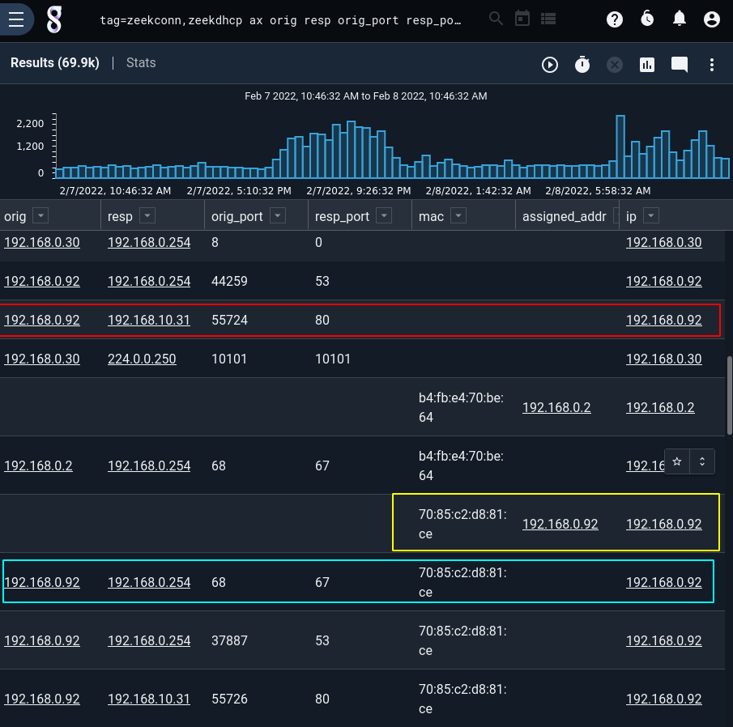
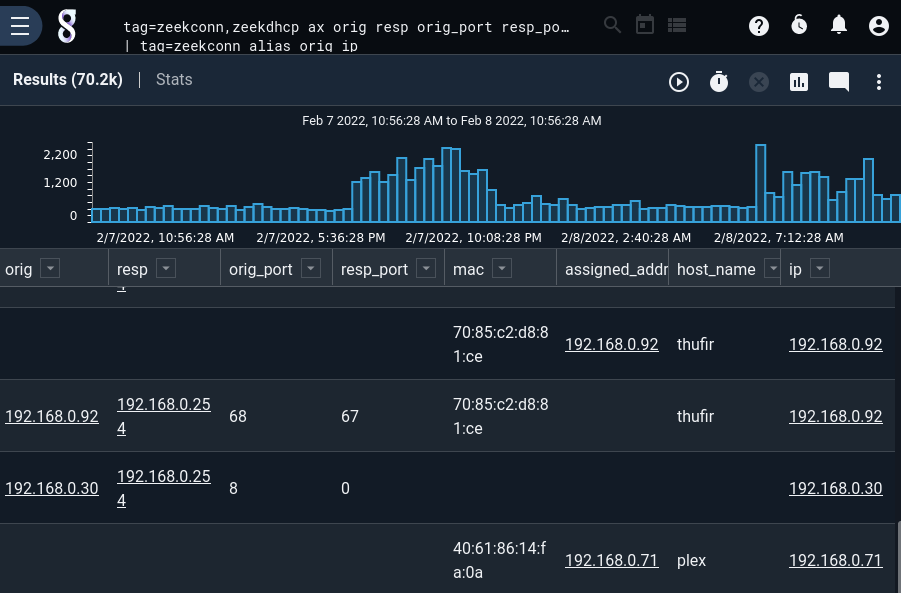

# Fuse

The fuse module can do basic data fusion in the pipeline, without requiring [compound queries](#!search/search.md), multiple queries, or [`eval`](#!search/eval/eval.md) code. It takes one or more "key" enumerated values, plus one or more "data" enumerated values. For each entry that comes into the module, it does one of the following:

* *Store*: If all of the data enumerated values exist on the entry, it places the contents of those enumerated values into an in-memory lookup table, keyed off the contents of the key enumerated values.
* *Load*: If the data enumerated values are not set, it checks the lookup table, keying off the contents of the key enumerated values. If there are values stored in the lookup table, it copies them into the current entry.

Fuse tracks only the most-recently-seen set of data enumerated values for any given set of key enumerated values.

For instance, you might combine DHCP logs with Netflow records in order to attach MAC addresses to the Netflow. As soon as the fuse module sees a DHCP log associating the MAC address "00:11:22:33:44:55" with the IP address 10.0.0.1, it can start attaching an enumerated value containing 00:11:22:33:44:55 to each Netflow record with IP address 10.0.0.1. However, because the fuse module is highly temporal, this means that any Netflow records which show up *before* the DHCP log arrives will *not* get the MAC address attached.

You can think of fuse like a simpler version of [lookup](#!search/lookup/lookup.md), where the lookup table is built on the fly in the pipeline rather than ahead of time.

## Syntax

Fuse can take its arguments in a few different forms. If you're specifying only one key E.V. and one data E.V., the syntax is particularly simple:

	fuse key data

To specify more than one key E.V., group the names inside square brackets.

	fuse [key1 key2] data

To specify more than one data E.V., group the names inside parentheses.

	fuse key (data1 data2)

These options can be combined:

	fuse [key1 key2] (data1 data2)

Fuse uses square brackets and parentheses this way in order to draw a similarity with the syntax of [the lookup module](#!search/lookup/lookup.md).

## Example: Zeek connection & DHCP fusion

This example uses Zeek DHCP logs to attach a MAC address to Zeek *connection* logs.

Taking a look at the `zeekdhcp` tag, we see that we'll be interested in the `mac` and `assigned_addr` fields:

	tag=zeekdhcp ax | table mac host_name assigned_addr



From `zeekconn` we'll just extract the orig & resp IP addresses, plus port numbers:

	tag=zeekconn ax orig resp orig_port resp_port | ip resp~PRIVATE orig~PRIVATE | table



Now we use the fuse module to enrich:

```
tag=zeekconn,zeekdhcp ax orig resp orig_port resp_port mac assigned_addr 
| tag=zeekconn alias orig ip 
| tag=zeekdhcp alias assigned_addr ip 
| tag=zeekconn ip resp~PRIVATE orig~PRIVATE 
| sort by time asc 
| fuse ip mac 
| table
```

Breaking down the query:

* First, we use the ax module to extract all desired fields. We take advantage of the fact that the AX module will "ignore" fields that aren't defined for a given tag; this lets us simultaneously extract `orig`, `resp`, `orig_port`, and `resp_port` from the zeekconn tag, `mac` and `assigned_addr` from the zeekdhcp tag.
* Next, we alias `orig` on the zeekconn tag and `assigned_addr` on the zeekdhcp tag to the same name: `ip`. This is the key E.V. we will later use in the fuse module.
* To keep the search results briefer, we then use the `ip` module to filter down to only conn logs between two private IP addresses.
* Since the fuse module is a strongly temporal operation, we use `sort by time asc` to make sure entries are arriving in order.
* At last we invoke the fuse module. We tell it to use `ip` as the key enumerated value, and `mac` as the data enumerated value.
* Finally, the table renderer displays the results.

The results are shown below. Note the connection log outlined in red; it does not have a MAC address set, because the fuse module does not yet have a MAC value stored for ip = 192.168.0.92. This changes after the arrival of the DHCP entry outlined in yellow. The very next connection log, outlined in blue, now has a MAC address attached for 192.168.0.30!



If we want to include hostnames too, we can tweak the query very slightly to add them to the fuse invocation:

```
tag=zeekconn,zeekdhcp ax orig resp orig_port resp_port mac assigned_addr host_name
| tag=zeekconn alias orig ip 
| tag=zeekdhcp alias assigned_addr ip 
| tag=zeekconn ip resp~PRIVATE orig~PRIVATE 
| sort by time asc 
| fuse ip (host_name mac)
| table
```

