# Gauge & Numbercard

The gauge renderer is a condensing renderer used to turn entries into one or more final values suitable for display as "gauges". For instance, you might wish to find the total number of brute-force attempts over the last hour and display it in a dashboard. While this could be accomplished with the table renderer, the gauge renderer makes for a more attractive result with at-a-glance readability.


The numbercard renderer is an "alias" of gauge: it has the exact same syntax as gauge, but will default to displaying simple numeric tiles instead of gauges:

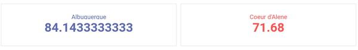

## Basic Usage

The simplest way to use the gauge renderer is by passing it a single enumerated value argument:

```
tag=json json class | stats mean(class) | gauge mean
```

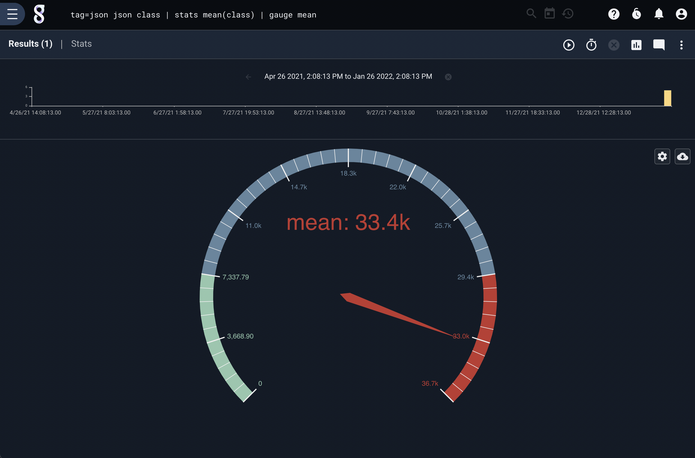

Selecting the gear icon allows you to change some options on the gauge. Clicking the 'Half' will change the style of the gauge display:


Selecting 'Number card' in the chart type dropdown will change the display to the other kind of gauge:

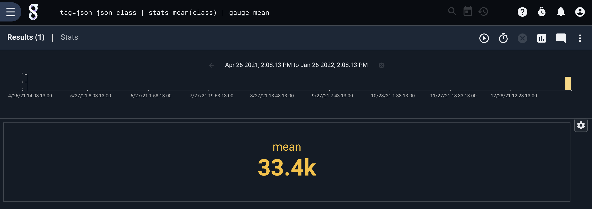

If we specify `numbercard` instead of `gauge`, we will default to the 'Number card' view:


```
tag=json json class | stats mean(class) | numbercard mean
```

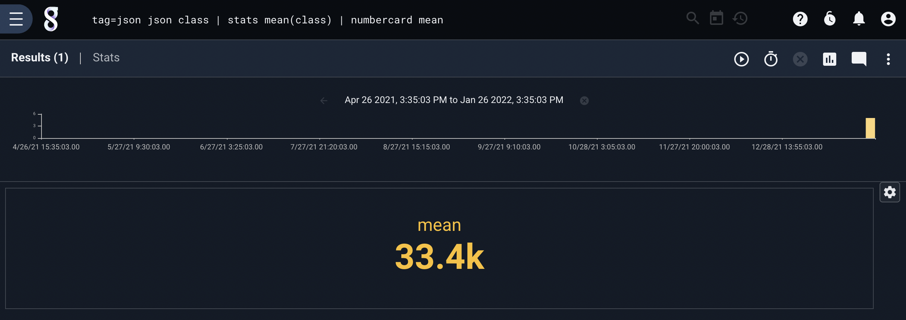

## Specifying a Label

The default label is not always ideal, especially when creating a gauge for use in a dashboard. If you would like a more informative label, wrap the magnitude enumerated value and the desired label in parentheses as below:

```
tag=json json class | mean class | gauge (mean "Avg Class")
```

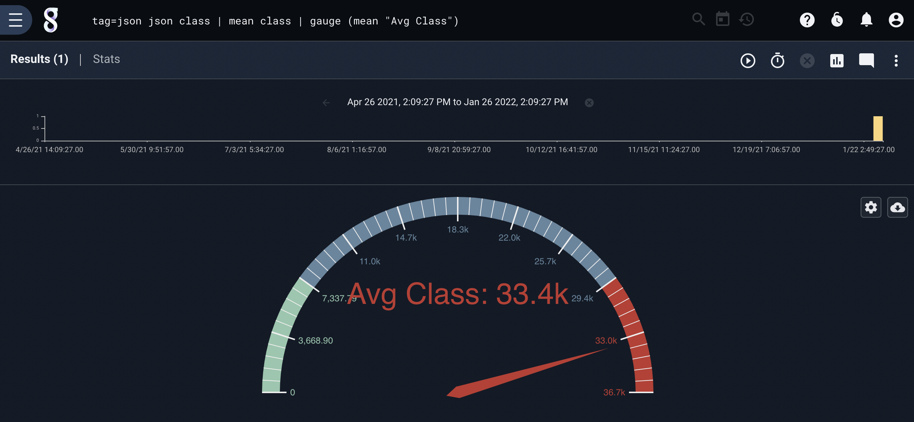

## Specifying Max and Min Limits

You can specify minimum and maximum values for the gauge by wrapping the magnitude enumerated value and the desired min/max values in parentheses:

```
tag=json json class | stats mean(class) | gauge (mean 1 100000)
```

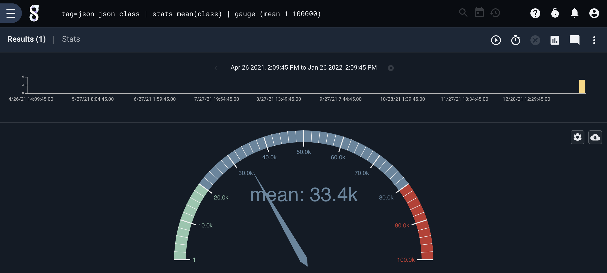

You can also specify the minimum and maximum by enumerated values:

```
tag=json json class | stats mean(class) min(class) max(class) | gauge (mean min max)
```

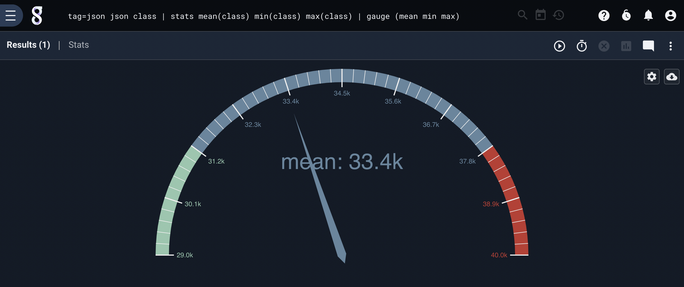

Or use a mix of constants and enumerated values:

```
tag=json json class | stats mean(class) max(class) | gauge (mean 1 max)
```

## Combining Min/Max with Labels

You can, of course, specify a gauge with both min/max values *and* a label:

```
tag=json json class | mean class | gauge (mean 0 100000 "Avg Class")
```

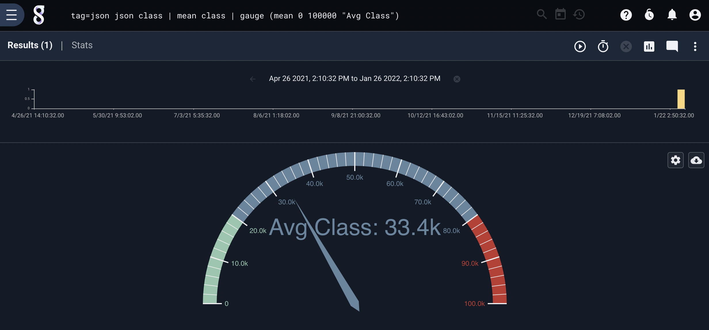

## Multiple Gauges

You can list multiple enumerated values to place multiple needles on the gauge:

```
tag=json json class | stats mean(class) stddev(class) | gauge mean stddev
```

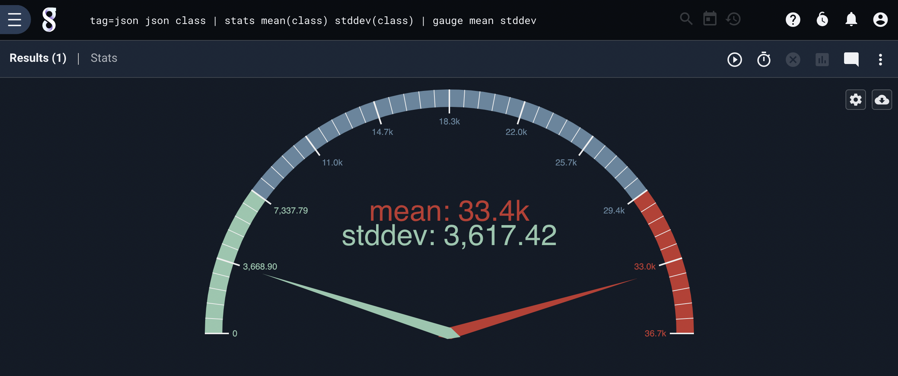

You can specify min/max values for each needle separately if desired, but note that default single-gauge renderer will select the lowest min and highest max for display, ignoring the others. For that reason, you may wish to select the "multiple gauges" option in the configuration menu:

```
tag=json json class | stats mean(class) stddev(class) min(class) max(class) | gauge (mean min max) (stddev 1 35000)
```

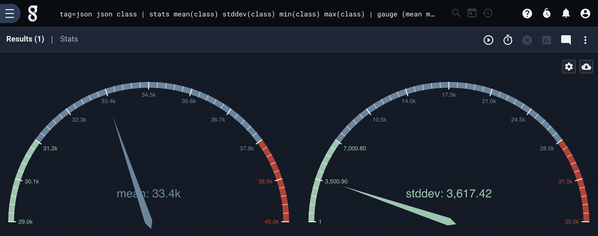

The renderer also behaves appropriately in "number card" mode with multiple items:

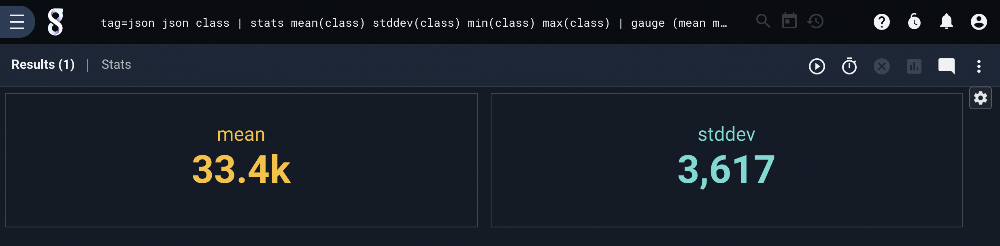

## Keyed Multi-Gauge

If you specify a magnitude which is *keyed*, gauge will output values for each combination of keys. So for instance, one might take weather data from multiple cities and find the average *per city*, then pass the resulting average to `gauge` or `numbercard`:

```
tag=weather json main.temp name | stats mean(temp) by name | numbercard mean
```

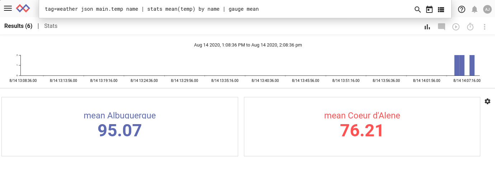

If you specify a label, it will be used appropriately:

```
tag=weather json main.temp name | stats mean(temp) by name | gauge (mean "Fahrenheit temp")
```

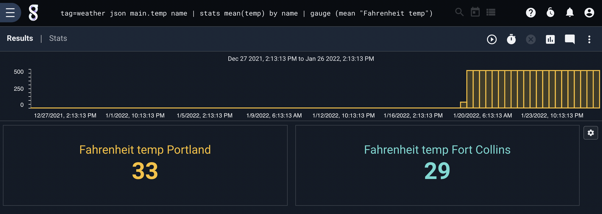
