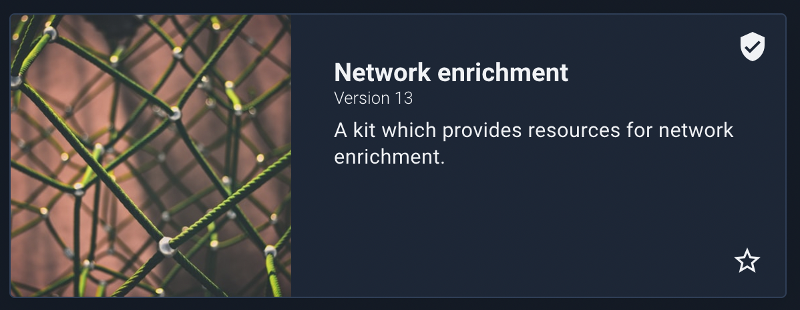
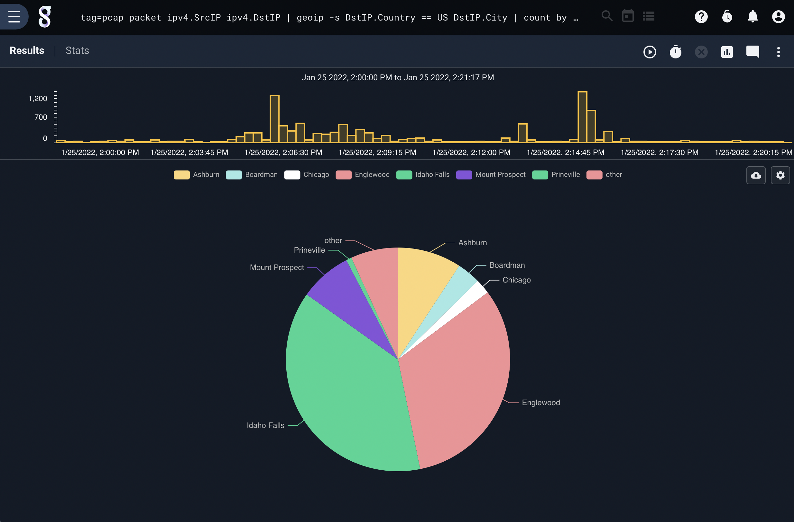
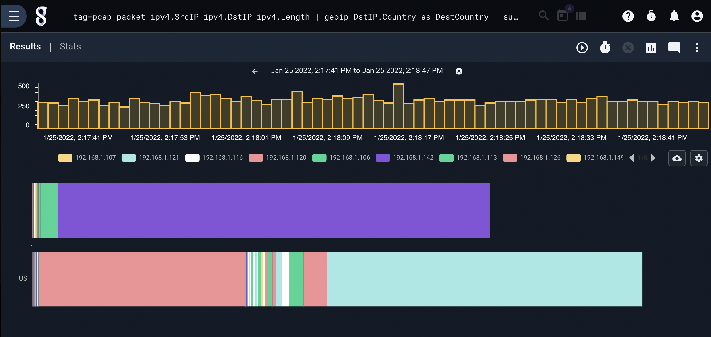

## Geoip

The geoip module uses [MaxMind](https://maxmind.com/) GeoIP databases to extract location information about IP addresses. It can extract approximate latitude/longitude as well as city, country, and continent names. It can also extract ASN numbers and the ASN organization associated with the IP.

### Setting Up Databases

Before using the geoip module, you must install the Network Enrichment kit. The Network Enrichment kit contains maxmind and ASN databases for use with the geoip module.



### Supported Options

* `-r <arg>`: The “-r” option specifies the resource name or UUID which contains a MaxMind geoip database.  If no "-r" is specified the geoip module uses the default "maxmind" resource name.
* `-s`: The “-s” option specifies that the geoip module should operate in strict mode.  In strict mode, if any of the specified operators cannot resolve an IP, the entry is dropped.

### Processing Operators

The geoip extractors support direct operators that allow for very fast filtering in the geoip module.  These filters can enable fast filtering of entries based on locations, ISPs, owners, etc.  The filters supported by each operator are determined by the data type of the extracted item.  Strings, such as ISPs, countries, cities, etc. only support equal to (==) and not equal to (!=) where integers and floats support the full numeric comparison operators.  The Location extractor generates a data structure comprised of both the Longitude and Latitude and does not support any filtering operators.  Multiple operators can be specified in a single invocation of the geoip module, and the output enumerated value names can be modified using the "as" directive.  This allows for getting the country associated with two IP addresses in a single entry and populating two different enumerated values with the results.

| Operator | Name | Description
|----------|------|-------------
| == | Equal | Field must be equal
| != | Not equal | Field must not be equal
| < | Less than | Field must be less than
| > | Greater than | Field must be greater than
| <= | Less than or equal | Field must be less than or equal to
| >= | Greater than or equal | Field must be greater than or equal to
| ~ | Subset | Field must be a member of
| !~ | Not subset | Field must not be a member of

### Data Item Extractors

The following extractions are possible with the standard MaxMind GeoIP database:

| Extractor | Operators | Description | Example 
|-----------|-----------|-------------|----------
| ISP | == != | ISP which owns the IP (only available with MaxMind enterprise database) | SrcIP.ISP != Comcast
| Country | == != | Country code for the IP | DstIP.Country == "US"
| CountryName | == != | Country name for the IP | SrcIP.CountryName != "United States"
| City |  == != | City name for the IP | DstIP.City
| Continent |  == != | Continent code for the IP | SrcIP.Continent == NA
| ContinentName |  == != | Continent name for the IP | DstIP.ContinentName != "North America"
| TZ |  == != | Timezone for the IP | SrcIP.TZ != "MST"
| Location |  | Latitude and Longitude location for IP | SrcIP.Location
| Lat | > < <= >= == != | Latitude for IP | DstIP.Lat < 22.5432
| Long |  > < <= >= == != | Longitude for IP | DstIP.Long > -15.1234

The following require the separate ASN database (specified with the -r flag):

| Extractor | Operators | Description | Example 
|-----------|-----------|-------------|----------
| ASNOrg |  == != | Autonomous system number organization owner for IP | DstIP.ASNOrg != Google
| ASN |  > < <= >= == != | Autonomous system number | DstIP.ASN >= 1024

### Examples

#### Filtering on country and requiring that city is resolved

```
tag=pcap packet IPv4.SrcIP IPv4.DstIP | geoip -s DstIP.Country == US DstIP.City | count by City | chart count by City
```



#### Showing Per IP Country Traffic

```
tag=pcap packet ipv4.SrcIP ipv4.DstIP ipv4.Length  | geoip DstIP.Country as DestCountry | sum Length by SrcIP,DestCountry | stackgraph DestCountry SrcIP sum
```



#### Extracting City for Two IPs

```
tag=pcap packet ipv4.SrcIP ipv4.DstIP | geoip DstIP.City as dest SrcIP.City as src | fdg -b src dst
```

#### Extracting ASN Org

```
tag=pcap packet ipv4.SrcIP !~ PRIVATE | geoip -r asn SrcIP.ASNOrg | table
```


