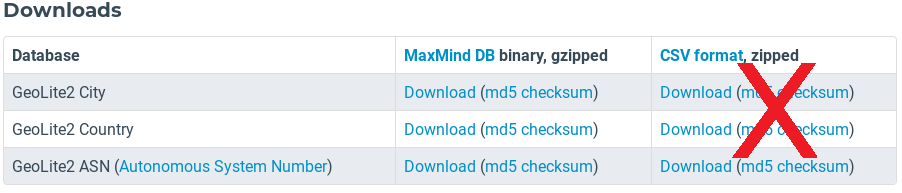
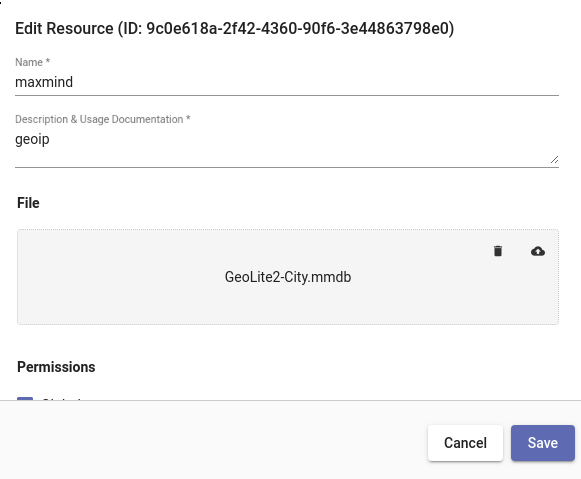
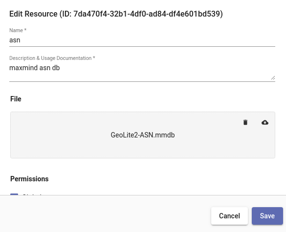

## Geoip

geoipモジュールは[MaxMind](https://maxmind.com/) GeoIPデータベースを使用して、IPアドレスに関する位置情報を抽出します。おおよその緯度/経度、都市名、国名、大陸名を抽出できます。また、ASN番号とIPに関連付けられたASN組織を抽出することもできます。

### データベースのセットアップ

geoipモジュールを使用する前に、MaxMindのデータベースを含む[resources](#!resources/resources.md)をインストールする必要があります。無料の制限付きデータベースをダウンロード](https://dev.maxmind.com/geoip/geoip2/geolite2/)するか、エンタープライズバージョンを購入することができます。CityデータベースとASNデータベースの両方をインストールすることをお勧めします。ウェブサイト上で、以下のようにMaxMind DBのバージョンを選択し、入手したtarファイルを解凍すると、必要なファイル (GeoLite2-City.mmdbとGeoLite2-ASN.mmdb) が見つかります。

注意: 必ずバイナリ版をダウンロードして、tar.gzファイルから.mmdbファイルを解凍してください。 SolitonNKはネイティブのMaxMindDBフォーマットを採用しており、優れたスループットを実現しています。

[](https://dev.maxmind.com/geoip/geoip2/geolite2/)

デフォルトでは、geoip モジュールは MaxMind "city" データベースが "maxmind" という名前のリソースにあることを想定しています。これにより、リソース名を明示的に指定することなく、GeoIP抽出を行うことができます。



ASNデータベースにはデフォルトの名前はありませんが、タイプミスを減らすために"asn"のようなシンプルな名前をつけることをお勧めします:



### サポートされているオプション

* `-r <arg>`: "-r"オプションは、MaxMind geoip データベースを含むリソース名または UUID を指定します。 "-r"が指定されていない場合、geoipモジュールはデフォルトの "maxmind"リソース名を使用します。
* `-s`: "-s"オプションは、geoipモジュールを厳密モードで動作させることを指定します。 厳密モードでは、指定された演算子のいずれかがIPを解決できない場合、そのエントリーはドロップされます。

### 処理演算子

geoipエクストラクタは、geoipモジュールで非常に高速なフィルタリングを可能にする直接演算子をサポートしています。 これらのフィルタにより、場所、ISP、所有者などに基づくエントリの高速フィルタリングが可能になります。 各演算子でサポートされるフィルタは、抽出されたアイテムのデータタイプによって決まります。 ISP、国、都市などの文字列は、equal to (==)とnot equal to (!=)のみをサポートし、整数と浮動小数点は完全な数値比較演算子をサポートします。 Locationエクストラクタは、LongitudeとLatitudeの両方からなるデータ構造を生成し、フィルタリング演算子はサポートしていません。 geoipモジュールの1回の起動で複数の演算子を指定することができ、出力される列挙値の名前は "as"ディレクティブで変更することができます。 これにより、1つのエントリで2つのIPアドレスに関連する国を取得し、その結果を2つの異なる列挙値に入力することができます。

| 演算子 | 名前 | 説明
|----------|------|-------------
| == | 等しい | フィールドは等しい
| != | 等しくない | フィールドは等しくない
| < | 未満 | フィールドはその値より小さい
| > | より大きい | フィールドはその値より大きい
| <= | 以下 | フィールドはその値以下
| >= | 以上 | フィールドはその値以上
| ~ | 含む | フィールドはその値を含む
| !~ | 含まない | フィールドはその値を含まない

### データ項目抽出

標準のMaxMind GeoIPデータベースでは、次の抽出が可能です:

| エクストラクタ | 演算子 | 説明 | 例 
|-----------|-----------|-------------|----------
| ISP | == != | IP を所有する ISP (MaxMind エンタープライズデータベースでのみ利用可能) | SrcIP.ISP != Comcast
| Country | == != | IPの国コード | DstIP.Country == "US"
| CountryName | == != | IPの国名 | SrcIP.CountryName != "United States"
| City |  == != | IPの都市名 | DstIP.City
| Continent |  == != | IPの大陸 | SrcIP.Continent == NA
| ContinentName |  == != | IPの大陸名 | DstIP.ContinentName != "North America"
| TZ |  == != | IPのタイムゾーン | SrcIP.TZ != "MST"
| Location |  | IPの緯度/経度 | SrcIP.Location
| Lat | > < <= >= == != | IPの緯度 | DstIP.Lat < 22.5432
| Long |  > < <= >= == != | IPの経度 | DstIP.Long > -15.1234

以下には、個別のASNデータベース（-rフラグで指定）が必要です:

| エクストラクタ | 演算子 | 説明 | 例 
|-----------|-----------|-------------|----------
| ASNOrg |  == != | IPの自律システム番号組織の所有者 | DstIP.ASNOrg != Google
| ASN |  > < <= >= == != | 自律システム番号 | DstIP.ASN >= 1024

### 例

#### 国のフィルタリングとその都市の解決の要求

```
tag=pcap packet IPv4.SrcIP ~ 10.0.0.0/16 IPv4.DstIP | geoip -s DstIP.Country == US DstIP.City | count by City | chart count by City
```


#### IPの国別トラフィックの表示

```
tag=pcap packet ipv4.SrcIP ~ 10.10.10.0/24 ipv4.DstIP !~ 10.0.0.0/8 ipv4.Length  | geoip DstIP.Country as DestCountry | sum Length by SrcIP,DestCountry | stackgraph DestCountry SrcIP sum
```


#### 2つのIPの都市の抽出

```
tag=pcap packet ipv4.SrcIP ipv4.DstIP | geoip DstIP.City as dest SrcIP.City as src | fdg -b src dst
```

#### ASN組織の抽出

```
tag=pcap packet ipv4.SrcIP !~ PRIVATE | geoip -r asn SrcIP.ASNOrg | table
```


