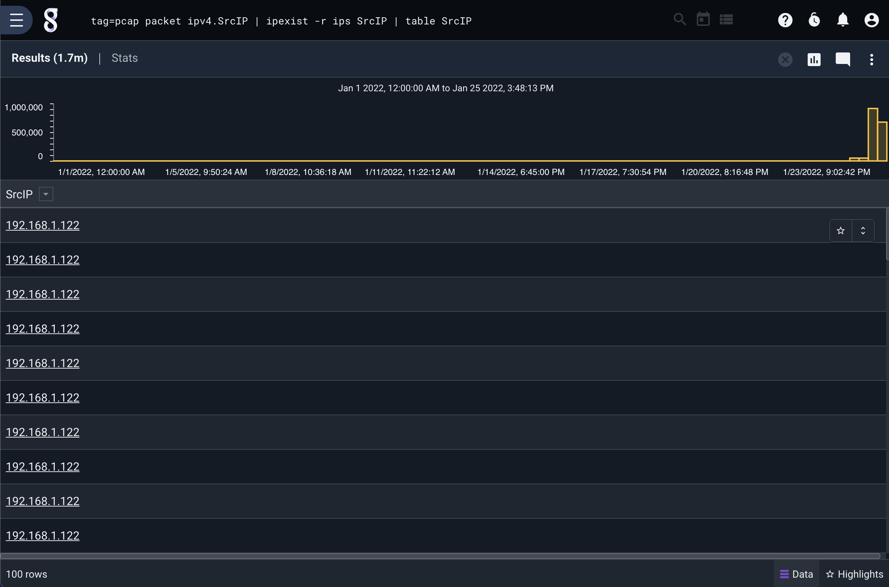
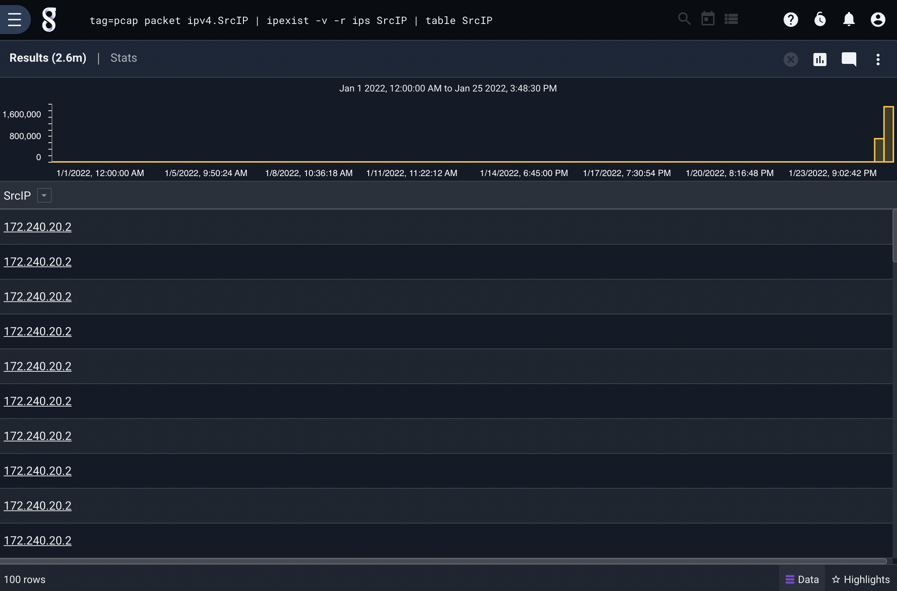

# IPexist

ipexistモジュールは、IPアドレスの簡単な存在チェックをできるだけ早く実行するように設計されています。   Gravwellの[ipexistライブラリ](https://github.com/gravwell/ipexist)を使用してIPアドレスのセットを管理し、そのセット内の特定のIPの存在をすばやく照会します。   ユーザーは、セットと照合するために1つ以上の列挙値を指定します。   デフォルトでは、列挙されたすべての値がセット内のアドレスと一致すると、エントリが渡されます。

## サポートされているオプション

* `-r <resource>`: "-r"フラグは、ipexist形式のルックアップセットを含むリソースの名前を指定します。   このフラグは、複数のリソースにまたがって検索を試みるために複数回指定することができます。   これらのセットの作成に関する詳細については、下記を参照してください。
* `-v`: "-v"フラグは、ipexistモジュールに逆モードで動作するように指示します。   したがって、クエリipexist -r ips SrcIPが通常、SrcIPがリソース内のipと一致するすべてのエントリを通過させる場合、ipexist -v -r ips SrcIPは代わりにそれらのエントリを削除し、他のすべてのエントリを通過させます。
* `-or`: "-or"フラグは、すべてのフィルタが成功した場合に、ipexistモジュールがエントリをパイプラインに沿って続行することを許可することを指定します。

## IPセットを作成する

ipexistモジュールは特定のフォーマットを使用してIPv4アドレスのセットを格納します。  これは、高速検索を可能にしながら、比較的スペース効率を維持するように設計されています。  この形式は、コマンドラインでセットを生成するためのツールを含む[ipexistライブラリ](https://github.com/gravwell/ipexist)に実装されています。

まず、ツールを取得します:

	go get github.com/gravwell/ipexist/textinput

それから、セットに入れたいIPアドレスのリストを1行に1つのIPアドレスでテキストファイルに入力してください。  順序は関係ありません:

	10.0.0.2
	192.168.3.77
	10.3.2.1
	8.8.8.8

次にtextinputツールを実行し、入力ファイルへのパスと出力へのパスを指定します:

	$GOPATH/bin/textinput -i /path/to/inputfile -o /path/to/outputfile

これにより、ipexistモジュールで使用するためのリソースとしてアップロードできる適切にフォーマットされた出力ファイルが作成されます。

## 使用例

パケットがpcapタグの下でキャプチャされると仮定すると、次のクエリはソースIPアドレスがipsリソース内のIPと一致するパケットのみを通過させます:

```
tag=pcap packet ipv4.SrcIP | ipexist -r ips SrcIP | table SrcIP
```



このクエリは、SrcIPとDstIPがリソースにあるエントリをすべて渡します:

```
tag=pcap packet ipv4.SrcIP ipv4.DstIP | ipexist -r ips SrcIP DstIP | table SrcIP DstIP
```

`-or`フラグを追加すると、照会が緩和されます。   SrcIPまたはDstIPがリソースに見つかったエントリをすべて渡します:

```
tag=pcap packet ipv4.SrcIP ipv4.DstIP | ipexist -or -r ips SrcIP DstIP | table SrcIP DstIP
```

## 反転クエリ

`-v`フラグはクエリを反転します。  クエリに-vを追加した場合、通常削除されるエントリはすべて渡され、その逆も同様です。

このクエリは、ソースIPアドレスがリソース内に見つかったエントリを削除します:

```
tag=pcap packet ipv4.SrcIP | ipexist -v -r ips SrcIP | table SrcIP
```



次のクエリでは、SrcIPとDstIPがリソースに存在するエントリはすべて削除されます。   この問い合わせは本質的に、「送信元または宛先が既知のリストにないすべてのパケットを表示する」となります。

```
tag=pcap packet ipv4.SrcIP ipv4.DstIP | ipexist -v -r ips SrcIP DstIP | table SrcIP DstIP
```

`-or`フラグと組み合わせると、モジュールは、指定された列挙値の1つでもリソース内に見つかったエントリをすべて削除します。   以下の例では、ソースIPと宛先IPがリソースに見つからないエントリだけがパイプラインを通過します。

```
tag=pcap packet ipv4.SrcIP ipv4.DstIP | ipexist -or -r ips SrcIP DstIP | table SrcIP DstIP
```

### 複数のリソース

`-r`フラグを繰り返すことによって、複数の固有IPセットを指定できます。   ipexistsモジュールは本質的にそれらを1つの大きなセットとして扱います。

```
tag=pcap packet ipv4.SrcIP | ipexist -r ips -r externalips SrcIP | table SrcIP
```
