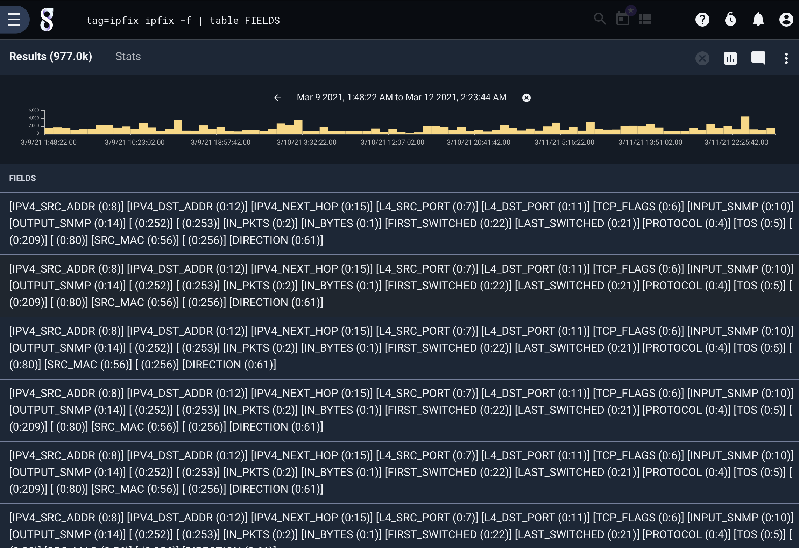

# IPFIX and Netflow V9

The ipfix processor is designed to extract and filter raw IPFIX and Netflow V9 data frames, allowing you to quickly identfy network flows, filter on ports, or generally monitor the behavior of aggregate flows.  Gravwell has a native IPFIX + Netflow ingester which is open source and avialable at https://github.com/gravwell/ingesters or as an installer in the [quickstart section](/#!quickstart/downloads.md).

## A Note About Templates

Gravwell is flexible with regards to entry order. You can run queries from oldest entry to newest, from newest to oldest, or you can sort entries based on some other criteria entirely.

Unfortunately, this flexibility does not interact well with IPFIX and Netflow V9. These protocols define *templates*, which describe the format of data records. Templates are transmitted infrequently; any given IPFIX message is unlikely to contain a template record, but it will have data records referring to previously-defined templates. Without access to the appropriate template, a data record is meaningless. This means that parsing IPFIX messages from newest to oldest (or sorted in some other fashion) cannot work properly **unless** additional steps are taken.

We determined that the most straight-forward course of action was to have the *ingester* repack every incoming IPFIX/Netflow V9 message with the appropriate templates for its data records. This increases the size of each messsage stored, but because messages typically include tens of data records, the increase is not large. It also means that every single message (entry) stands completely on its own and does not depend on any previous messages for parsing.

## Supported Options

* `-e <name>`: The “-e” option specifies that the ipfix module should operate on an enumerated value.  Operating on enumerated values can be useful when you have extracted an ipfix frame using upstream modules. 
* `-s`: The "-s" option puts the ipfix module in strict mode. In strict mode, any specified extractions *must* succeed, or the entry will be dropped; thus, `ipfix protocolIdentifier==1 srcPort` would drop all entries, because ICMP messages (IP protocol 1) will never contain a source port field.
* `-f`: The "-f" flag tells the module to extract a list of available fields for each IPFIX data record it sees and drop them, in human-readable format, into an enumerated value called "FIELDS". This is mutually exclusive with field extraction; if you specify -f, you cannot specify any fields to extract.

## Processing Operators

Each IPFIX field supports a set of operators that can act as fast filters.  The filters supported by each operator are determined by the data type of the field. Numeric values support everything *except* the subset operators, while IP addresses support *only* the subset operators.

| Operator | Name | Description |
|----------|------|-------------|
| == | Equal | Field must be equal
| != | Not equal | Field must not be equal
| < | Less than | Field must be less than
| > | Greater than | Field must be greater than
| <= | Less than or equal | Field must be less than or equal to
| >= | Greater than or equal | Field must be greater than or equal to
| ~ | Subset | Field must be a member of
| !~ | Not subset | Field must not be a member of


## Data Items

The ipfix search module is designed to process raw IPFIX & Netflow v9 message.  A single IPFIX (or NFv9) message consists of a header and N data records. One essential difference between IPFIX/NFv9 and Netflow v5 is that all fields in Netflow v5 are pre-defined, while IPFIX/NFv9 data records conform to templates specified by the generating device and transmitted in previous messages. Thus, one IPFIX/NFv9 generator might send source and destination IP & ports for flows, while a switch just sends records containing packet counts.

All elements of the IPFIX/NFv9 message *header* can be used for filtering, as can the elements in the data records themselves. When filtering on header data items, the filter applies to *all* records in the message.  Header data items are processed first, and only if the header filters do not drop the frame are the individual records processed.

The ipfix processor is an expanding module; expanding modules break input entries into multiple output entries. The module takes in individual entries corresponding to whole IPFIX messages. It then processes each data record within the message and emits a new entry *for each record*; thus, a single input entry might turn into 30 output entries.

Note: If you specify *only* header items to extract (e.g. `ipfix Version Sequence`), entries are *not* expanded, because there is only one header per IPFIX message. Each incoming entry will result in no more than one outgoing entry. Specifying a mix of header and data items will trigger expansion.

### IPFIX Header Data Items

| Field |       Description        | Supported Operators | Example |
|-------|--------------------------|---------------------|---------|
| Version | The Netflow version in use. 10 means IPFIX, 9 means Netflow v9. | > < <= >= == != | Version != 0xa
| Length | IPFIX: the total length of this IPFIX message. Netflow v9: the number of records contained in this message. | > < <= >= == != | Length > 1000
| Sec | Current Unix timestamp of the sensing device | > < <= >= == != | Sec == 1526511023
| Uptime | Number of milliseconds the sensing device has been online (Netflow v9 only) | > < <= >= == != | Sec == 3516293216
| Sequence | Sequence counter of total messages sent by the sensing device | > < <= >= == != | Sequence == 234
| Domain | The observation domain from which the record originated | > < <= >= == != | Domain == 0x1A

### Data Record Items

IPFIX and Netflow v9 define fields which may make up a data record. Netflow defines several dozens of fields which can be found [in RFC3954](https://tools.ietf.org/html/rfc3954#section-8). A Netflow v9 field is defined by a field ID (a positive integer), a data type (e.g. 16-bit unsigned integer, etc.), and a name (e.g. L4_SRC_PORT).

IANA has defined a similar set of fields for IPFIX, which [can be found here](https://www.iana.org/assignments/ipfix/ipfix.xhtml#ipfix-information-elements). An IPFIX fields are similar to Netflow v9 fields (they have a field ID, a type, and a name), but IPFIX introduces the concept of the _enterprise ID_ in addition to the field IDs used by Netflow v9. The enterprise ID allows users to define their own set of fields in addition to the predefined ones, which all have an enterprise ID of 0.

Attention: Because IPFIX and Netflow v9 are template-based, any given data record may or may not contain the fields described below. If you attempt to extract e.g. "sourceIPv4PrefixLength" but get empty results, it is possible that your IPFIX records do not contain that field.

For convenient, we list some of the most common IPFIX and Netflow v9 fields below; refer to the documents linked above for a complete list of supported names.


| IPFIX Name | Netflow v9 Name |      Description        | Supported Operators | Example |
|-------|--------------------------|---------------------|---------|
| octetDeltaCount | IN_BYTES | The number of octets since the previous report (if any) in incoming packets for this Flow at the Observation Point. The number of octets includes IP header(s) and IP payload | > < <= >= == != | octetDeltaCount == 80
| packetDeltaCount | IN_PKTS | The number of incoming packets since the previous report (if any) for this Flow at the Observation Point. | > < <= >= == != | packetDeltaCount == 80
| deltaFlowCount | FLOWS | The conservative count of Original Flows contributing to this Aggregated Flow; may be distributed via any of the methods expressed by the valueDistributionMethod Information Element. | > < <= >= == != | packetDeltaCount == 80
| protocolIdentifier | PROTOCOL | Protocol number of the flow (TCP = 6, UDP = 17 | > < <= >= == != | protocolIdentifier == 17
| ipClassOfService | TOS | For IPv4 packets, this is the value of the TOS field in the IPv4 packet header.  For IPv6 packets, this is the value of the Traffic Class field in the IPv6 packet header | > < <= >= == != | ipClassOfService != 0
| tcpControlBits | TCP_FLAGS | TCP control bits observed for the packets of this Flow. | > < <= >= == != | tcpControlBits != 0x0004
| sourceTransportPort | L4_SRC_PORT | Source port of the flow.  If the protocol does not have a port the value is zero | > < <= >= == != | sourceTransportPort != 0
| sourceIPv4Address | IPV4_SRC_ADDR| IPv4 source address of the flow. | ~ !~ == != | sourceIPv4Address ~ 10.0.0.0/24 
| sourceIPv4PrefixLength | SRC_MASK | IPv4 source address prefix length. | > < <= >= == != | sourceIPv4PrefixLength < 24
| sourceIPv6Address | IPV6_SRC_ADDR | IPv6 source address of the flow. | ~ !~ == != | sourceIPv6Address == ::1
| sourceIPv6PrefixLength | IPV6_SRC_MASK | IPv6 source address prefix length. | > < <= >= == != | sourceIPv6PrefixLength < 64
| destinationTransportPort | L4_DST_PORT | Destination port of the flow.  If the protocol does not have a port the value is zero | > < <= >= == != | destinationTransportPort != 0
| destinationIPv4Address | IPV4_DST_ADDR | IPv4 destination address of the flow. | ~ !~ == != | destinationIPv4Address ~ 10.0.0.0/24 
| destinationIPv4PrefixLength | DST_MASK | IPv4 destination address prefix length. | > < <= >= == != | destinationIPv4PrefixLength < 24
| destinationIPv6Address | IPV6_DST_ADDR | IPv6 destination address of the flow. | ~ !~ == != | destinationIPv6Address == ::1
| destinationIPv6PrefixLength | IPV6_DST_MASK | IPv6 destination address prefix length. | > < <= >= == != | destinationIPv6PrefixLength < 64

Note: In general, you can specify Netflow v9 field names when extracting IPFIX messages and vice versa. However, because data types vary slightly between the two protocols, it is always safest to use IPFIX field names when processing IPFIX and Netflow names when processing Netflow.

The module also provides a handful of "shortcuts" for convenience:

| Field |       Description        | Supported Operators | Example |
|-------|--------------------------|---------------------|---------|
| src | The source address for this flow (IPv4 or IPv6) | ~ !~ == != | src == ::1
| dst | The destination address for this flow (IPv4 or IPv6) | ~ !~ == != | dst !~ PRIVATE
| srcPort | The source port for this flow. | > < <= >= == != | srcPort == 80
| dstPort | The destination port for this flow. | > < <= >= == != | dstPort == 80
| ip | Extract the first IP that matches a filter.  If no filter is specified the Src is used | ~ !~ == != | ip ~ 10.0.0.0/24
| port | Extract the first port that matches the filter.  If no filter is specified the lower value is used | > < <= >= == != | port == 80
| vlan | Extracts the first VLAN that matches a filter, where the VLAN may be drawn from either the vlanId or dot1qVlanId field. | > < <= >= == != | vlan == 100
| srcMac | Extracts the source MAC address for the flow | == != | srcMac==01:23:45:67:89:00
| dstMac | Extracts the destination MAC address for the flow | == != | dstMac==01:23:45:67:89:00
| bytes | Total bytes seen, this adds the `octetDeltaCount` and `postOctetDeltaCount` values together | > < <= >= == != | bytes <= 10000
| packets | Total packets seen, this adds the `packetDeltaCount` and `postPacketDeltaCount` values together | > < <= >= == != | packets > 0xffffff 
| flowStart | The start timestamp of the flow, this shorthand uses any of the following fields: `flowStartSeconds`, `flowStartMilliseconds`, `flowStartMicroseconds`, `flowStartNanoseconds` and outputs a proper timestamp | | flowStart
| flowEnd | The end timestamp of the flow, this shorthand uses any of the following fields: `flowEndSeconds`, `flowEndMilliseconds`, `flowSEndMicroseconds`, `flowEndNanoseconds` and outputs a proper timetamp | | flowStart
| flowDuration | The duration value calculated from `flowEnd` and `flowStart`. | == != < > <= >= | flowDuration > 1m 

#### Filtering on other fields

You can also specify fields by giving an enterprise ID and field ID separated by a colon, e.g. "0x1ad7:0x15". We recommend extracting this to a more convenient name: `ipfix 0x1ad7:0x15 as foo`. If you wish to extract Netflow v9 fields in this fashion, just assume an enterprise ID of 0, e.g. `ipfix 0:7 as srcport` to extract the source port.

## Examples

### Number of HTTPS flows by Source IP over time

```
tag=ipfix ipfix destinationIPv4Address as Dst destinationTransportPort==443 | count by Dst | chart count by Dst
```


### Find out which IPs are using port 80

```
tag=ipfix ipfix port==80 ip ~ PRIVATE | unique ip | table ip
```

### Find the most common protocol in Netflow v9 records

This example filters down to only Netflow v9 records, then extracts the protocol and counts how many flows appeared for each.

```
tag=v9 ipfix Version==9 PROTOCOL | count by PROTOCOL | table PROTOCOL count
```

### Extract a list of fields in each data record

```
tag=ipfix ipfix -f | table FIELDS
```


