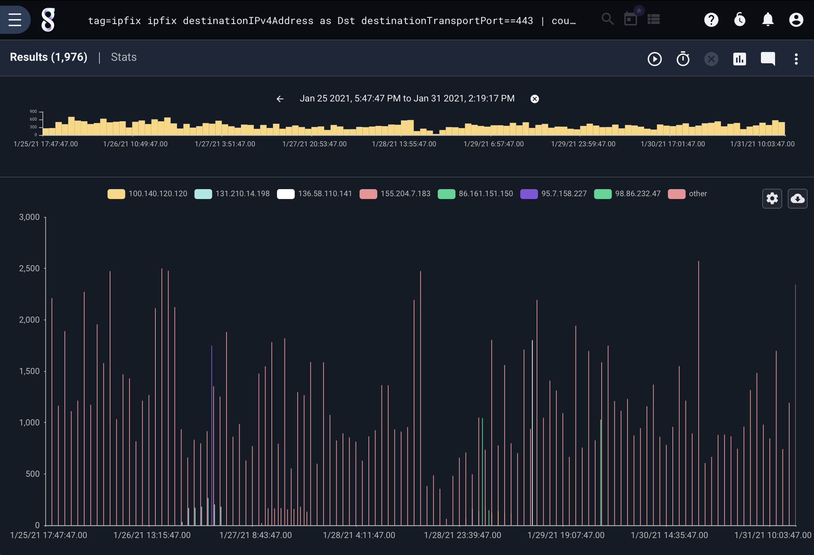

# IPFIX

The ipfix processor is designed to extract and filter raw IPFIX data frames, allowing for quickly identfying network flows, filtering on ports, or generally monitoring the behavior of aggregate flows.  Gravwell has a native IPFIX + Netflow ingester which is open source and avialable at https://github.com/gravwell/ingesters or as an installer in the [quickstart section](/#!quickstart/downloads.md).

## Supported Options

* `-e`: The “-e” option specifies that the ipfix module should operate on an enumerated value.  Operating on enumerated values can be useful when you have extracted an ipfix frame using upstream modules.  You could extract ipfix frames from raw PCAP and pass the frames into the ipfix module.

## Processing Operators

Each IPFIX field supports a set of operators that can act as fast filters.  The filters supported by each operator are determined by the data type of the field. Numeric values support everything but the subset operators and IP addresses support just the subset operators.

| Operator | Name | Description |
|----------|------|-------------|
| == | Equal | Field must be equal
| != | Not equal | Field must not be equal
| < | Less than | Field must be less than
| > | Greater than | Field must be greater than
| <= | Less than or equal | Field must be less than or equal to
| >= | Greater than or equal | Field must be greater than or equal to
| ~ | Subset | Field must be a member of
| !~ | Not subset | Field must not be a member of


## Data Items

The ipfix search module is designed to process raw IPFIX frames.  A single IPFIX frame consists of a header and N data records. One essential difference between IPFIX and Netflow v5 is that all fields in Netflow are pre-defined, while IPFIX data records conform to templates specified by the generating device. Thus, one IPFIX generator might send source and destination IP & ports for flows, while a switch just sends IPFIX records containing packet counts.

All elements of the IPFIX header can be used for filtering, as can some of the more common data elements. When filtering on Header data items, the filter applies to all records in the frame.  Header data items are processed first, and only if the header filters do not drop the frame are the individual records processed.  The ipfix processor is an expanding module; expanding modules break input entries into multiple output entries.  This means that when using the ipfix module more entries can come out of the pipeline than were fed in.

### IPFIX Header Data Items

| Field |       Description        | Supported Operators | Example |
|-------|--------------------------|---------------------|---------|
| Version | The IPFIX version in use; this should always be 10 | > < <= >= == != | Version != 0xa
| Length | The total length of this IPFIX frame | > < <= >= == != | Length > 1000
| Sec | Current Unix timestamp of the sensing device | > < <= >= == != | Sec == 1526511023
| Sequence | Sequence counter of total flows on the sensing device | > < <= >= == != | Sequence == 1
| Domain | The observation domain from which the record originated | > < <= >= == != | Domain == 0x1A

### IPFIX Data Record Items

There are many possible fields which can be populated in any given IPFIX flow record; [IANA defines hundreds](https://www.iana.org/assignments/ipfix/ipfix.xhtml#ipfix-information-elements). We have implemented filtering for some of the most common:

| Field |       Description        | Supported Operators | Example |
|-------|--------------------------|---------------------|---------|
| octetDeltaCount | The number of octets since the previous report (if any) in incoming packets for this Flow at the Observation Point. The number of octets includes IP header(s) and IP payload | > < <= >= == != | octetDeltaCount == 80
| packetDeltaCount | The number of incoming packets since the previous report (if any) for this Flow at the Observation Point. | > < <= >= == != | packetDeltaCount == 80
| deltaFlowCount | The conservative count of Original Flows contributing to this Aggregated Flow; may be distributed via any of the methods expressed by the valueDistributionMethod Information Element. | > < <= >= == != | packetDeltaCount == 80
| protocolIdentifier | Protocol number of the flow (TCP = 6, UDP = 17 | > < <= >= == != | protocolIdentifier == 17
| ipClassOfService | For IPv4 packets, this is the value of the TOS field in the IPv4 packet header.  For IPv6 packets, this is the value of the Traffic Class field in the IPv6 packet header | > < <= >= == != | ipClassOfService != 0
| tcpControlBits | TCP control bits observed for the packets of this Flow. | > < <= >= == != | tcpControlBits != 0x0004
| sourceTransportPort | Source port of the flow.  If the protocol does not have a port the value is zero | > < <= >= == != | sourceTransportPort != 0
| sourceIPv4Address | IPv4 source address of the flow. | ~ !~ == != | sourceIPv4Address ~ 10.0.0.0/24 
| sourceIPv4PrefixLength | IPv4 source address prefix length. | > < <= >= == != | sourceIPv4PrefixLength < 24
| sourceIPv6Address | IPv6 source address of the flow. | ~ !~ == != | sourceIPv6Address == ::1
| sourceIPv6PrefixLength | IPv6 source address prefix length. | > < <= >= == != | sourceIPv6PrefixLength < 64
| destinationTransportPort | Destination port of the flow.  If the protocol does not have a port the value is zero | > < <= >= == != | destinationTransportPort != 0
| destinationIPv4Address | IPv4 destination address of the flow. | ~ !~ == != | destinationIPv4Address ~ 10.0.0.0/24 
| destinationIPv4PrefixLength | IPv4 destination address prefix length. | > < <= >= == != | destinationIPv4PrefixLength < 24
| destinationIPv6Address | IPv6 destination address of the flow. | ~ !~ == != | destinationIPv6Address == ::1
| destinationIPv6PrefixLength | IPv6 destination address prefix length. | > < <= >= == != | destinationIPv6PrefixLength < 64
| ingressInterface | The index of the IP interface where packets of this flow are being received. | > < <= >= == != | ingressInterface == 1

Note: While the names we use are not as short / friendly as those used in the netflow or packet parsers, they match exactly [the names assigned by the specification](https://www.iana.org/assignments/ipfix/ipfix.xhtml#ipfix-information-elements).

Beside the fields specified above, you can also extract (but not filter on) any other official IPFIX information element name as specified [here](https://www.iana.org/assignments/ipfix/ipfix.xhtml#ipfix-information-elements). You can also specify non-standard fields by giving an enterprise ID and field ID separated by a colon, e.g. "0x1ad7:0x15". We recommend extracting this to a more convenient name: `ipfix 0x1ad7:0x15 as foo`.

## Examples

### Number of HTTPS flows by Source IP over time

```
tag=ipfix ipfix destinationIPv4Address as Dst destinationTransportPort==443 | count by Dst | chart count by Dst
```


