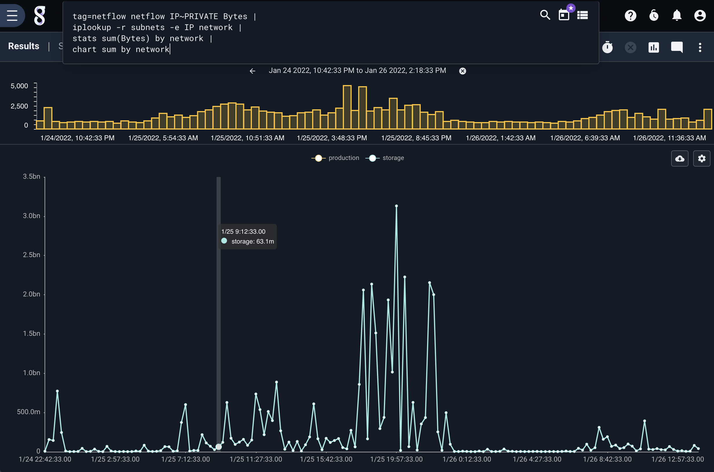

## IPLookup

The `iplookup` module is used to perform data enrichment of IP addresses using a subnet as a key, this allows for generating simpler lookup tables that do not need to contain an exact match, potentially simplifying the management of some resources.  The `iplookup` module uses a resource that specifies a column containing a CIDR.  Each row in the CSV must contain a valid IPv4 or IPv6 CIDR definition.  Additional columns in the CSV can be used to provide additional values that can be attached to entries during query.  This may be network segment names, organizations, security tier, or even a latitude/longitude.

The `iplookup` module uses a [radix tree](https://en.wikipedia.org/wiki/Radix_tree) to match a specific IP or CIDR against the provided data list.  While radix trees are fast, it is NOT an `O(1)` lookup.  There are some cases where the iplookup module may not be the best choice.  For example, if your resource contains mostly `/32` CIDRs, a plain old [lookup](../lookup/lookup.md) list might be a better option.  Extremely large sets of lookups may also incur significant memory and CPU overhead.  The `iplookup` system fully supports IPv6 and it is entirely possible to specify trillions of CIDRs in the resource which will consume TBs of RAM and create an extremely large tree.  Most reasonable uses of the iplookup module will be very fast, even faster than the [geoip](../geoip/geoip.md) module using the maxmind database.

The `iplookup` module can perform any number of enrichments in a single execution.  For example, if your CSV contained the columns `CIDR`, `network`, `building`, `lat`, `long`, `division` we could attach all of the additional data at once using a single invocation.  An example would look like:

```
iplookup -r <resource> -e IP network building lat long division
```

The `iplookup` module can also assign into enumerated values using a custom name.  This is performed using the `as` keyword.  In this example we are going to enrich the entry with the value contained in the `division` column, but we are going to name it `Business Unit` in the enumerated value:

```
iplookup -r <resource> -e IP network as "Business Unit"
```

### Supported Options
* `-r <arg>`: The "-r" option informs the iplookup module which lookup resource should be used to enrich data.
* `-s`: The "-s" option specifies that the iplookup modules should require that all specified operations succeed.
* `-v`: The "-v" flag inverts the flow logic in the lookup module, meaning that successful matches are suppressed and missed matches are passed on.  The `-v` flag is not compatible with enrichments
* `-e <arg>`: The "-e" flag specifies the enumerated value to use when matching against the resource list.  "-e" is a required flag.
* `-cidr <arg>`: The "-cidr" flag specifies the column to use in the resource CSV that contains the CIDR specifications.  If no "-cidr" flag is specified the `iplookup` module assumes a column named `CIDR`.

### Setting up an iplookup resource

The iplookup resources are simply CSVs.  A valid resource is any CSV where at least one column contains a standard [CIDR notation](https://en.wikipedia.org/wiki/Classless_Inter-Domain_Routing#CIDR_notation).  Iplookup assumes the column containing the CIDR definition is named "CIDR" but you can set it to whatever you want, just make sure to specify the column with the `-cidr` flag.  We recommend that you stay in the habit of using the defaults as it makes queries shorter.

Here is an example resource containing both IPv4 and IPv6 definitions:

```
CIDR,network,owner
10.0.0.0/8,storage,Bob
192.168.1.0/24,research,Tim
1.2.3.0/21,corporate,CEO
2001:4860:4860:FE08::/48,corporate ipv6,CEO
```

Warning: If two CIDRs contain overlapping definitions, the larger definition takes precedence.  That means that if you define `192.168.1.0/24` and `192.168.0.0/16` the definition for `192.168.1.0/24` will be ignored and lookups will match `192.168.0.0/16`.

### Example Searches

The iplookup module can be used for creating whitelists (`-s` flag), blacklists (`-v` flag), or just to enrich things like Zeek logs, netflow, pcap, or any log with an IP address.

#### Example subnet categorizing

The `iplookup` module is often used for categorizing IPs and enriching IPs.  Some useful queries might group traffic by business unit, or system tier.  It can also provide a simple means to apply geolocation to private subnets where you know the exact coordinates of a machine based on its subnet.  Here we show using the iplookup module to enrich netflow to perform traffic accounting using a business unit.  In this case we have a segmented network and can see the traffic volumes by each segment.

```
tag=netflow netflow IP~PRIVATE Bytes |
iplookup -r subnets -e IP network |
stats sum(Bytes) by network |
chart sum by network
```



####  Example subnet blacklists

The iplookup module can be used to perform blacklist checks, where we can ensure that IP addresses DO NOT exist in a list.  This may be useful for auditing secure enclaves or firewall rules.  For example, we may want to ensure that a specific host or set of hosts do not communicate with some set of subnets.  In the critical infrastructure world the control system network is sacrosanct, so validating that nothing in the IT side of the house is even attempting to communicate with control system subnets may be a daily query, or candidate for alert.

Here is an example query that uses the iplookup system to ensure that there are no flows between our 172.17.0.0/16 subnet and a set of defined subnets specified in the `controlsubnets` resource.  Here we use the `-s` flag to ONLY look at flows with a Dst address in the specified resource.

```
tag=netflow
netflow Src~172.17.0.0/16 Dst DstPort |
iplookup -s -r controlsubnets -e Dst |
stats count by Src Dst DstPort |
table Src Dst DstPort count
```

The `controlsubnets` resource might be a CSV that looks like the following:

```
CIDR,network
10.0.0.0/24,secure
10.10.10.0/24,insecure
172.20.0.0/24,gravwell
192.168.0.0/16,dracnet
```
