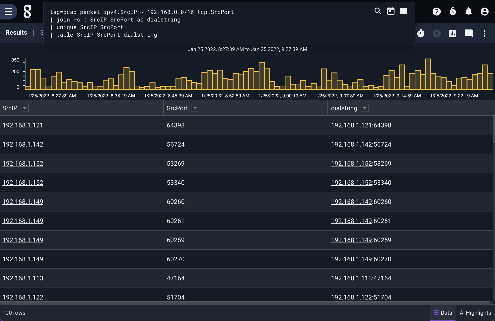

# Join

The join module makes it easier to join two or more enumerated values into a single enumerated value. All enumerated value types are converted to strings and concatenated, except for byte slices which can only be joined to byte slices and will remain byte slices.

The following search will extract the destination IP and port from netflow records and join them with a semicolon as a separator, placing the result in an enumerated value named `dialstring`:

```
tag=netflow netflow Dst DstPort | join -s : Dst DstPort as dialstring | table Dst DstPort dialstring
```

Any number of enumerated values can be specified. An output enumerated value is specified with the `as` argument e.g. `join foo bar as output`; if not given, the first-listed enumerated value will be overwritten.

## Supported Options

* `-s <separator>`: Place the given separator string between the value of each enumerated value in the resulting string. If not specified, no separator will be used. Ignored for byte slices.

## Example

```
tag=pcap packet ipv4.SrcIP ~ 192.168.0.0/16 tcp.SrcPort | join -s : SrcIP SrcPort as dialstring | unique SrcIP SrcPort | table SrcIP SrcPort dialstring
```

