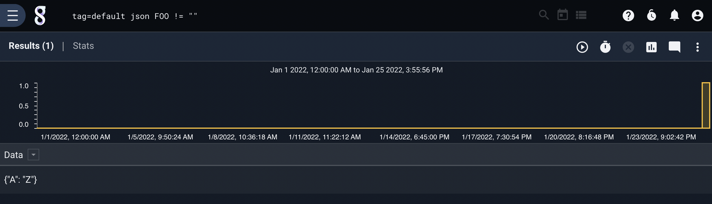
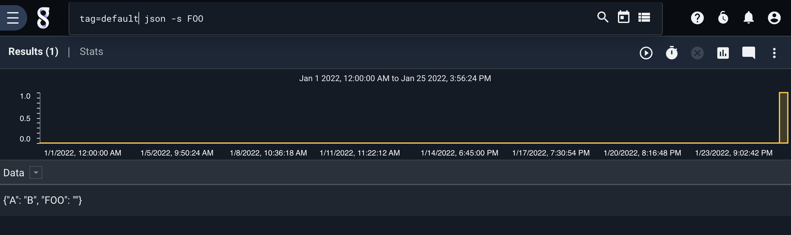
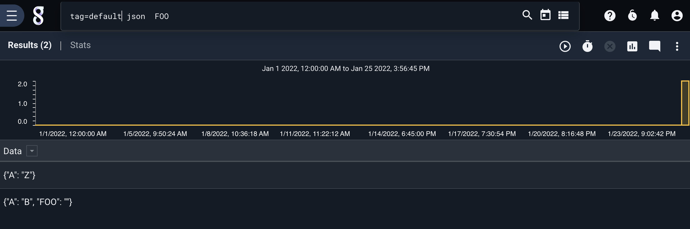

# JSON

jsonモジュールは、検索エントリからデータを抽出し、後で使用するため列挙値にフィルタリングするために使用されます。 JSONは、データが自己記述的であるため、デイトミックな探索に最適なデータ形式です。 JSONモジュールは、項目を抽出して名前を変更したり、抽出した値に基づいてフィルタリングしたりすることができます。 JSONモジュール内で直接フィルタリングすることで、特定のフォーマットのデータを選択するための非常に高速で直感的な方法を提供します。

## サポートされているオプション

* `-e <arg>` : "e" オプションはレコード全体ではなく、列挙値に対して操作します。
* `-s`: "s" オプションは、厳密なモードであることをjsonモジュールに通知します。`json -s foo` と指定すると、"foo" という名前のフィールドを含まないエントリはすべて削除されます。逆に、`json foo` は可能な限り単に "foo" を抽出し、何も削除しません。`json -s foo bar` を指定すると、各エントリは "foo" と "bar" という名前のフィールドを含まなければならないことを意味します。
* `-x <arg>`: "x"オプションは、JSON配列の内容を、配列の値ごとに複数のエントリに展開することを示します。 エントリの残りの部分は同じままです。引数には、現在の抽出物の1つの出力名を指定することも、列挙値を指定することもできます。 したがって、`tag=foo json -x bar foo.bar` と `tag=foo json foo.bar | json -x bar` の両方が有効な起動方法です。

## フィルタリング演算子

JSONモジュールは、平等性に基づくフィルタリングを可能にします。等しさを指定するフィルタが有効になっている場合、フィルタの指定に失敗したエントリは完全に削除されます。 

| 演算子 | 名称 | 意味 |
|----------|------|-------------|
| == | 等しい  | フィールドは等しい|
| != | 等しくない | フィールドは等しくない|
| ~  | 含む | フィールドはその値を含む|
| !~ | 含まない | フィールドはその値を含まない|

注意 : フィールドが"!="ではなく、フィールドが存在しないと指定された場合、フィールドは抽出されませんが、エントリは削除されません。フィールドを全く含まないエントリを削除したい場合は `-s` フラグを使ってください。

## 例
最も多く投稿しているredditt投稿者を見つけるために、以下の検索は各reddit投稿の "Author"フィールドを新しい列挙値に抽出し、各投稿者の出現回数をカウントしてテーブルに格納します。

```
tag=reddit json Author | count by Author | table Author count
```

また、このモジュールはJSONエントリに複数のレイヤーを降順させることもできます。例えば、テストのためにインジェストするShodanのデータでは、エントリーから「リージョンコード」を抽出して、エンドポイントがどこに存在するかを発見することができます。AT&T U-verseの顧客が最も多い州を知りたい場合は、以下のように検索することができます。

```
tag=shodan grep "AT&T U-verse" | json location.region_code | count by region_code | table region_code count
```

### 列挙値の使用

必要であれば、完全な入力データではなく列挙値を操作することもできます。

```
<System><Data>{ "domain". "gravwell.io" }</Data></System> </Data
```

次のコマンドを使ってXML内のJSONを "Data "という名前の列挙値として抽出し、jsonモジュールを適用してドメインの値を "domain "という名前の別の列挙値に解析します:

```
xml System.Data | json -e Data domain
```

### 抽出物の名前を変更

列挙値名は、JSON仕様の最後の名前によって導出されます。先ほどのregion_codeフィールドを抽出した例では、出力は "region_code"列挙値で生成されています。 出力される列挙値名は、"as"引数で上書きすることができます。 次の例はData列挙値からドメインメンバーを抽出し、それを "dd"という名前の新しい列挙値に代入しています:

```
json -e Data domain as dd
```
フィルタ演算子を使用すると、Dataフィールドを抽出することができますが、ドメインが "google.com "という値ではない場合に限ります。フィルタはリネームと組み合わせることができます。

```
json -e Data domain != "google.com" as dd
```

### 引用のルール

JSONフォーマットは非常に自由度が高く、Gravwellが通常'.'や"-"などの区切り文字として扱う文字を含め、すべてのタイプの名前を許可します。JSON名にそのような文字が含まれている場合は、個々のフィールドをダブルクォートで囲み、1つのトークンとして解析します。例えば、このJSON文字列はフィールド名にドット文字を含んでいます:

```
{ "subfield.op": "stuff", "subfield.type": "int", "subfield.value": 99}
```

subfield.opのメンバーを抽出するjsonモジュールの引数の例は次のようになります。

```
json "subfield.op" as sop
```

同様に、次のような入れ子構造を考えてみます:

```
{ "fields"。{ "search-id". 1234, "search-type". "background" } }
```

search-idとsearch-typeにはダッシュ文字が含まれているので、使用する場合は引用符で括る必要があります:

```
json fields. "search-id" fields. "search-type" as type｜"search-id",type｜table "search-id" type count
```

### 配列

jsonモジュールは配列から要素を抽出することができます。次のような構造を考えます：

```
{ "uid"。1, "groups". [17,3] }
```

グループの配列から最初のグループを抽出するには：

```
json groups.
```

(抽出がリネームされていない場合、列挙値は"[0]"という名前になりますが、これは非常に不格好です)

配列を展開するには、配列を抽出し、出力名を `-x` フラグに渡します:

```
json -x groups groups uid
```

これにより、1つのエントリーが、列挙値が `uid=1` と `groups=17` のものと、 `uid=1` と `groups=3` のものの、2つのエントリーになります。

注意: `-x` フラグで配列を展開すると、基礎となる Data フィールドと他のすべての列挙値はそのまま複製され、配列の列挙値のコンテンツのみが変更されます。

配列の要素の中からコンポーネントを抽出することもできます:

```
{ "Metadata" [ {"Value": "john"}, {"Value": "Albuquerque"} ] } } }
```

```
json Metadata.[0].Value as Username
```


## 空フィールドと厳格なフラグ

このモジュールでは、定義されていないフィールドと空の文字列を含むフィールドを区別しています。以下のエントリを考えます：

```
{"A": "B", "FOO". ""}
```

```
{"A": "Z"}
```

最初のエントリには "FOO"というフィールドが含まれていますが、これは空の文字列です。2番目のエントリには "FOO"フィールドが全く含まれていません。

このクエリは最初のエントリを削除して、2番目のエントリを渡します:

```
json FOO!=""
```



次のクエリは2番目のエントリを削除して1番目のエントリを渡し、空の文字列をFOOという名前の列挙型の値に抽出します:

```
json -s FOO
```



このクエリは両方のエントリを渡し、最初のエントリからFOOを抽出します:

```
json FOO
```



このクエリは両方のエントリを削除します。なぜならば、!=フィルターは最初のエントリを除外し、strictフラグは2番目のエントリを除外するからです(FOOという名前のフィールドがないからです):

```
json -s FOO!=""
```
