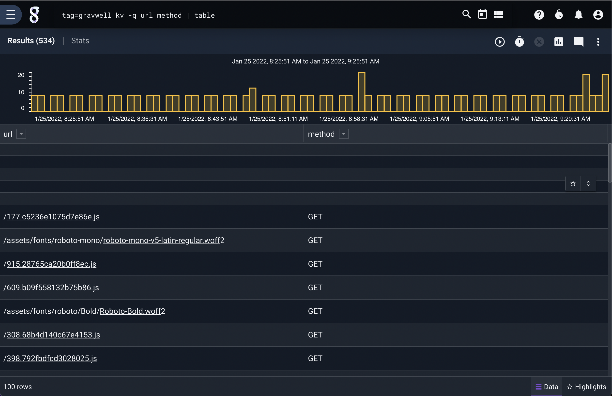
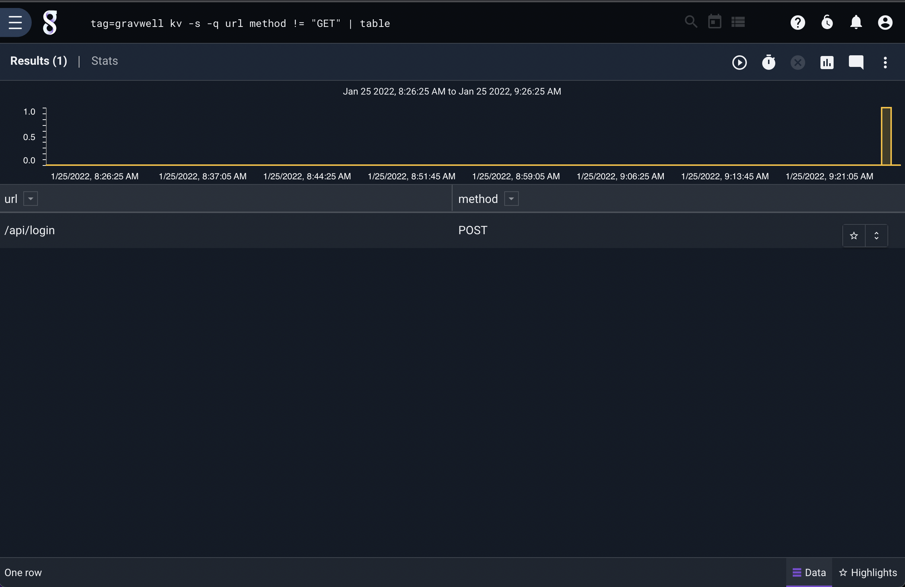

# KV

The kv module is used to extract and filter key-value formatted data from search entries into enumerated values for further analysis. Key-value data consists of one or more key-value pairs, such as `a = 1` or `Name: Fred`.

## Key-Value Terminology

The kv module uses a few specific terms to describe key-value data formats. They are:

* Separator: The character(s) which separate the key from the value, such as '='.
* Delimiters: The character(s) which separate key-value pairs from each other. May also exist between the key and the separator or the separator and the delimiter.

For example, the following entry contains 4 key-value pairs, using '=' as the separator and spaces as the delimiters:

```
x=1 y=2 z=3 foo=bar
```

Note that a key-value pair may also contain delimiters between key, separator, and value. The following is equivalent to the previous entry:

```
x= 1 y = 2 z=3 foo    =  bar
```

This entry contains the same key-value pairs but uses ':' as the separator and '|' as the delimiter:

```
x:1|y:2|z:3|foo:bar
```

## Supported Options

* `-e <arg>`: The "-e" option operates on an enumerated value instead of on the entire record.
* `-sep <separator>`: The "-sep" flag allows the user to specify the separator. This can be one or more characters, for example `-sep EQUALS`.
* `-d <delimiters>`: The "-d" flag specifies the delimiters to use. You can specify multiple delimiters characters; for example, to use double-quote, tab, and space as delimiters, set `-d "\" \t"`.
* `-s`: The "-s" option puts the module into strict mode. In strict mode, an entry will be dropped unless *all* specified extractions succeed.
* `-q`: The "-q" option enables quoted values. This allows values to contain the delimiter characters, e.g. `key="this is the value"`

## Key renaming

Extracted keys can be renamed by appending the directive `as <name>` immediately after a key.  For example, to extract the key "foo" into an enumerated value with the name "bar" the extraction directive would be `foo as bar`.  If no rename directive is provided the extracted values are given the name that matches the key.

## Filtering

The kv module can filter based on string equality. If a filter is enabled that specifies equality ("equal", "not equal", "contains", "not contains") any entry that fails the filter specification on one or more extracted values will be dropped entirely.  If a key is specified as not equal "!=" and the key does not exist, the field is not extracted but the entry won't be dropped entirely (unless `-s` is set).

| Operator | Name | Description |
|----------|------|-------------|
| == | Equal | Field must be equal
| != | Not equal | Field must not be equal
| ~ | Subset | Field contains the value
| !~ | Not Subset | Field does NOT contain the value

## Examples

Given entries generated by the [syslog generator](https://github.com/gravwell/generators) which look like this:

```
<5>1 2019-09-27T09:33:01.362929-06:00 unicorn chatter 14747 - [sofiamartinez461@test.net source-address="1.192.254.26" source-port=47734 destination-address="15.176.86.127" destination-port=626 useragent="Mozilla/5.0 (Windows NT 6.2; WOW64; rv:39.0) Gecko/20100101 Firefox/39.0"] Have I come to Utopia to hear this sort of thing?
```

The following query will extract the source-port and source-address fields and show them in a table:

```
tag=syslog kv -q "source-port" "source-address" | table
```


This query will drop all entries whose source-address does not contain "1.192.":

```
tag=syslog kv -q "source-port" "source-address"~"1.192." | table
```



### Changing the separator

The separator can be set to any string of characters; for example, key-value pairs might look like this:

```
x EQUALS 1 y EQUALS 2
```

You could extract the value of 'y' using the following:

```
kv -sep EQUALS y
```
