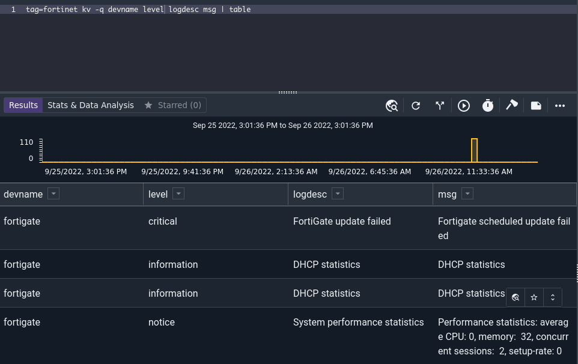
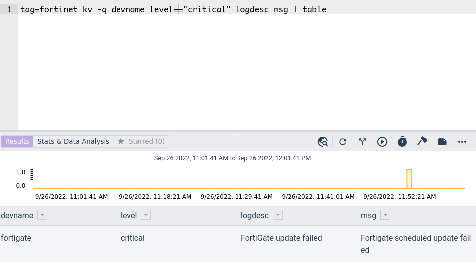

# KV

The kv module is used to extract and filter key-value formatted data from search entries into enumerated values for further analysis. Key-value data consists of one or more key-value pairs, such as `a = 1` or `Name: Fred`.

## Key-Value Terminology

The kv module uses a few specific terms to describe key-value data formats. They are:

* Separator: The character(s) which separate the key from the value, such as '='.
* Delimiters: The character(s) which separate key-value pairs from each other. May also exist between the key and the separator or the separator and the delimiter.

For example, the following entry contains 4 key-value pairs, using '=' as the separator and spaces as the delimiters:

```
x=1 y=2 z=3 foo=bar
```


This entry contains the same key-value pairs but uses ':' as the separator and '|' as the delimiter:

```
x:1|y:2|z:3|foo:bar
```

## Supported Options

* `-e <arg>` (optional): The "-e" option operates on an enumerated value instead of on the entire record.
* `-sep <separator>` (optional): The "-sep" flag allows the user to specify the separator (default "="). This can be one or more characters, for example `-sep EQUALS`.
* `-d <delimiters>` (optional): The "-d" flag specifies the delimiters to use (defaults to the space and tab characters). You can specify multiple delimiters characters; for example, to use double-quote, tab, and space as delimiters, set `-d "\" \t"`.
* `-s` (optional): The "-s" option puts the module into strict mode. In strict mode, an entry will be dropped unless *all* specified extractions succeed.
* `-q` (optional): The "-q" option enables quoted values. This allows values to contain the delimiter characters, e.g. `key="this is the value"`
* `-noclean` (optional): The "-noclean" option will disable trimming left whitespace on extracted tokens, even if the whitespace is contained in the delimiters field. For example `key=   value` would be extracted with the leading 3 spaces intact.

```
x= 1 y = 2 z=3 foo    =  bar
x=1 y=2 z=3 foo=bar
```

## Key renaming

Extracted keys can be renamed by appending the directive `as <name>` immediately after a key.  For example, to extract the key "foo" into an enumerated value with the name "bar" the extraction directive would be `foo as bar`.  If no rename directive is provided the extracted values are given the name that matches the key.

## Filtering

The kv module can filter based on string equality. If a filter is enabled that specifies equality ("equal", "not equal", "contains", "not contains") any entry that fails the filter specification on one or more extracted values will be dropped entirely.  If a key is specified as not equal "!=" and the key does not exist, the field is not extracted but the entry won't be dropped entirely (unless `-s` is set).

| Operator | Name | Description |
|----------|------|-------------|
| == | Equal | Field must be equal
| != | Not equal | Field must not be equal
| ~ | Subset | Field contains the value
| !~ | Not Subset | Field does NOT contain the value

## Examples

Here's a sample of a log entry from a Fortigate firewall:

```
date=2022-09-26 time=10:57:08 devname="fortigate" devid="FGT60EABCDEF012" eventtime=1664215028981468505 tz="-0700" logid="0100041001" type="event" subtype="system" level="critical" vd="root" logdesc="FortiGate update failed" status="update" msg="Fortigate scheduled update failed"
```

It's nicely formatted, using the equals sign as the separator and spaces as delimiters, which are the defaults for the kv module. The following query will extract the devname, level, logdesc, and msg fields and show them in a table:

```gravwell
tag=syslog kv -q devname level logdesc msg | table
```



This query will show only "critical" entries:

```gravwell
tag=syslog kv -q devname level=="critical" logdesc msg | table
```



### Changing the separator

The separator can be set to any string of characters; for example, key-value pairs might look like this:

```
x EQUALS 1 y EQUALS 2
```

You could extract the value of 'y' using the following:

```
kv -sep EQUALS y
```
