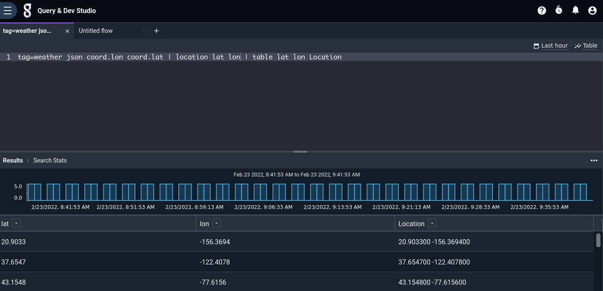
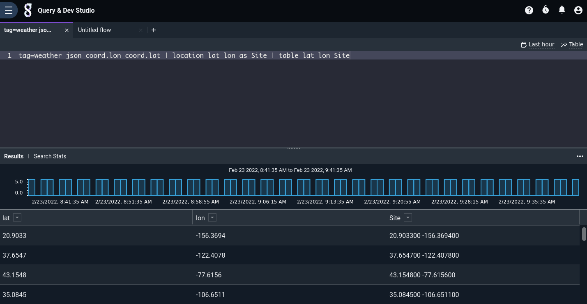

# Location

The location module converts individual latitude & longitude enumerated values into Gravwell location enumerated values. By default, if given a latitude and longitude E.V., it will join them into a new E.V. named Location:

	tag=weather json coord.lon coord.lat | location lat lon | table lat lon Location

The output can be renamed:

	tag=weather json coord.lon coord.lat | location lat lon as Site | table lat lon Site

Multiple latitude/longitude pairs may be specified in the same invocation as long as unique output names are specified for each pair:

	location lat1 lon1 as Loc1 lat2 lon2 as Loc2
