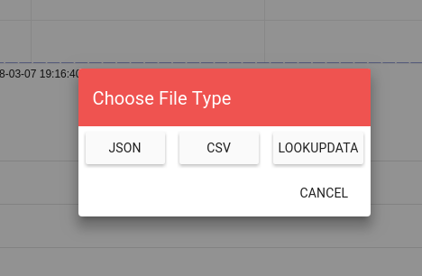
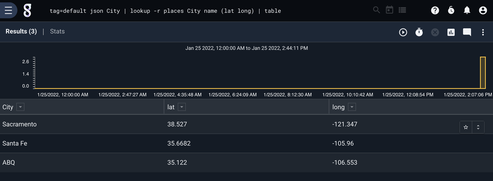

## Lookup

The lookup module is used to do data enrichment and translation off of a static lookup table stored in a resource. The contents of one or more *enumerated values* are compared against values in the *match columns* until a match is found, then the value in that row's *extract column* is extracted into another enumerated value:

```
lookup -r <resource name> <enumerated value> <column to match> <column to extract> as <valuename>
```

Note: If you do NOT provide an ```as <valuename>``` addition to the syntax, lookup will create an enumerated value with the name of the "extracting" column.

Multiple lookup operations can be specified in a single invocation of the lookup module by stringing together additional operations:

```
lookup -r mytable A B C as foo D E F
```

You can also extract multiple columns for each match. The following example matches the contents of enumerated value A against the values in column B; when a match is found, it extracts both columsn C and D:

```
lookup -r mytable A B (C as foo D as bar)
```

Lookup also supports vectored matches, this means you can match a set of enumerated values against a set of columns.  Vectored matches are performed by specifying match and extraction lists.  When performing vectored matches the number of extracted enumerated values much match the number of columns to match against.

```
lookup -r mytable [A B] [A B] (C as foo D as bar)
```

### Supported Options
* `-r <arg>`: The "-r" option informs the lookup module which lookup resource should be used to enrich data.
* `-s`: The "-s" option specifies that the lookup modules should require that all extractions succeed or the entry will be dropped.
* `-v`: The "-v" flag inverts the flow logic in the lookup module, meaning that successful matches are suppressed and missed matches are passed on.  The "-v" and "-s" flags can be combined to provide basic whitelisting, passing only values which do not exist in the specified lookup table.

Note: When using the `-s` or `-v` flags it is legal to specify that no extractions are to take place.  This operation can be useful when performing whitelisting or blacklisting.

Here is an example that ensures that enumerated values `A` and `B` exist in the columns `X` and `Y` but does not enchrich data.

```
lookup -v -r mytable [A B] [X Y] ()
```

### Setting up a lookupdata resource

Lookup data can be downloaded from compatible render modules (e.g. the table module) and stored in a resource for sharing and utilization. Using the menu on the search results page, we can opt to download a table of search results in this format by selecting "LOOKUPDATA".



The [table renderer](#!search/table/table.md) also provides a `-save` option, which will automatically save the search result table as a resource for later use by lookup:

```
tag=syslog regex "DHCPACK on (?P<ip>\S+) to (?P<mac>\S+)" | unique ip mac | table -save ip2mac ip mac
```

In the above example, the table renderer automatically creates a resource named 'ip2mac' which contains a mapping of IP addresses to MAC addresses as derived from DHCP logs.

#### CSV tables

CSV data can also be used for the lookup module. In order to use a csv file as a resource in the Gravwell lookup search module the CSV must contain unique headers for the columns.

### Examples

#### Basic Extraction

In this example, we have a resource called "macresolution" which was created from the following csv:
```
mac,hostname
mobile-device-1,40:b0:fa:d7:af:01
desktop-1,64:bc:0c:87:bc:71
mobile-device-2,40:b0:fa:d7:ae:02
desktop-2,64:bc:0c:87:9a:11
```

Then we issue a search off of packet data and use the lookup module to enrich our data stream to include hostnames, which in this case we are assigning to the "devicename" enumerated value.

```
tag=pcap packet eth.SrcMAC | count by SrcMAC | lookup -r macresolution SrcMAC mac hostname as devicename |  table SrcMAC devicename count
```

This results in a table containing the following:

```
64:bc:0c:87:bc:71	|	desktop-1       	|	52183
40:b0:fa:d7:ae:02	|	mobile-device-2 	|	21278
64:bc:0c:87:9a:11	|	desktop-2       	|	 2901
40:b0:fa:d7:af:01	|	mobile-device-1 	|	  927
```

#### Whitelisting

Using the same "macresolution" table shown above:

```
tag=pcap packet eth.SrcMAC | count by SrcMAC | lookup -v -s -r macresolution SrcMAC mac hostname |  table SrcMAC count
```

This results in a table containing any mac addresses which were **not** in the look up list.  System administrators can use the "-v" and "-s" flag to provide basic white listing and identification of new devices on a network or new logs in an event stream.

```
64:bc:0c:87:bc:60	|	24382
40:b0:fa:d7:ae:13	|	93485
64:bc:0c:87:9a:02	|	11239
40:b0:fa:d7:af:fe	|	   21
```

#### Multiple Extraction

Consider the following lookup table named "places":

```
name,lat,long
Albuquerque,35.122,-106.553
Santa Fe,35.6682,-105.96
Sacramento,38.527,-121.347
```

Given the name of a city, we'd like to be able to extract both latitude and longitude values. Assuming we're working with JSON entries with contain a "City" field, the following query will do exactly that:

```
tag=default json City | lookup -r places City name (lat long) | table
```

It matches the enumerated value City against the table's "name" column, then when a match is found it extracts both "lat" and "long", as shown below:


