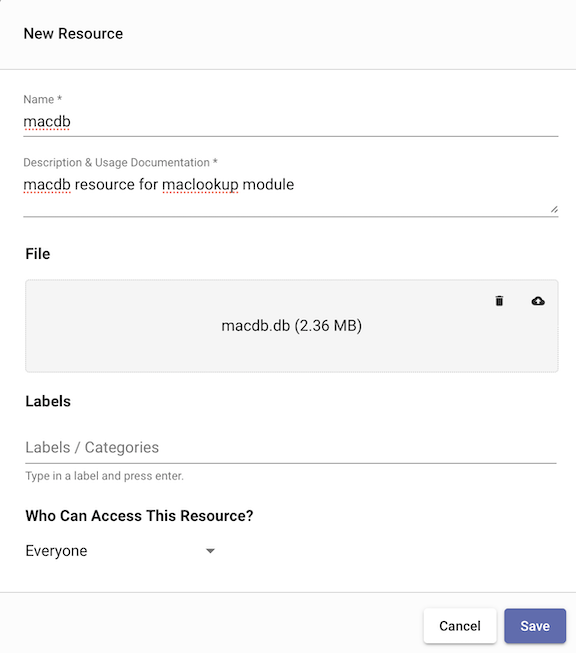
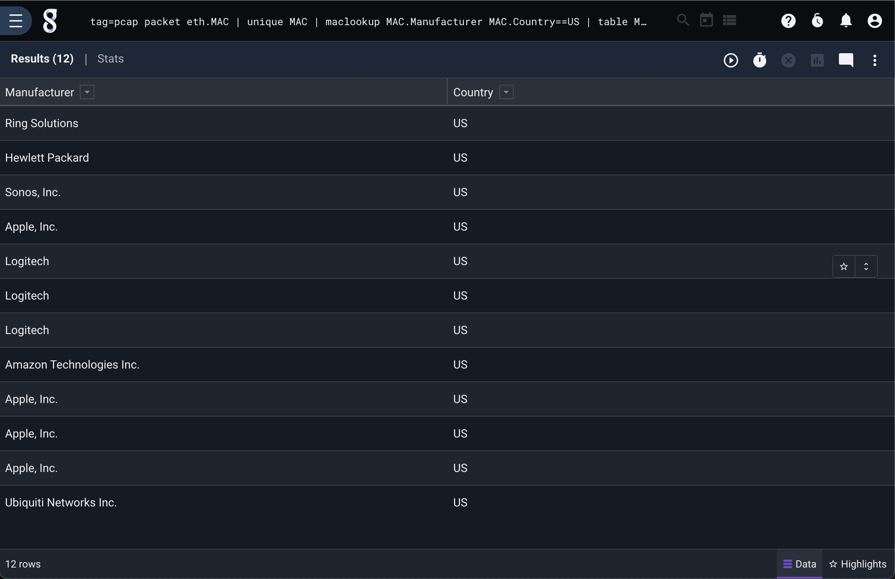
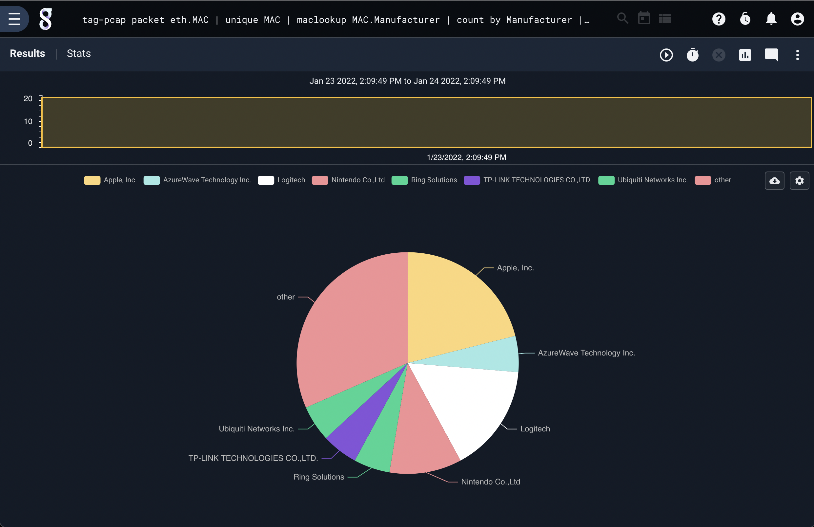

## maclookup 

The maclookup module uses a custom MAC prefix database to extract Manufacturer, Address, and Country information about the owner of a block of MAC addresses. 

### Setting Up Databases

Before using the maclookup module, you must install a [resource](#!resources/resources.md) containing the macdb database. 

By default, the maclookup module expects the macdb database to be in a resource named "macdb". This will allow you to do extractions without specifying the resource name explicitly.



### Supported Options

* `-r <arg>`: The “-r” option specifies the resource name or UUID which contains a macdb database.  If no "-r" is specified the geoip module uses the default "macdb" resource name.
* `-s`: The “-s” option specifies that the maclookup module should operate in strict mode.  In strict mode, if any of the specified operators cannot resolve a MAC, the entry is dropped.

### Processing Operators

The maclookup extractors support direct operators that allow for very fast filtering in the module. These filters can enable fast filtering of entries based on manufacturer, address, or country. Extraction filters support equal to (==), not equal to (!=), and subset (~) operators. Multiple operators can be specified in a single invocation of the maclookup module, and the output enumerated value names can be modified using the "as" directive. 

| Operator | Name | Description
|----------|------|-------------
| == | Equal | Field must be equal
| != | Not equal | Field must not be equal
| ~ | Subset | Field must be a member of
| !~ | Not subset | Field must not be a member of

### Data Item Extractors

The following extractions are possible with the maclookup database:

| Extractor | Operators | Description | Example 
|-----------|-----------|-------------|----------
| Manufacturer | == != ~ !~ | Manufacturer name, such as "Apple Inc.", "IBM" | mac.Manufacturer~Apple
| Address | == != ~ !~ | Address, such as "One Apple Park Way, Cupertino, CA" | mac.Address~Cupertino as addr
| Country | == != ~ !~ | Country code | mac.Country == "US"

### Examples

### Listing all manufacturers from PCAP with from the US.

```
tag=pcap packet eth.MAC | maclookup MAC.Manufacturer MAC.Country == US | table
```



### Pie chart of manufacturers from PCAP.

```
tag=pcap packet eth.MAC | maclookup mac.Manufacturer | count by Manufacturer | chart count by Manufacturer
```




