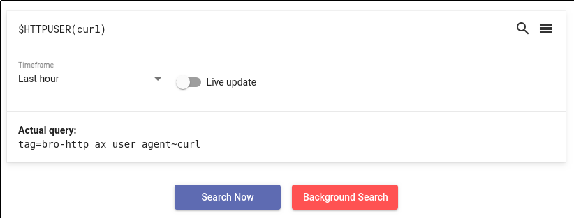
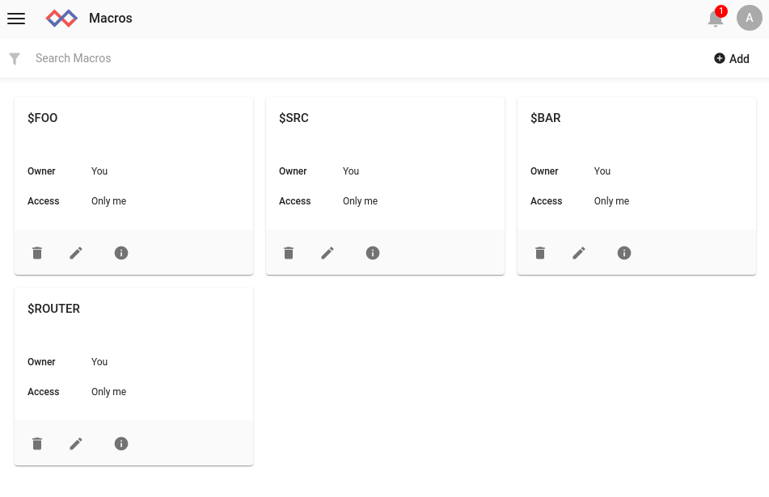
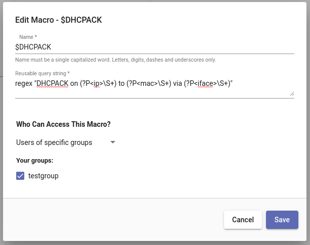

# 検索マクロ

検索マクロは、Gravwellをより効果的に使うための強力な機能です。マクロは、長くて反復的な検索クエリを、覚えやすいショートカットに変えることができます。

## マクロの基礎

マクロは、基本的には検索クエリの文字列に適用される文字列置換ルールです。マクロは、短い名前($MYMACRO のような)を長い文字列にマッピングします。Gravwellが検索クエリを解析するとき、マクロ名(ドル記号の後に少なくとも1つの大文字または数字が続くように定義されている)を探し、検索を開始する前に置換を行います。マクロを使用すると、GUIにはクエリの拡張バージョンが表示されます。

例えば、`$DHCPACK`というマクロを定義すると、`regex "DHCPACK on (?P<ip>\S+) to (?P<mac>\S+) via (?P<iface>S+)`に展開されます。例えば、`tag=syslog $DHCPACK | unique ip mac | table ip mac`のように、そのマクロをregex呼び出しの代わりに使うことができます。

マクロは、タグ指定、検索モジュール、レンダリングモジュールなど、通常の Gravwell クエリの任意の部分を含むことができます。マクロはクエリ全体を含むこともできますが、クエリ全体を格納するには検索ライブラリの方が便利なツールです。

### マクロ引数

マクロは引数を使って定義することができます。引数を取るマクロを定義するには、クエリ文字列の中に `%%1%%`, `%%2%%` などの形式の置換ディレクティブを入れます。これらのディレクティブは、実行時に与えられた引数に置き換えられます。例えば、`tag=bro-http ax user_agent~"%%1%%"`と展開する `HTTPUSER` というマクロを定義するとします。後で、CやPythonの関数のように引数をマクロに渡すことができます。

### ネストされたマクロ

マクロは別のマクロを含むことができます。マクロ `$FOO` を定義して `tag=foo json timestamp $BAR` に展開することができます; マクロを使用すると、Gravwell はその展開に別のマクロが含まれていることを認識し、順番に $BAR マクロも展開します。

Gravwellは、マクロループが存在する場合には無限の再帰をキャッチしますが、数回の反復のためにマクロを展開し続けます。

## マクロの定義

マクロ管理ページは、Gravwellのメインメニューにあります。

新しいマクロを追加するには、右上の「追加」ボタンを選択します。マクロ名とクエリ文字列の入力を求めるウィンドウが表示されます。

