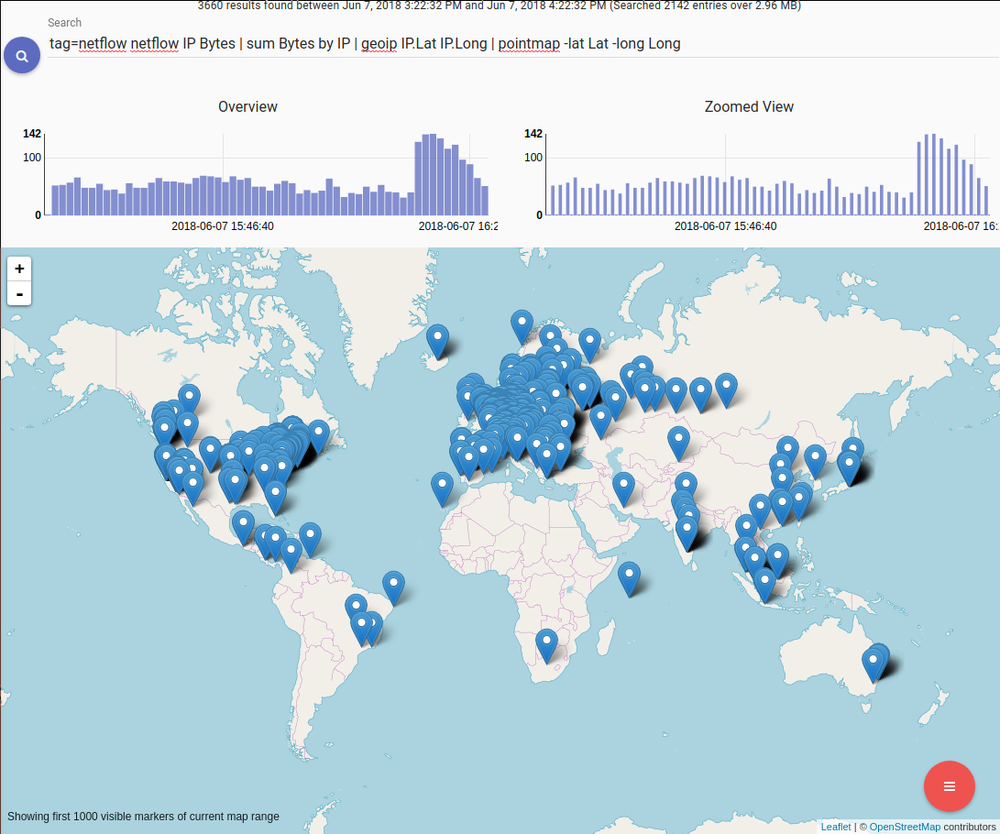
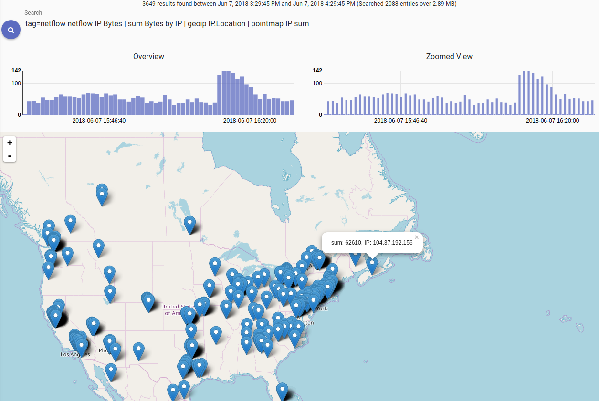
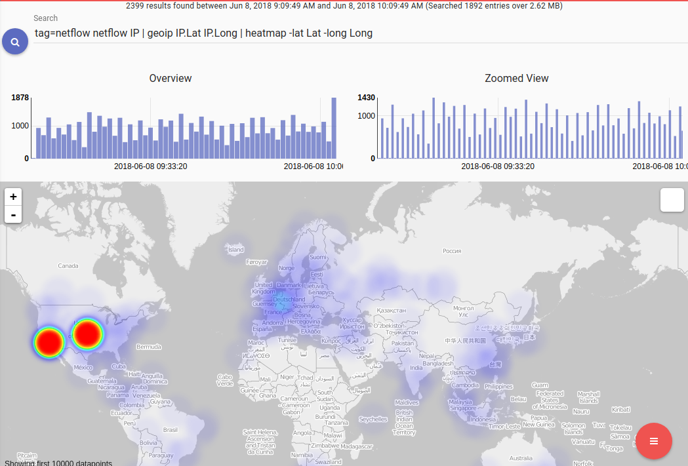
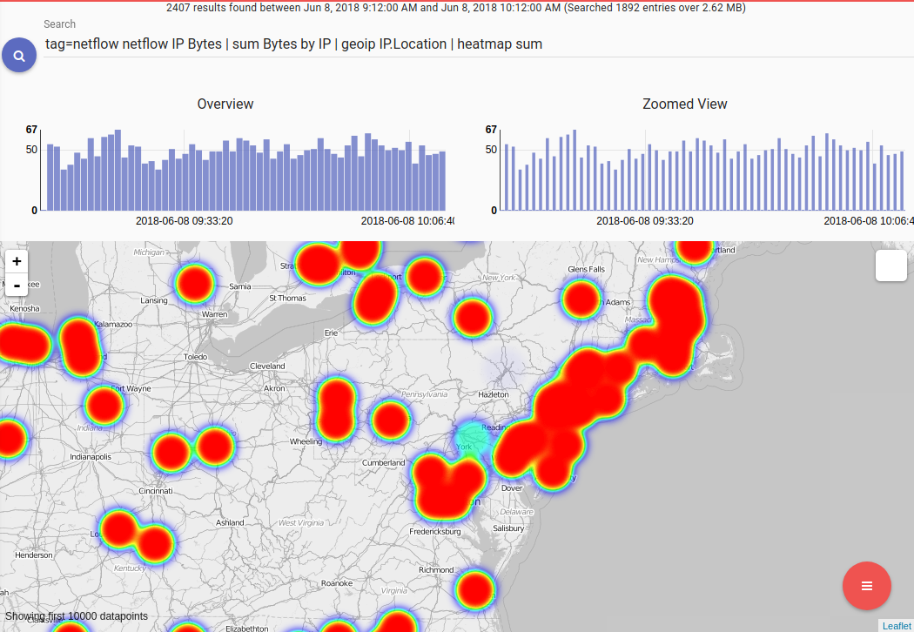

# Map modules

The `pointmap` and `heatmap` renderer modules translate search results onto a map. Both place entries on the map based on locations in enumerated values. By default, the modules look for an enumerated value called 'Location', as set by the [geoip](#!search/geoip/geoip.md) search module. Locations can also be specified explicitly using the following:

* `-loc <enumerated value>` tells the module to look for a location in the specified enumerated value, rather than the default `Location`.
* `-lat <enumerated value> -long <enumerated value>` tells the module to look for the latitude and longitude values separately. These can be floating point numbers (as delivered by the `geoip` module) or strings from another source.

The map will display a maximum of 1000 points. It is geofenced, meaning that zooming in on one portion of the map will display up to 1000 points within that area.

# Pointmap

Pointmap translates entries into distinct markers on the map. If additional enumerated value names are specified, their contents will be displayed when a point is clicked.

The following search displays a map of all IP addresses captured in netflow records:

```
tag=netflow netflow IP | geoip IP.Location | pointmap
```



If we sum up the number of bytes from each IP and add the IP and Bytes enumerated values to pointmap's arguments, they will appear when we click on a point:

```
tag=netflow netflow IP Bytes | sum Bytes by IP | geoip IP.Location | pointmap IP Bytes
```



# Heatmap

Heatmap operates similarly to pointmap, but it takes 0 or 1 additional enumerated values as arguments. If no enumerated value argument is given, it generates a heat map using the number of entries for each location as the 'heat'. In this example using netflow records, the 'heat' represents the number of connections from a location:

```
tag=netflow netflow IP | geoip IP.Lat IP.Long | heatmap -lat Lat -long Long
```



If we add the total number of bytes as an argument, the 'heat' is derived from the number of bytes sent over the connection, rather than the number of connections:

```
tag=netflow netflow IP Bytes | sum Bytes by IP | geoip IP.Location | heatmap sum
```

