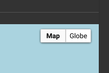
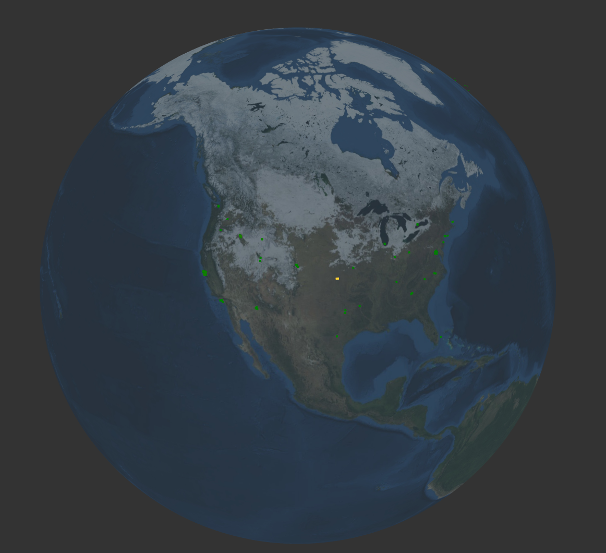

# マップモジュール

`pointmap` と `heatmap` のレンダラモジュールは、検索結果を地図上に変換します。どちらも、列挙値の位置に基づいて、地図上にエントリを配置します。デフォルトでは、[geoip](#!search/geoip/geoip.md) 検索モジュールで設定された 'Location' と呼ばれる列挙型の値を検索します。ロケーションは、以下のようにして明示的に指定することもできます。

* `-loc <列挙値>` は、デフォルトの `Location` ではなく、指定された列挙値の中からロケーションを探すようにモジュールに指示します。
* `-lat <列挙値> -long <列挙値>` は、緯度と経度の値を別々に探すようにモジュールに指示します。これらの値は、浮動小数点数（`geoip`モジュールによって提供されるもの）または他のソースからの文字列です。

マップには最大 1000 地点が表示されます。地図の一部を拡大すると、その範囲内で最大 1000 地点が表示されます。

# pointmap

pointmap は、エントリを地図上の明確なマーカーに変換します。追加の列挙値名が指定された場合、ポイントがクリックされたときにその内容が表示されます。

以下の検索では、netflow レコードに取り込まれたすべての IP アドレスのマップが表示されます。

```
tag=netflow netflow IP | geoip IP.Location | pointmap IP
```


各 IP からのバイト数を集計し、IP と Bytes の列挙値を pointmap の引数に追加すれば、ポイントをクリックしたときに表示されます（誰と話しているのかわかるように、ASN組織も追加しています）。

```
tag=netflow netflow IP Bytes | sum Bytes by IP | geoip IP.Location | geoip -r maxmindASN IP.ASNOrg | pointmap IP Bytes ASNOrg
```


# heatmap

heatmap は pointmap と同様の動作をしますが、引数として 0 または 1 の追加の列挙値を受け取ります。列挙値の引数が与えられない場合は、各場所のエントリ数を「heat」としてヒートマップを生成します。netflow レコードを使用したこの例では、「heat」はある場所からの接続数を表しています。

```
tag=netflow netflow IP | geoip IP.Lat IP.Long | heatmap -lat Lat -long Long
```


総バイト数を引数に加えれば、「熱」は接続数ではなく、接続で送られたバイト数から得られます。

```
tag=netflow netflow IP Bytes | sum Bytes by IP | geoip IP.Location | heatmap sum
```


## 3D について

heatmap と pointmap には 3D レンダリング機能もあり、マップの右上にある「Globe」セレクターをクリックすると、マップが再描画されます。



全く同じ heatmap クエリを実行しますが、Globe システムを使ってレンダリングすると以下のようになります。



しかし、もう1つ、非常に気の利いた仕掛けがあります。ローテーションを追加することで、あなたが世界的な脅威についてリアルタイムに考えていることを、上司全員に知らせることができます。


