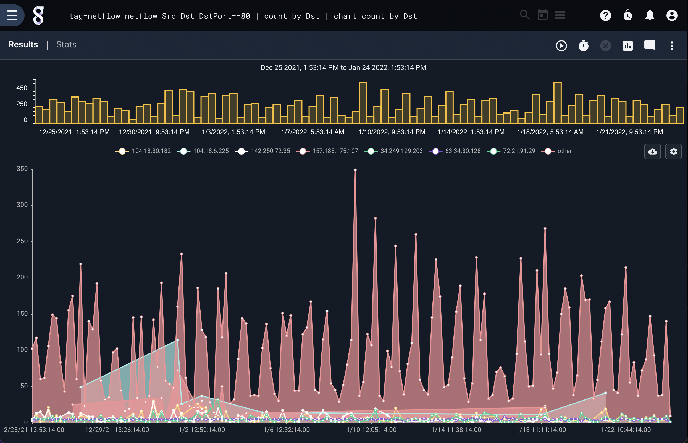
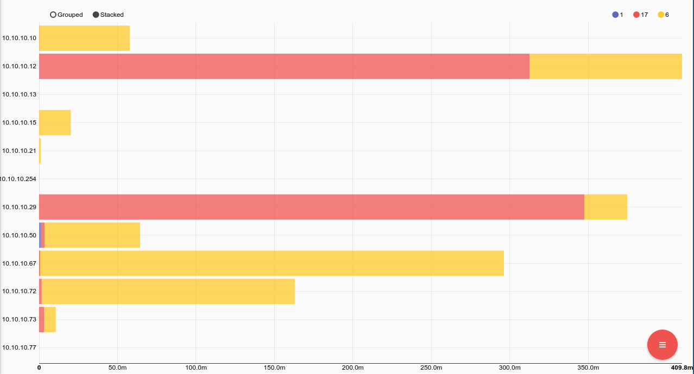

## Netflow

The netflow processor is designed to extract and filter raw netflow data frames, allowing for quickly identfying network flows, filtering on ports, or generally monitoring the behavior of aggregate flows.  Gravwell has a native netflow ingester which is open source and avialable at https://github.com/gravwell/ingesters or as an installer in the [quickstart section](/#!quickstart/downloads.md).

### Supported Options

* `-e`: The “-e” option specifies that the netflow module should operate on an enumerated value.  Operating on enumerated values can be useful when you have extracted a netflow frame using upstream modules.  You could extract netflow frames from raw PCAP and pass the frames into the netflow module.

### Processing Operators

Each netflow field supports a set of operators that can act as fast filters.  The filters supported by each operator are determined by the data type of the field. Numeric values support everything but the subset operators and IP addresses support just the subset operators.

| Operator | Name | Description |
|----------|------|-------------|
| == | Equal | Field must be equal
| != | Not equal | Field must not be equal
| < | Less than | Field must be less than
| > | Greater than | Field must be greater than
| <= | Less than or equal | Field must be less than or equal to
| >= | Greater than or equal | Field must be greater than or equal to
| ~ | Subset | Field must be a member of
| !~ | Not subset | Field must not be a member of


### Data Items

The netflow search module is designed to process raw netflow frames.  A single netflow frame consists of a header and N records; for Netflow V5 N must be > 0 and < 31.  Each data item in a netflow record can be extracted and used as a filter.  When filtering on Header data items, the filter applies to all records in the frame.  Header data items are processed first, and only if the header filters do not drop the frame are the records processed.  The netflow processor is an expanding module; expanding modules break input entries into multiple output entries.  This means that when using the netflow module more entries can come out of the pipeline than were fed in.

#### Netflow v5 Header Data Items

| Field |       Description        | Supported Operators | Example |
|-------|--------------------------|---------------------|---------|
| Count | The number of records in the netflow frame | > < <= >= == != | Count >= 10
| Version | The Netflow frame version | > < <= >= == != | Version == 5
| Uptime | Total number of seconds the netflow sensor has been active | > < <= >= == != | Uptime > 0x100000
| Sec | Current Unix timestampe of the sensing device | > < <= >= == != | Sec == 1526511023
| NSec | Residual nanoseconds for the current time of the sensing device | > < <= >= == != | Nsec > 0x100101
| Sequence | Sequence counter of total flows on the sensing device | > < <= >= == != | Sequence == 1
| EngineType | The type of flow-switching engine | > < <= >= == != | EngineType == 0x1A
| EngineID | The ID for the flow sensing engine | > < <= >= == != | EngineID == 0x00
| SampleMode | 2 bit ID for the Sampling mode of the sensing engine | > < <= >= == != | SampleMode == 0x01
| SampleInterval | 14 bit value represening the sampling interval of the sensing engine | > < <= >= == != | SampleInterval > 0x100

#### Netflow v5 Record Data Items

| Field |       Description        | Supported Operators | Example |
|-------|--------------------------|---------------------|---------|
| IP | Extract the first IP that matches a filter.  If no filter is specified the Src is used | ~ !~ == != | IP ~ 10.0.0.0/24 
| Port | Extract the first Port that matches the filter.  If no filter is specified the SrcPort is used | > < <= >= == != | Port == 80
| Src | Source IPv4 address in the flow record | ~ !~ == != | Src !~ 192.168.1.0/24
| Dst | Destination IPv4 address in the flow record | ~ !~ == != | Dst ~ 10.0.0.0/16
| Next | Next hop address in the flow record | ~ !~ | Next == 1.2.3.4
| Input | SNMP index of the input interface | > < <= >= == != | Input == 1
| Output | SNMP index of the output interface | > < <= >= == != | Output != 1
| Pkts | Total number of packets in the flow | > < <= >= == != | Pkts > 10
| Bytes | Total number of bytes in the flow | > < <= >= == != | Bytes < 1400
| UptimeFirst | Uptime of the sensing engine when the first packet was seen | > < <= >= == != | UptimeFirst != 0
| UptimeLast | Uptime of the sensing engine when the last packet was seen | > < <= >= == != | UptimeLast > 0x10000
| SrcPort | Source port of the flow.  If the protocol does not have a port the value is zero | > < <= >= == != | SrcPort != 0
| DstPort | Destination port of the flow.  If the protocol does not have a port the value is zero | > < <= >= == != | DstPort == 0
| Flags | Cumulative OR of TCP flags for the flow | > < <= >= == != | Flags == 0x7
| Protocol | Protocol number of the flow (TCP = 6, UDP = 17 | > < <= >= == != | Protocol == 17
| ToS | IP type of the flow | > < <= >= == != | ToS == 19
| SrcAs | Source Autonomous System Number of the flow | > < <= >= == != | SrcAS == 15169
| DstAs | Source Autonomous System Numer of the flow | > < <= >= == != | DstAs != 15169
| SrcMask | Source IPv4 address mask bits | > < <= >= == != | SrcMask > 24
| DstMask | Destination IPv4 address mask bits | > < <= >= == != | | DstMask <= 16

### Examples

#### Number of HTTP flows by Source IP over time

```
tag=netflow netflow Src Dst Port==80 | count by Src | chart count by Src limit 24
```



#### Total traffic by IP and Protocol

```
tag=netflow netflow IP Protocol Bytes as traffic | sum traffic by IP,Protocol | stackgraph IP Protocol sum
```


