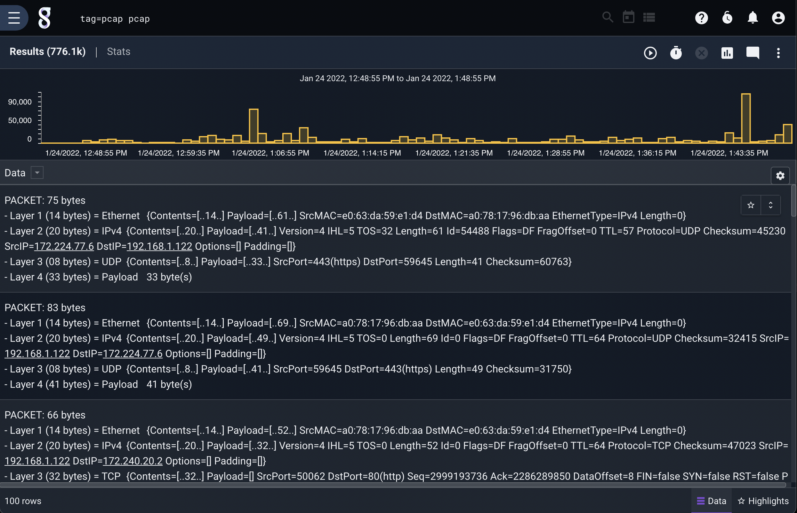
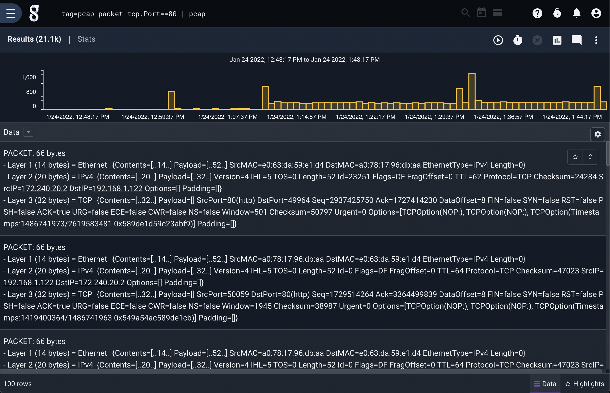
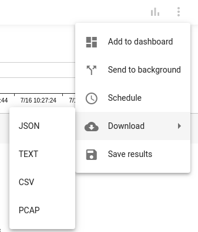

# PCAP

The pcap renderer attempts to decode entries as packets and display them in a human-readable text format. It will, for instance, display the various flags and options set at the Ethernet, IP, and TCP layers of a packet. It can also decode 802.11 packets as captured from a wireless interface in monitor mode.

The pcap renderer has a special download option, named simply 'pcap', which allows you to save the packets in the current query as a Wireshark-readable packet capture file.

The pcap renderer has no option flags and takes no arguments.

## Sample Queries

The following query assumes the "packet" tag contains packets captured with the Network Capture ingester. It simply displays the packets as text. This is a way to get a general look at what kind of traffic might exist on your network:

```
tag=packet pcap
```



You can also restrict the entries by using search modules as usual:

```
tag=packet packet tcp.Port==80 | pcap
```



Having determined that this traffic appears interesting, you can click the Download button to save it in the PCAP format for further inspection with a tool such as Wireshark.


