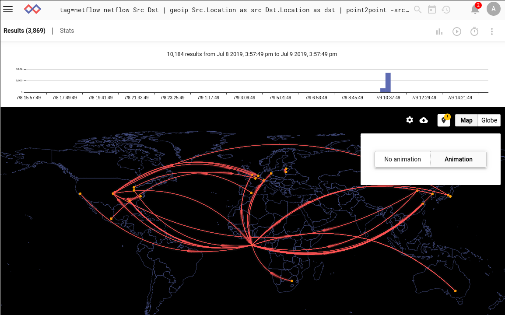

# Point-to-Pointレンダラー

ポイントツーポイントレンダラー（point2point）は、地理的な"始点"と"終点"を持つデータを表示するために使用されます。たとえば、すべてのネットフローレコードの送信元/宛先の場所を表示し、どの国が最もトラフィックを受け取っているかを視覚的に推定できます。

## サポートされているオプション
レンダラーでは、各エントリのソースとデスティネーションの両方に緯度/経度座標を指定する必要があります。これらは、[geoip module](#!search/geoip/geoip.md)によって生成されるLocation列挙値のペアにすることができます:

* `-srcloc <enumerated value>`は、ソースの場所を含む列挙値の名前を提供します。
* `-dstloc <enumerated value>` は、宛先の場所を含む列挙値の名前を提供します。

または、送信元と送信先ごとに個別の緯度と経度の列挙値にすることもできます:

* `-srclat <enumerated value>` は、ソースの緯度を含む列挙値の名前を提供します。
* `-dstlat <enumerated value>` は、宛先の緯度を含む列挙値の名前を提供します。
* `-srclong <enumerated value>` は、ソースの経度を含む列挙値の名前を提供します。
* `-dstlat <enumerated value>`は、目的地の経度を含む列挙値の名前を提供します。

デフォルトでは、レンダラーは指定されたソースと宛先のエントリの数をカウントし、それを行の大きさとして使用します。代わりに、-magオプションを使用して代替の大きさを指定できます:

* `-mag <enumerated value>`は、行に適用されるべき大きさを含む列挙値の名前を提供します。

## 基本的な使用法

ポイントツーポイントレンダラーを使用する最も簡単な方法は、このクエリのnetflowレコードから抽出されたLocation列挙値のセットを渡すことです:

```
tag=netflow netflow Src Dst | geoip Src.Location as src Dst.Location as dst | point2point -srcloc src -dstloc dst
```


緯度と経度を別々に渡すことも、緯度/経度と場所を使用することもできます:

```
tag=netflow netflow Src Dst | geoip Src.Lat as slat Src.Long as slong Dst.Location as dst | point2point -srclat slat -srclong slong -dstloc dst
```

オプションメニューを選択すると、アニメーションマップ表示と非アニメーションマップ表示を切り替えることができます:



'globe'ボタンを選択すると、3Dグローブ表示に切り替わります:


注：上の写真の多くの弧は、アフリカの西海岸で終わっています。これは、プライベートIPアドレスがゼロ値の場所、緯度0°、経度0°にマッピングされるためです。マップ表示の右上に、黄色の通知バッジが付いたマップの「ピン」を示すボタンがあります。これをクリックすると、値がゼロの場所を再マップして、プライベートIPアドレスが自分の場所にマップされるようにすることができます。緯度と経度を手動で指定するか、[現在の場所を使用]をクリックして、ブラウザから現在地をリクエストできます。


## 大きさの指定

デフォルトでは、ポイントを接続する線の大きさは、これらのソース値と宛先値を持つエントリの数であり、次と同等です:

```
tag=netflow netflow Src Dst | geoip Src.Location as src Dst.Location as dst | count by src,dst | point2point -srcloc src -dstloc dst -mag count
```

代わりに、ネットワークからキャプチャされたIPv4パケットの平均サイズを確認したい場合は、次のクエリを実行できます:

```
tag=pcap packet ipv4.SrcIP ipv4.DstIP ipv4.Length | geoip SrcIP.Location as src DstIP.Location as dst | mean Length by src,dst | point2point -srcloc src -dstloc dst -mag mean
```


レンダラーは、必要に応じて平均の平均、合計の計算などを正しく処理します。