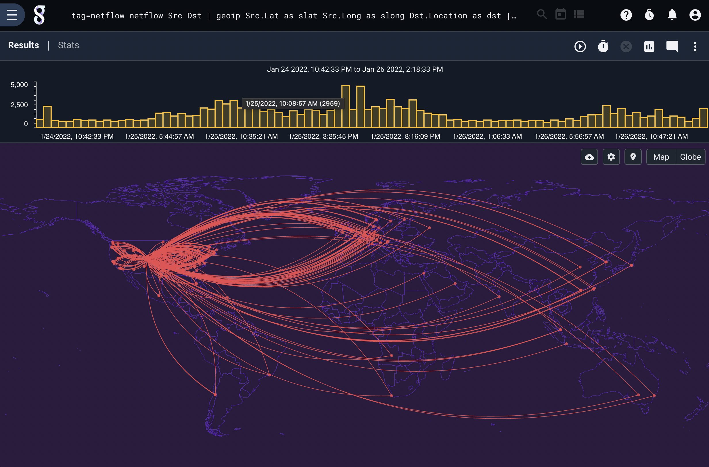
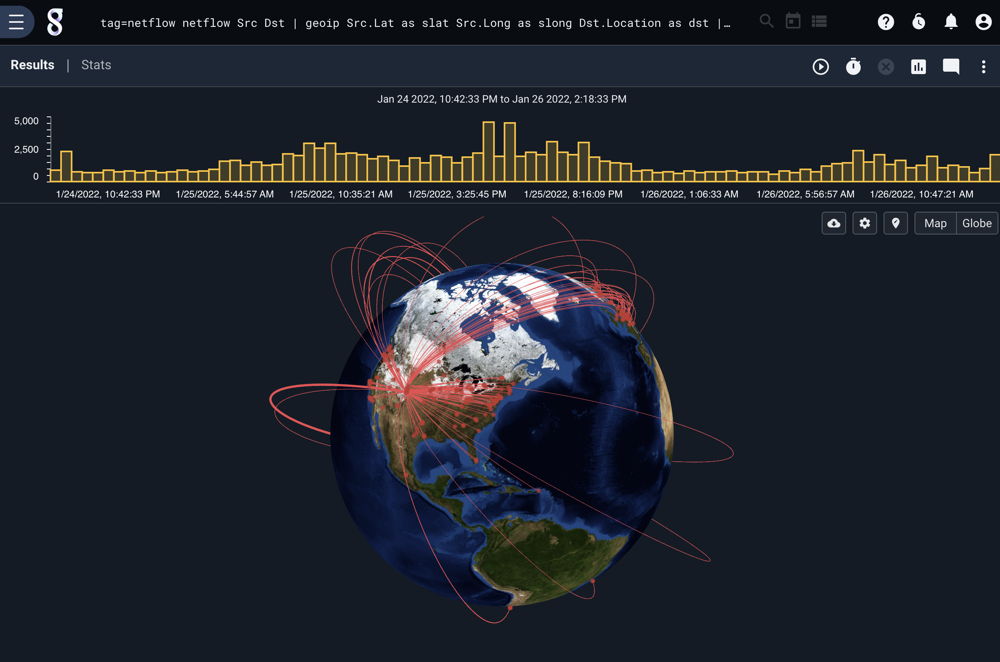
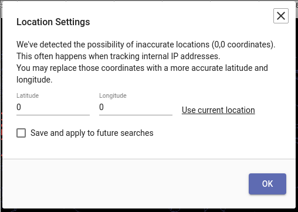
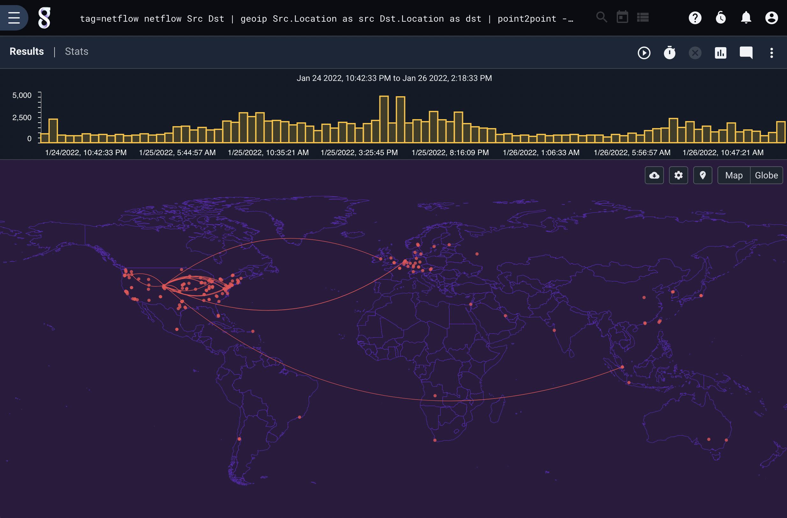

# Point-to-Point renderer

The point-to-point renderer (point2point) is used to display data which has a geographic "origin" and "destination". For instance, it could show the source/destination locations of all netflow records, giving a visual estimate of which countries receive the most traffic.

## Supported Options
The renderer requires that you specify latitude/longitude coordinates for both the source and destination of each entry. These can be a pair of Location enumerated values (as generated by the [geoip module](#!search/geoip/geoip.md):

* `-srcloc <enumerated value>` gives an enumerated value name containing the Location for the source.
* `-dstloc <enumerated value>` gives an enumerated value name containing the Location for the destination.

Or it can be a separate latitude and longitude enumerated value for each of the source and destination:

* `-srclat <enumerated value>` gives an enumerated value name containing the latitude of the source.
* `-dstlat <enumerated value>` gives an enumerated value name containing the latitude of the destination.
* `-srclong <enumerated value>` gives an enumerated value name containing the longitude of the source.
* `-dstlat <enumerated value>` gives an enumerated value name containing the longitude of the destination.

By default, the renderer counts the number of entries with a given source and destination and uses that as the magnitude of the line. You can instead specify an alternative magnitude using the -mag option:

* `-mag <enumerated value>` gives the name of an enumerated value containing the magnitude which should be applied to the line.

## Basic Usage

The simplest way to use the point-to-point renderer is by passing it a set of Location enumerated values, as extracted from netflow records in this query:

```
tag=netflow netflow Src Dst | geoip Src.Location as src Dst.Location as dst | point2point -srcloc src -dstloc dst
```



You can also pass latitude and longitude separately, or mix the use of lat/long and Locations:

```
tag=netflow netflow Src Dst | geoip Src.Lat as slat Src.Long as slong Dst.Location as dst | point2point -srclat slat -srclong slong -dstloc dst
```

Selecting the 'globe' button switches to a 3d globe display:



Note: Many arcs in the pictures above end off the west coast of Africa. This is because private IP addresses map to the zero-value location, 0° latitude by 0° longitude. There is a button visible in the upper right of the map display showing a map "pin" with a yellow notification badge on it; clicking this will allow you to re-map the zero-value location so that private IP addresses map to your location. You can either manually specify latitude and longitude, or click "Use current location" to request your location from the browser.



## Specifying Magnitude

By default, the magnitude of the lines connecting points is the number of entries with those source and destination values, equivalent to the following:

```
tag=netflow netflow Src Dst | geoip Src.Location as src Dst.Location as dst | count by src,dst | point2point -srcloc src -dstloc dst -mag count
```

If instead you wanted to see the average size of IPv4 packets captured off the network, you could run the following query:

```
tag=pcap packet ipv4.SrcIP ipv4.DstIP ipv4.Length | geoip SrcIP.Location as src DstIP.Location as dst | mean Length by src,dst | point2point -srcloc src -dstloc dst -mag mean
```



The renderer will correctly handle computing the mean of means, the sum of sums, etc. as needed.
