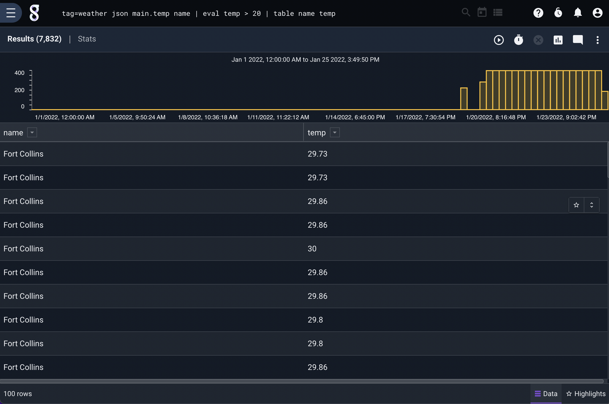
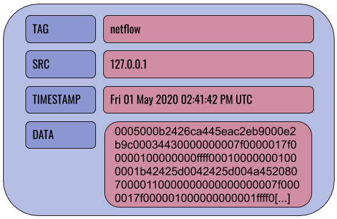
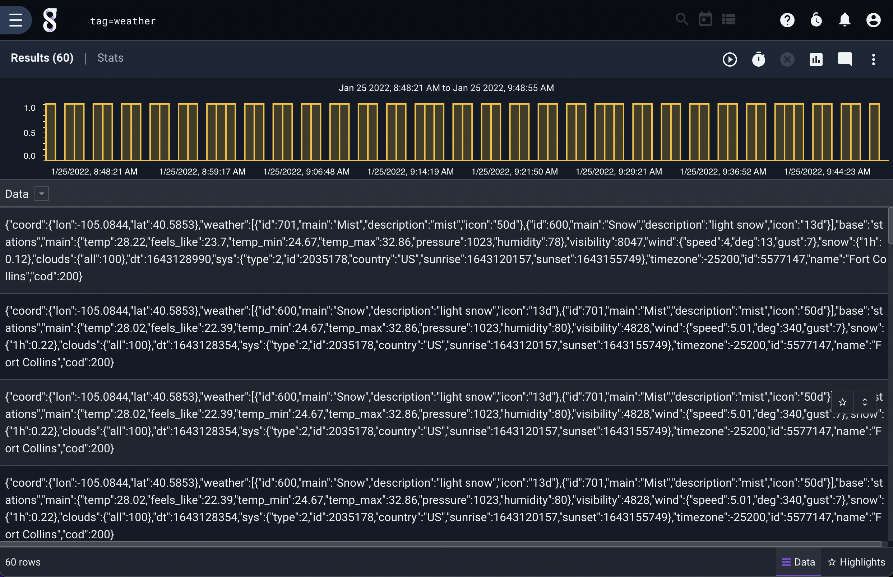
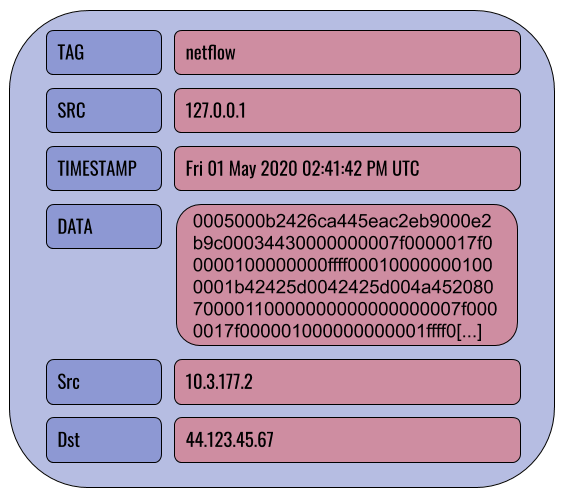
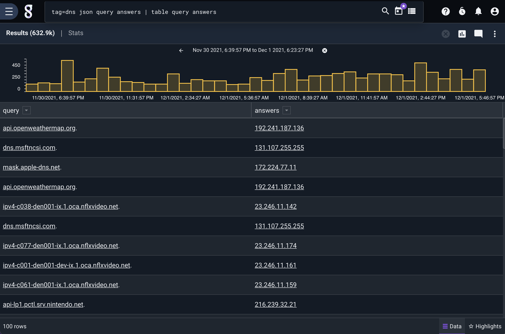
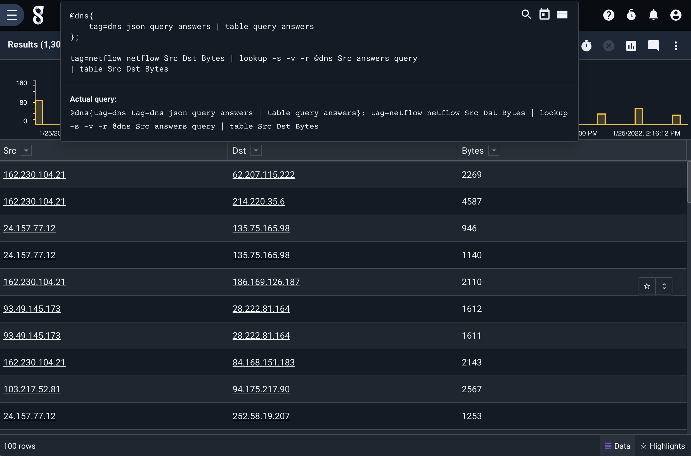

# Search

Gravwell is a structure-on-read data lake and the search pipeline is the core of that functionality. This is where the power and flexibility of the platform can be seen: we don't need to know much about the data at collection time. Instead, we can ingest the raw data and assemble a search processing pipeline to turn that raw data into actionable results! This all but eliminates normalizing or massaging data to try and fit specific molds, a common issue with SIEMs. Further, it lets us perform analysis retroactively against older data when new information, techniques, or search modules become available.

The search pipeline is the core of Gravwell's functionality and operates in a similar fashion to the Linux/Unix command line. The Gravwell search query syntax assembles a processing pipeline to search and transform raw data into results. The pipeline modules often consist of at least one extraction module, one or more filtering or processing modules, and a rendering module. For example, the following query fetches data tagged "weather", uses the json module to extract a temperature and location name, then uses the eval module to filter out any entries with temperatures below 50 degrees, then finally uses the table renderer to display the contents of the name and temp fields:

```gravwell
tag=weather json main.temp name | eval temp > 20 | table name temp
```



The user interface used to run queries [is documented here](/gui/queries/queries).

<video controls width="100%" height="auto">
	<source src="https://www.gravwell.io/hubfs/videos/Query%20Basics.mp4" type="video/mp4">
	Your browser does not support the video tag
</video>

(entries)=
## Entries

Entries are the basic unit of data in Gravwell. Entries are generated by *ingesters* and sent to *indexers*, where they are stored until queried. Every entry contains 4 fields: DATA, TIMESTAMP, SRC, and TAG.



```{note}
Entries are immutable once ingested.
```


The TAG field categorizes a particular entry: Netflow records might be tagged "netflow", syslog records from a webserver could be tagged "syslog-www", etc. The SRC field is an IP address indicating where the entry originated. The TIMESTAMP field indicates when the entry was created. The DATA field contains the actual body of the entry, be it a raw TCP/IP packet, a syslog record, a Windows event log in XML format. There is no restriction on what goes in the DATA field--Gravwell will accept and store any binary data.

In the example query shown above, we are dealing with entries tagged "weather" whose DATA fields contain JSON that looks like this:

```
{"coord":{"lon":-116.8,"lat":47.69},"weather":[{"id":801,"main":"Clouds","description":"few clouds","icon":"02d"}],"base":"stations","main":{"temp":40.91,"feels_like":34.56,"temp_min":39.2,"temp_max":42.01,"pressure":1032,"humidity":80},"visibility":10000,"wind":{"speed":5.82,"deg":200},"clouds":{"all":20},"dt":1605896400,"sys":{"type":1,"id":3672,"country":"US","sunrise":1605884460,"sunset":1605917119},"timezone":-28800,"id":5589173,"name":"Coeur d'Alene","cod":200}
```
```
{"coord":{"lon":-106.65,"lat":35.08},"weather":[{"id":800,"main":"Clear","description":"clear sky","icon":"01d"}],"base":"stations","main":{"temp":62.94,"feels_like":56.34,"temp_min":61,"temp_max":66,"pressure":1029,"humidity":27},"visibility":10000,"wind":{"speed":4.52,"deg":224},"clouds":{"all":1},"dt":1605896230,"sys":{"type":1,"id":3232,"country":"US","sunrise":1605880012,"sunset":1605916694},"timezone":-25200,"id":5454711,"name":"Albuquerque","cod":200}
```

The query takes this raw JSON and applies structure to it for our analysis.

## Components of a Query

The example query above can be broken into several individual portions, which are described below.

(tag_specification)=
### Tag Specification

The first part of a Gravwell query is the tag specification. The user must specify one or more tags from which the indexers should pull data to put into the start of the pipeline. The following tells Gravwell to take data tagged "reddit":

```gravwell
tag=reddit
```

You can also specify multiple tags:

```gravwell
tag=reddit,hackernews
```

Or you can use wildcards:

```gravwell
tag=syslog-http-*,syslog-firewall-*
```

These are all valid queries; if you run a query that is just a tag specification, Gravwell will fetch the entries and show you the unprocessed contents:



### Extraction Modules

Extraction modules are used to pull out fields/values/properties from the raw underlying data. Given entries containing the weather data shown earlier, we can use the following query to pull out the location name and temperature, then show only the entries with a temperature over 50 degrees:

```gravwell
tag=weather json main.temp name | eval temp > 50 | table name temp
```

In the example above, the `JSON` module is extracting the values from the raw JSON text and providing them as "Enumerated Values" for any modules further down the pipeline. In other words, this module parses the JSON to extract particular components the user needs. We extract the fields "name" and "temp", the latter being found *within* the "main" field.

The full documentation for these modules can be found at [Extraction Modules](extractionmodules)

#### Filtering

Gravwell extraction modules will typically allow *extracted* items to be *filtered* at extraction time. Filtering lets you drop or pass entries based on whether or not they match particular criteria; see [this page](filtering) for full documentation.


### Processing Modules

Processing modules are used to analyze data entries, filter out undesired data, and perform statistical analyses. A search pipeline may include many processing modules, one after another, each operating on the results of the previous module.

In the example shown in the previous section, `eval` is a processing module performing some filtering. Note that many processing modules can be made to operate on a subset of the overall query tags by putting an *additional* tag specification before the module invocation -- something we call Data Fusion. This can be very useful if you need to perform some initial extractions differently:

```gravwell
tag=reddit,hackernews tag=reddit json Body | tag=hackernews json body as Body | eval len(Body) < 20 | table Body
```

[Click here for complete documentation of processing modules](processingmodules)


### Render Modules

Render modules take the results generated by the search modules and present them to the user graphically. A search pipeline will only include one render module, at the very end of the pipeline.

```gravwell
tag=weather json main.temp name | eval temp > 50 | table name temp
```

In the example above, "table" is the render module; it has been told to display the contents of the "name" and "temp" Enumerated Values in their own columns.

[Click here for complete documentation of render modules](rendermodules)

(enumerated_values)=
## Enumerated Values

Enumerated values are special data elements which are created and used within the search pipeline. In the pipeline below, several enumerated values are created.

```gravwell
tag=reddit json Body | langfind -e Body | count by lang | sort by count desc | table lang count
```

First, the json module parses the JSON in the raw entries and pulls out the "Body" element, storing it in an enumerated value named `Body`. Then the langfind module accesses the `Body` enumerated values and attempts to analyze the language used; it puts the result in a new enumerated value called `lang`. Next, the count module reads the `lang` enumerated values and counts how many times each value appears, storing the results in enumerated values named `count`. The rest of the pipeline sorts the results based on the counts and creates a table from the `lang` and `count` enumerated values.

You can think of enumerated values as additional fields which are attached to an entry over the course of a query; if we use the netflow module to extract Src and Dst values from the raw DATA field, we add Src and Dst fields to the entry:

```gravwell
tag=netflow netflow Src Dst
```



Further examples throughout the documentation should help clarify the use of enumerated values.

(intrinsic_enumerated_values)=
## Intrinsic Enumerated Values

Intrinsic Enumerated Values are Enumerated Values which are created at the time of ingest. Intrinsic enumerated values are optionally [created by ingesters](#attach-target) and often contain metadata or pre-processed extractions. Use the [intrinsic](intrinsic/intrinsic) module to work with intrinsic enumerated values.

After extracting an intrinsic enumerated value, they are treated the same as regular enumerated values.

Intrinsic EVs are [automatically accelerated](#intrinsic-acceleration-target) when using acceleration.

## Quoting and tokenizing

When specifying arguments to Gravwell modules, be mindful of special characters. Most modules treat spaces, tabs, newlines, and the following characters as separators: !#$%&'()*+,-./:;<=>?@

When specifying an argument to a module which contains one of these characters, wrap the argument in double-quotes:

```
json "search-id"
```

```
grep "dank memes"
```

You can escape double quote characters if you need to use them, for instance to identify mis-used dialog tags in text you could search for the sequence `",`:

```
grep "\","
```

## Macros

Macros can help turn long, complex queries into easy-to-remember shortcuts. See [the full macro documentation](/search/macros) for more information.

(compound_queries)=
## Compound Queries

You can combine multiple queries together as a single "compound" query in order to leverage multiple data sources, fuse data into another query, and simplify complex queries. Gravwell's compound query syntax is a simple sequence of in-order queries, with additional notation to create temporary resources that can be referenced in queries later in the sequence. 

A compound query consists of a main query (the last query in a sequence), and one or more inner queries. The main query is written just like a normal query, while inner queries are always wrapped in the notation `@<identifier>{<query>}`. Queries are separated by `;`. 

Inner queries generate named resources in the form of `@<identifier>`. These resources can be used as a regular resources with any module that supports table-based resources, listed below:

| Module | Notes |
|--------|-------|
| [dump](/search/dump/dump) | | 
| [enrich](/search/enrich/enrich) | | 
| [ipexist](/search/ipexist/ipexist) | Inner queries must use the table module with the `-format ipexist` flag |
| [iplookup](/search/iplookup/iplookup) | Inner queries must use the table module with the `-format csv` flag |
| [lookup](/search/lookup/lookup) | |
| [anko](/search/anko/anko) | Anko scripts can read from named resources |

Named resources are scoped to the compound query they exist in, and are ephemeral - they are only accessible to other queries in the compound query, and are deleted as soon as the query is completed. 

For example, say we have both DNS query and IP-level connection data under the tags "dns" and "conns", and we want to filter connection data down to only connections that didn't first have a corresponding DNS query. We can use compound queries to enrich our first query with DNS data and filter.

Let's start with the inner query:

```gravwell
tag=dns json query answers | table query answers
```

This produces a table:



In the inner query, we simply create a table of all queries and answers in our DNS data. Since this is an inner query, we need to give it a name so later queries can reference its output, and wrap the query in braces. We'll call this inner query "dns":

```gravwell
@dns{tag=dns json query answers | table query answers}
```

In the main query, we use our connection data, and use the `lookup` module to read from our inner query "@dns":

```gravwell
tag=conns json SrcIP DstIP SrcIPBytes DstIPBytes | lookup -s -v -r @dns SrcIP answers query 
| table SrcIP DstIP SrcIPBytes DstIPBytes 
```

This query uses the `lookup` module drop (via the `-s` and `-v` flags) any entry in our conns data that has a SrcIP that matches a DNS answer. From there we simply create a table of our data. 

We wrap this into a compound query simply by joining the queries together and separating them with a `;`:

```gravwell
@dns{
	tag=dns json query answers | table query answers
};

tag=conns json SrcIP DstIP SrcIPBytes DstIPBytes | lookup -s -v -r @dns SrcIP answers query 
| table SrcIP DstIP SrcIPBytes DstIPBytes 
```

This gives us a table of just connections that didn't have a corresponding DNS query:



```{note}
Compound queries create ephemeral resources that exist only during the query, however those resources can and do consume disk space and are restricted by the [Render-Store-Limit](config_params_render_store_limit) global configuration variable which defaults to 1024MB. If the ephemeral resource is larger than the specified size, the query will fail.
```

(specify-search-timeframe-in-query)=
## Specifying the search timeframe in query

It is possible to specify the timeframe in the query, using both relative and concrete time, instead of using the GUI time range picker. This is useful for creating portable queries that contain the exact timeframe needed using only the query itself.

Specifying the search timeframe in the query is done by providing one or both of `start=` and `end=` constraints. These are provided at the beginning of the query, similar to the tag specification. The order of constraints (including the tag specification) does not matter. The `start/end` constraints take a string consisting of an offset or a concrete timestamp. 

For example, to search over the last 10 hours, except the last hour, you can specify the time constraints as offset durations:

```gravwell
tag=default start=-10h end=-1h json foo | table
```

In the example above, we provide a start range of `-10h`, meaning "10 hours in the past from now". Additionally, the end range is `-1h`. Durations consist of a signed offset, and use the following letters as units of time:

| Unit | Description |
|--------|-------|
| us | microseconds | 
| ms | milliseconds | 
| s | seconds|
| m | minutes |
| h | hours |
| d | days |
| w | weeks |
| y | years |

It is also possible to use concrete timestamps. Any timestamp supported by [timegrinder](https://pkg.go.dev/github.com/gravwell/gravwell/v3/timegrinder#pkg-constants) can be interpreted as a concrete timestamp.

For example:

```gravwell
start="2006-01-02T15:04:05Z" end="2006-01-02T23:04:05Z" tag=default json foo table
```

The example above uses RFC3339 timestamps to specify a concrete time range.

If `start=` or `end=` is used individually, the omitted constraint will be interpreted as `NOW`. For example, to simply search over the last hour:

```gravwell
start=-1h tag=default json foo | table
```

In the example above, the `end=` constraint is omitted, which sets the end of the range to the time at which the query is executed.

Additionally, relative and concrete timestamps can be combined. For example, to search from January 2nd, 2006, up to an hour ago:

```gravwell
start="2006-01-02T15:04:05Z" end=-1h tag=default json foo table
```

```{note}
If start/end time constraints are provided, the GUI time picker timeframe will be ignored.
```

```{note}
Timeframes are always aligned to one second boundaries. Sub-second timeframes will be automatically rounded down to the second.
```

```{note}
The start time cannot come after the end time.
```

### Using time constraints in compound queries

The `start` and `end` constraints can also be used in compound queries. When using absolute times in an inner query, the inner query will search over the specified time. 

Otherwise, `start` and `end` constraints in inner queries are always relative to the time range of the main query. For example:

```gravwell
@foo{
    start=-10h
    tag=gravwell limit 1
};

start=-1h
tag=gravwell limit 1
```

In the above example, the main query executes over the last hour. The inner query also has a relative offset, and it is relative to the start time of the main query -- meaning it searches over the last 11 hours (10 hours offset from the main query, which is 1 hour offset from the current time).

### Time constraint arithmetic

```{note}
START and END always reference the start and end times of the main query regardless of whether they are used in the main query or the inner part of a compound query.
```

Time constraints support three verbs: `START`, `END`, and `NOW`, which can be combined with relative offsets to perform simple arithmetic offsets. For example:

```gravwell
@foo{
    start=START-2h          // start 2 hours before the main query's start time
    end=END-1h              // end 1 hour before the main query's end time
    tag=default json foo
};

end="2006-01-02T15:04:05Z"  // An absolute time
start=END-1h                // start 1 hour before the absolute end time
tag=default dump -r @foo | table
```

In the above example, the main query has an absolute end time, and a start time that is relative to the end time. Additionally, the inner query uses relative offsets from the main query's start and end times.

(time-constraint-summary)=
### Time constraint summary

Below is a summary of how time constraints work across all forms of use.

| Time constraints | Main query | Inner query |
|---|---|---|
| Not set | Use GUI time picker | Use GUI time picker |
| Absolute time | Use absolute time | Use absolute time |
| Relative | Relative to now | Relative to main query |
| Arithmetic | Use rules above ±duration | Use rules above ±duration |

## Comments

Gravwell supports two types of comments. 

1. Any input between ANSI-C style comment specifiers `/* */`.
2. Line comments, which begin with a double slash `//` and stop at the end of the line. 

Comments are saved in the search history, and are useful for debugging queries and adding inline notes. For example:

```gravwell
tag=foo json foo.bar /* a c-style comment that has no impact on the search */ baz | table // another comment!
```

## Temporal vs Non-temporal Searches

Gravwell performs searches in two modes: temporal and non-temporal. When you search over time without transforming data, Gravwell will usually perform the search in temporal mode. This mode is often seen with queries that are charted over time, or simple queries using the table renderer. For example, take the following query:

```gravwell
tag=foo json foo == "bar" | table
```

This query doesn't transform the data, instead it simply filters entries down to those with a json field named "foo" containing the string "bar". This will result in a temporal search. Gravwell will allow you to zoom in to different regions of time over the search results and will by default sort the data by time, newest entries first.

Now take this query:

```gravwell
tag=foo json foo == "bar" | stats count | table
```

This results in a non-temporal search due to the inclusion of `stats count`. The stats module here transforms the data by dropping all entries and producing a single new entry containing the total count. This synthetic entry has a timestamp, but the timestamp is meaningless because the result is simply a count over the time window searched. In non-temporal searches, Gravwell removes the "overview" chart and doesn't allow you to zoom over time.

Not all searches that transform data are non-temporal however. Consider the following query:

```gravwell
tag=foo json foo == "bar" | stats count over 10m | table
```

This results in a temporal search. By adding `over 10m` to the stats module, we reintroduce a notion of time into the search, and Gravwell will allow you to zoom across the time range, down to the resolution requested (in this case 10 minutes).

Additionally, you can force a table based search into non-temporal mode by using the `-nt` flag. This is useful for inspecting each value of a temporal search without having to zoom. Let's take our last example:

```gravwell
tag=foo json foo == "bar" | stats count over 10m | table -nt
```

By adding the `-nt` flag to the table module, we put the otherwise temporal search into non-temporal mode. The result is that we'll now see an entry for every 10 minute window (because of our stats module) instead of just one entry summarizing the count for the selected window.
