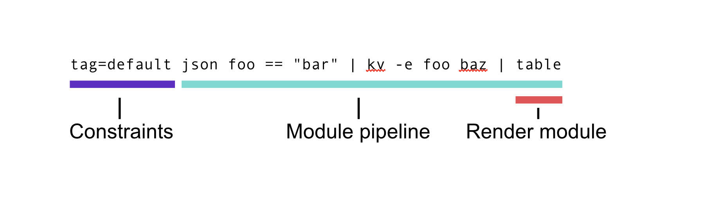

# The Gravwell Query Language Specification

## Introduction

This is the formal specification the Gravwell query language syntax. A query is made up of indexer and webserver directives, modules, a pipeline, and a renderer. This document provides documentation for how input text is interpreted and tokenized. Some lexical meaning of input is also defined here. Specific modules can sometimes have context-specific semantics that differ between modules (such as numbers being implied to be strings). The user should read the [search module](#!search/complete-module-list.md) documentation for more information on module specific considerations.

## Text Encoding 

All gravwell input is Unicode text encoded in UTF-8. 

### Characters and digits 

A character is defined as all Unicode points that are in the "General Category" of the Unicode specification, ([The Unicode Standard 8.0, Section 4.5](https://www.unicode.org/versions/Unicode8.0.0/)). This includes letters, numbers, marks, symbols, and punctuation. 

Digits are the subset of letters belonging to the Unicode Numeric Value category. 

## Lexical grammar

This section defines the syntax of input anywhere in a Gravwell query. Token semantics can be module specific, so the user should read the [search module](#!search/complete-module-list.md) documentation for more information on module specific considerations.

### Quotes

Many characters and keywords have special meaning in the Gravwell syntax. When using any special input as a string, you must use double quoted strings `"`. For example

```
json foo bar | table
```

extracts `foo` and `bar` from some JSON input, then passes the extractions to the `table` renderer. To use whitespace and the `|` character, both of which have special meaning, as the input to the `json` module, use a quoted string.

```
json "foo bar | table"
```

This example extracts a field named `foo bar | table` from the JSON input.

All other lexical definitions below are implied to be interpreted outside of a quoted string, except for escaped productions, which are always interpreted.

### Escaped input

Escaped text follows the same unescaping rules as described in the [Rune Literals](https://go.dev/ref/spec#Rune_literals) section of the Go programming language specification. See that document for more information.
 
### Whitespace

Whitespace is defined as all Unicode whitespace characters, which includes whitespace characters outside of the `Latin-1` category. Whitespace characters are folded, meaning multiple, continuous whitespace characters are interpreted as a single whitespace character. Whitespace delimits tokens when used outside of a quoted string.

For example, the input

```
json foo bar
```

is made up of three tokens `json`, `foo`, and `bar`. In the `json` module in Gravwell, this would extract two enumerated values `foo` and `bar`.

Quoted whitespace is treated as part of a single string. For example, the input

```
json "foo bar"
```

is made up of two tokens `json`, and `foo bar`. The `json` module in this case would extract a single enumerated value `foo bar`.

### Comments

A comment is any input between ANSI-C style comment specifiers `/* */`, and is not considered part of the input to Gravwell. 

For example,

```
kv myKey /* this is my key extraction */ | table
```

is implicitly reduced to

```
kv myKey | table
```

### Tokens

Tokens make up the "vocabulary" of the Gravwell query language. Tokens are groups of characters separated by whitespace (as defined above) and reserved characters (such as `|`), unless grouped in a quoted string. The semantic meaning of a token depends on the position the token occurs in the _token stream_. For example,

```
tag=default json tag
```

extracts the enumerated value `tag`, using the `json` module, all from the default tag. While the token `tag` shows up twice, the meaning is different based on the position in the token stream. The first occurrence tells Gravwell to pull data from the default tag. The second occurrence tells the `json` module to extract a value named `tag`.

Tokens cannot contain the following reserved characters, unless quoted.

| Character | Description |
|-----------|-------------|
| &#124; |  Pipe: separates modules in the module pipeline |
| @ | Compound query reference |
| {} | Compound query block |
| ; | Compound query delimiter |
| = | Assignment operator |
| ==, <, >, <=, >=, ~, !=, !~ | Comparison operators |
| !, #, $, %, ^, &, *, (, ), [, ], ? | Other reserved characters |
| . | Dot. Unless used in the right hand side of a filter operation ( foo == 1.23 ) |

### Operators and filters

Operators are reserved characters that are used when applying filters in certain modules. Filters, and their operators, are always in the form of

```
<identifier> <operator> <value>
```

For example,

```
foo <= 1.5
```

applies a filter on the identifier `foo`, such that it is less than or equal to the floating point value 1.5. 

Individual modules specify the rules for what types and operators are allowed on given identifiers. See the module documentation for more information.

## Type inference

Modules individually specify how values are typed. For example, the `json` module extracts all values as strings, and using a filter `json foo == 1.5` will perform a string comparison on the value of foo with the _string_ `1.5`. 

## Query structure



A query is made up of any number of query directives (such as what tags to pull data from), modules, arranged in a pipeline, and a render module. Additionally, multiple queries can be packed into a _compound query_.

### Query directives

All input before the first module in a query represents the query directives. Usually this is just the tag(s) to extract. Query directives are a whitespace-delimited list of key=value pairs. The following directives are supported.

| Directive | Description | Example |
|-----------|-------------|---------|
| tag | The tag(s) to extract. Supports comma separated lists and wildcards. Defaults to "tag=default" if omitted. | tag=dns,zeek* |

### Modules

Please see the [list of modules](#!search/complete-module-list.md) for module specific documentation.

Modules are pipelined functions that extract, transform, and render data. Conceptually, data flows left-to-right in the module pipeline, and modules can drop, pass, modify, or inject data into the pipeline. The last module in the pipeline is the render module (such as `table` or `chart`). The module pipeline is split by the `|` character. A module invocation is made up of the module name, optional flags, and optional arguments. 

#### Module name

The first token of a module invocation is the module name. See the [list of modules](#!search/complete-module-list.md) for the list of available modules.

#### Module flags

Flags are whitespace-delimited lists of module-specific configuration options. Some flags take arguments, and some modules support multiple invocations of the same flag. See the module documentation for more information on the specific flags for that module.

Flags take two forms. First is a flag with no arguments, such as

```
kv -q
```

The second form takes an argument, which must be quoted if it contains any reserved characters or whitespace.

```
kv -e "my enumerated value"
```

The first token that does not begin with a hyphen, and is not the argument to a flag, represents the first argument to the module.

#### Module arguments and semantics

Module arguments are module-specific lists of tokens containing identifiers, filters, and other keywords. Every token up to the end of the input or the `|` character is considered an argument to that module. Modules apply their own semantics to their argument tokens. For example, the `fields` module uses the special characters `[` and `]` to denote a column offset, while the `lookup` module uses `(` and `)` for groups of extractions. Refer to the module documentation for more information.

### Renderer

The last module in a query is always the renderer. Render modules take flags and arguments just like a search module, but must appear at the end of the pipeline.

If no renderer is specified, the text renderer is implied.

### Compound queries

Multiple modules can be grouped into a single _compound query_ using the [compound query notation](#!search/complete-module-list.md). A compound query takes the form of

```
@foo{tag=default ...}; @bar{tag=default ...}; tag=default lookup -r @foo | ...
```

Where `@foo`, `@bar` represent the names of "inner" queries. The `@` is required. Any query can be specified in the inner query body, enclosed in `{}`, but the renderer must be the `table` renderer. Any number of inner queries can be specified. Inner queries and the main query (the final query in the list of queries that is not wrapped in the `@{}` notation) are split by semicolons. 

Queries are executed in order, and any later query (including other inner queries) can use the output of an earlier inner query anywhere that a tabular resource can be used (such as the `lookup` module), by referencing the query by name with the `@` symbol. 

