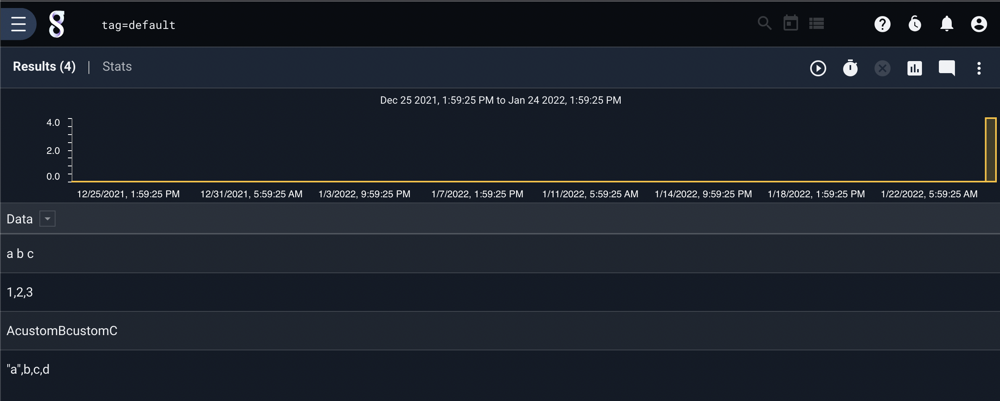
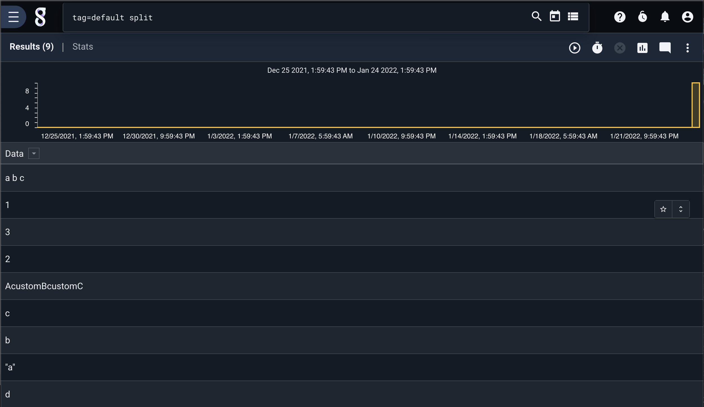
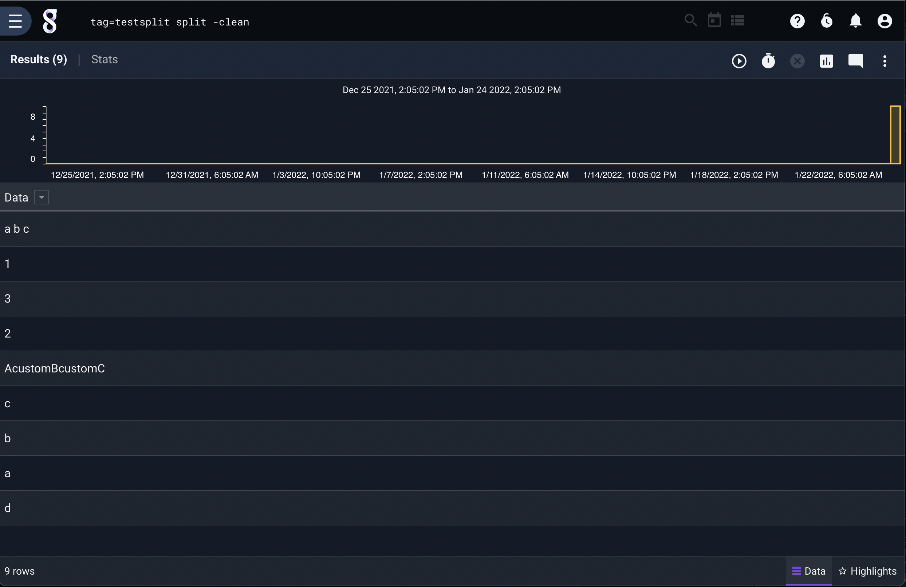
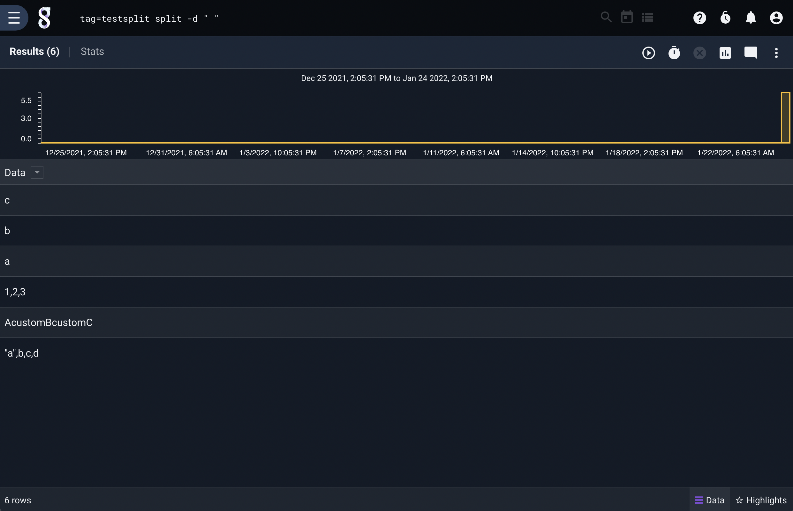
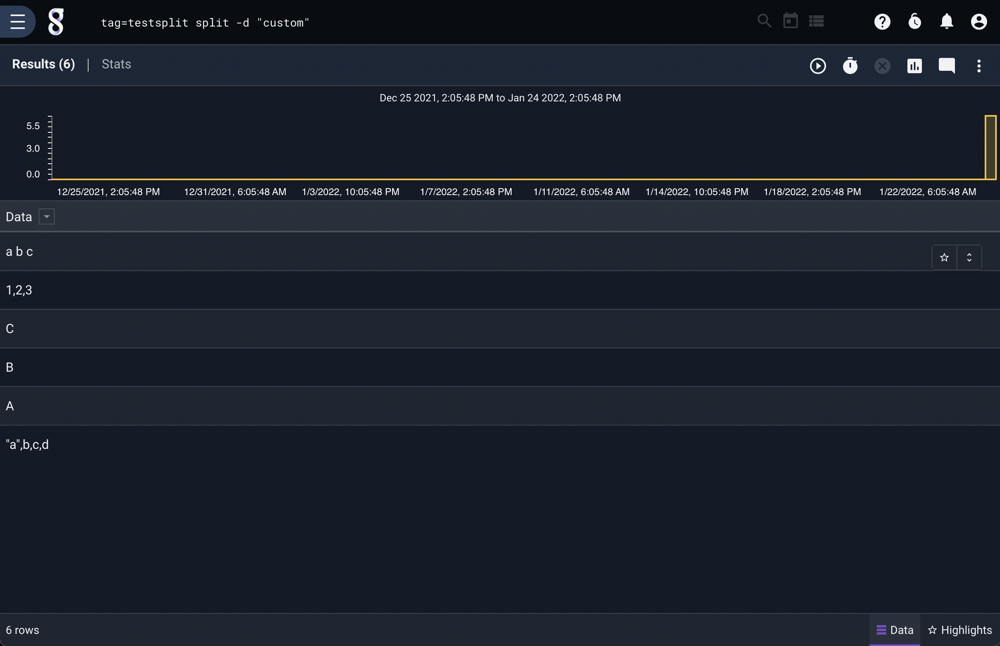
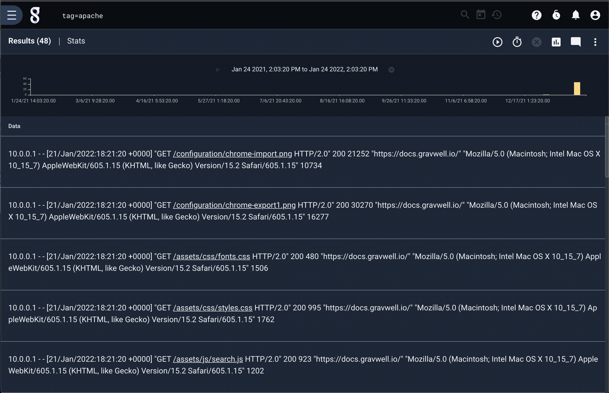
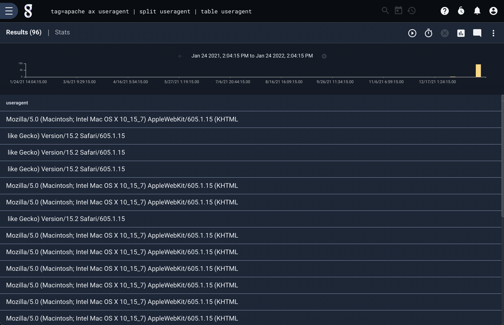
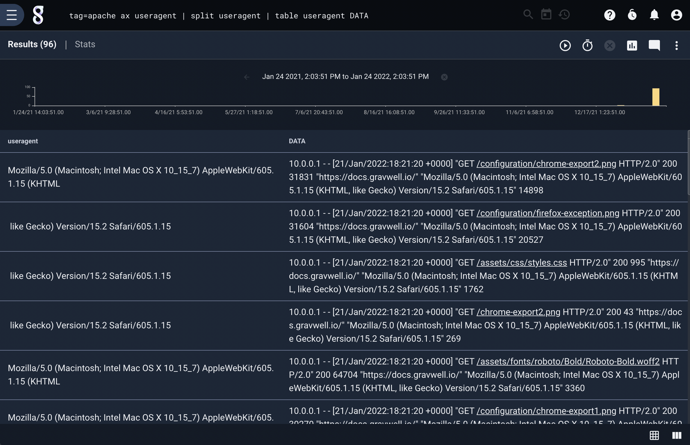

# Split

The split module lets you split the contents of an entry or enumerated value into multiple entries.

## Supported Options

Specifying a name following any options informs the split module that it should split the named enumerated value rather than the contents of the entry itself. Omitting a name will cause it to operate on the entry.

* `-d <delim>`: specify the delimiter. This can be a single character such as a semicolon, or a string--even a string with spaces, provided you wrap it in quotes.
* `-clean`: tells the module that after splitting the data, it should clean up tabs, spaces, and quote characters from the left and right ends of each string. Thus the entry containing `foo   ,'bar', baz` would be split into three entries containing `foo`, `bar`, and `baz`.

## Example Usage

For these examples, we will consider the following example entries:



### Basic splitting

Specifying the split module with no additional arguments will split the entries based on the default delimiter, the comma:

```
tag=default split
```



### Using the clean flag

If we add the `-clean` flag, we note that trailing/leading quote marks and whitespace are eliminated:

```
tag=default split -clean
```



### Specifying a delimiter

Some of the entries contain spaces. We can split on that using the `-d` flag:

```
tag=default split -d " "
```



Note that one entry, `a	b	c` was cleanly split into 3 entries because it had a tab between every field, while another entry, `"a",  b, c	,d'` was split into two because it contained a single tab character between 'c' and ','.

We can also specify arbitrary strings to use as delimiters:

```
tag=default split -d custom
```



## Example Usage with Enumerated Values

For this example, we will use Apache webserver log entries.



We can extract the 'useragent' field from the apache structure, then split it on commas:

```
tag=apache ax useragent | split useragent | table useragent
```



Note that the raw *contents* of the entries are not modified:

```
tag=apache ax useragent | split useragent | table useragent DATA
```


