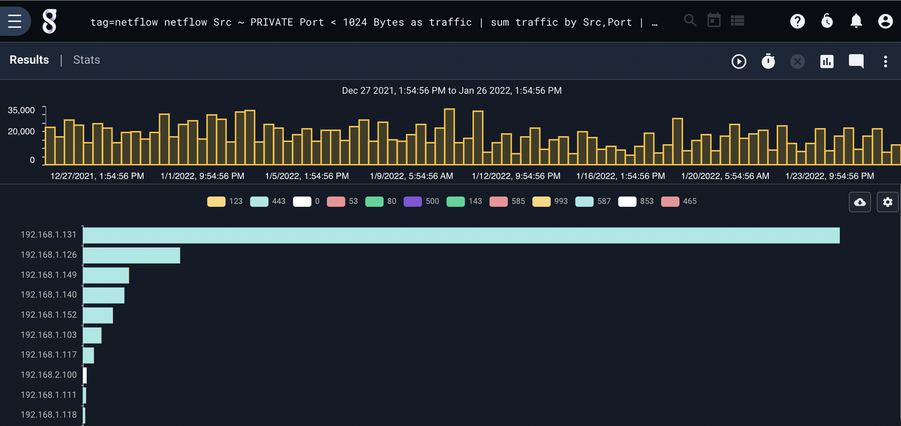
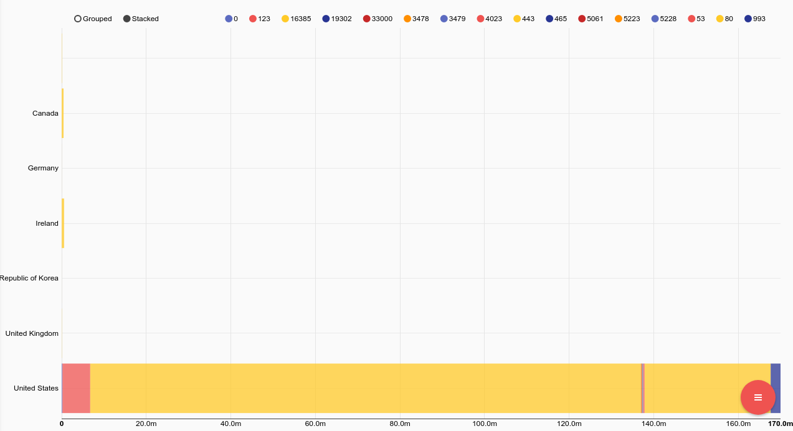
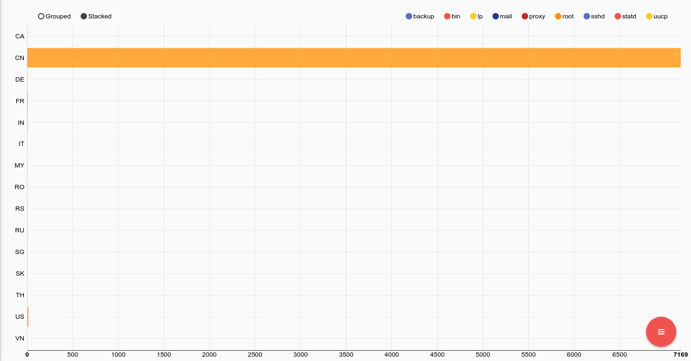
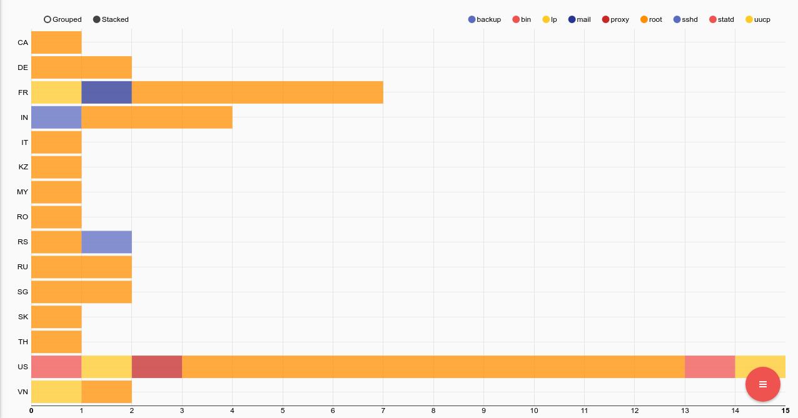

# Stackgraph

The stackgraph renderer is used to display horizontal bar graphs with stacked data points.  A stackgraph is useful in displaying the magnitude of results that are accumulated from multiple components across a set of tags.  The stackgraph renderer is an accumulator, meaning that it can interpret the operation of some upstream search modules and recalculate the results based on sub selections.  In Gravwell terms, stackgraph supports second order searching and selection.

Stackgraph invocation requires three arguments which must be the names of enumerated values extracted by upstream search components.  Argument one specifies the enumerated value which names each individual horizontal bar, for example an IP address. Argument two specifies the enumerated value which gives the individual components of each horizontal bar, for example a TCP port. Argument three is the magnitude value which represents the magnitude component of each stack value within a horizontal bar.  Example magnitude components are count, sum, stddev, sum, max, and min. The easiest way to understand these arguments is by examining the examples below.

Note: Sorting data before sending it to stackgraph is unlikely to do what is desired. If you had a count of IP->port pairs and were interested in sorting based on that count and then sending to a stackgraph (e.g. ```count by SrcIP,DstPort | sort by count desc | table SrcIP DstPort count```) then the first item in the list might be a port that has a very high count but only for one IP. For example, say port IP 10.0.0.1 spoke on port 443 with count 10000 but the next 8 entries are 8 different IPs all using port 80 with counts in the 9000 range, they will dwarf port 443 on the graph.

## Examples

The best way to describe a stackgraph is to show a couple.

### Traffic Volumes by IP and Port

```
tag=netflow netflow Src ~ PRIVATE Port < 1024 Bytes as traffic |  sum traffic by Src,Port | stackgraph Src Port sum
```



### Traffic Volumes by Port and Country

```
tag=netflow netflow Src ~ PRIVATE Dst  Bytes as traffic Port |  geoip Dst.CountryName | sum traffic by Port, CountryName | stackgraph CountryName Port sum
```



### Failed SSH Logins by Country and Attempted User

```
tag=syslog grep sshd | regex "Failed password for (?P<user>\S+) from (?P<ip>\d{1,3}\.\d{1,3}\.\d{1,3}\.\d{1,3}) " | geoip ip.Country | count by user,Country | stackgraph Country user count
```



### Failed SSH Logins by Country and Attempted User (China removed)

```
tag=syslog grep sshd | regex "Failed password for (?P<user>\S+) from (?P<ip>\d{1,3}\.\d{1,3}\.\d{1,3}\.\d{1,3}) " | geoip ip.Country != CN | count by user,Country | stackgraph Country user count
```


