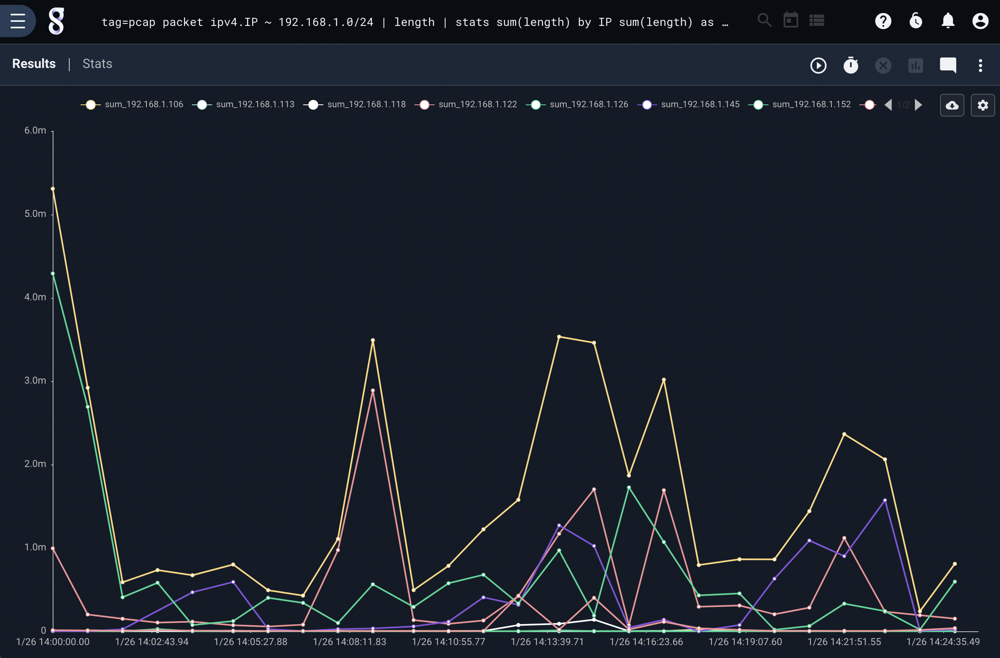

# Stats Module

The stats module allows the user to perform multiple stats operations simultaneously, where the individual math modules only perform one operation. The canonical example for the stats module is computing the mean and standard deviation of values in order to display error bars on a graph.

## Syntax

An invocation of the stats module consists of:

* The module name (`stats`)
* A list of operations, specifying which enumerated values should be operated on and optionally a name for the output (`mean(length)`, `count as foo`)
* Optional "by" arguments, which specify that the operations should be performed separately for each combination of by arguments (as in `mean(Length) by SrcIP`)
* An optional time window

These components are discussed below.

### Supported Flags

* `-b`: This flag tells the stats module to always preserve the original body of the entry. For example, saying `tag=* length | stats max(length) | text` would normally cause the output entry's body to be overwritten with the maximum length seen, for convenient display with the text renderer. Adding the `-b` flag (`tag=* length | stats -b max(length) | text`) would preserve the original body, meaning the renderer will instead display the *contents* of the longest entry seen.

## Math Operations Specification
 
An operation consists of the operation name, the "source" enumerated value contained in parentheses, and optionally a different name for the output enumerated value.

The following operation names are supported:

* count: count entries
* sum: sum values and return the total
* total: sum values over a period of time and keep a running total.
* mean: calculate the average
* stddev: calculate the standard deviation
* variance: calculate the variance
* min: return the minimum value seen
* max: return the maximum value seen
* unique_count: return the number of unique instances of the source were seen.

The operation is performed on the source enumerated value. Thus, specifying `stats sum(Bytes)` would tell the stats module to sum up the Bytes enumerated values, outputting a single entry with an enumerated value named `sum` containing the total.

Note: If no source is specified, the operation is instead performed on the body of the entry. Specifying `stats sum` is equivalent to specifying `stats sum(DATA)`

Multiple operations can be specified:

```
stats sum(Bytes) mean(Bytes)
```

```
stats mean(Bytes) stddev(bytes) min(Length)
```

The output of an operation is, by default, assigned to an enumerated value with the name of the operation. Thus `stats sum(Bytes)` will create an enumerated value named `sum` to hold the output. You can change this with the `as` option:

```
stats mean(Bytes) as BytesAvg
```

This is particularly useful when performing the same operation on multiple different enumerated values:

```
stats mean(Bytes) as BytesAvg mean(Length) as LengthAvg
```

## "By" Arguments Specification

When the user needs an operation performed separately for e.g. each different IP, it is necessary to specify "by arguments".

```
stats mean(Bytes) stddev(Bytes) by SrcIP
```

This tells the stats module to calculate separate mean and standard deviation for each unique SrcIP value. The result will be 1 entry for each SrcIP seen, each containing the appropriate SrcIP, mean, and stddev enumerated values.

You can specify as many by arguments as you want:

```
stats mean(Bytes) stddev(Bytes) by SrcIP DstIP DstPort
```

The module will calculate a separate mean and standard deviation for *every combination of SrcIP, DstIP, and DstPort*.

Attention: When working with very large datasets on systems with limited memory, specifying too many by arguments can lead to memory exhaustion as the stats module attempts to keep millions of combinations in memory.

### Using complex "By" arguments

If only a single "by" argument is provided and it is applied to the last operation then stats will apply it to all the operations.  This is a shorthand method.  If you do NOT want it applied to all operations ensure that the last operation does not have the "by" argument.

For example, the following will run a "mean" operation using `SrcIP DstIP DstPort` as the keys, but the stddev operation is applied without keys:

```
stats mean(Bytes) by SrcIP DstIP DstPort stddev(Bytes)
```

The stats module can perform operations with complex keying, this means that you can provide a keyset (or lack thereof) for every operation.  This is useful if you want to see multiple operation with different keys in a single table or chart.

For example, here is a query that performs a sum of packet sizes by IP but also provides a baseline sum across all packets:

```
tag=pcap packet ipv4.IP ~ 192.168.1.0/24 | length | stats sum(length) by IP sum(length) as total | chart total sum by IP 
```



## Time Window Specification

The stats module can operate in two modes: temporal or condensed.

In condensed mode, it emits results only once. This occurs automatically when using the text renderer or when the `-nt` flag is passed to the table renderer.

In temporal mode, the stats module operates over time windows, defaulting to 1 second. For every 1 second of data, the module emits a set of result entries. This is used when sending data to the chart renderer.

While the default window is 1 second, the window size can be modified with the "over" option:

```
stats mean(Bytes) stddev(Bytes) by SrcIP over 5m
```

When sent to the chart module, the results will be calculated over a 5 minute window rather than the standard 1 second.

Note: Only one time window can be specified, and the time window is applied to all operations.  The time window must also be the LAST argument to stats.

## sum() vs total()

The `sum` and `total` operators behave exactly the same in every context except chart.  When using the chart renderer the total module will not "reset" values across time buckets.

The behavior difference is best demonstrated in a screenshot generated using the following query:

```
tag=zeekconn fields -d "\t" [8] as dur
| stats sum(dur) total(dur)
| chart sum total
```


This query generates two lines based on the sum and total sum of the duration values.  The chart generates a line for the `sum` values by bucketing the data where the line for `total` represents buckets that compound over time.  The underlying operations are the same, but total does not "reset" the bucket each time it transitions to a new time span, where "sum" does.
