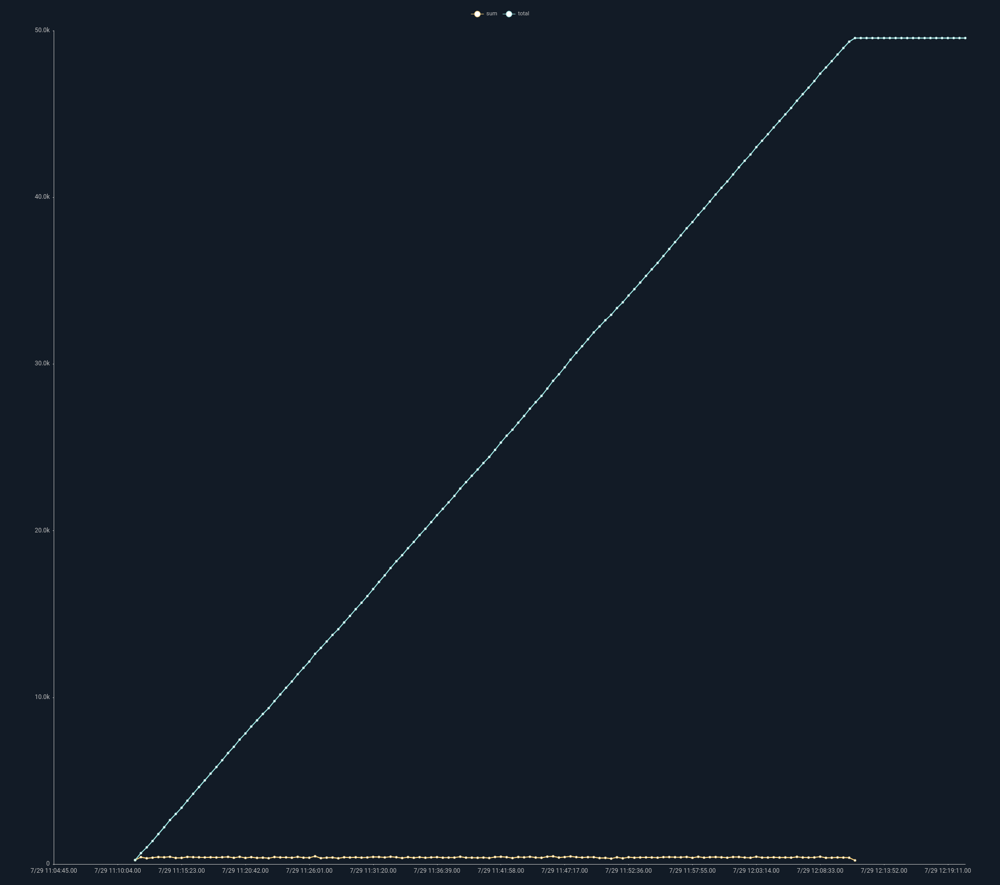

# stats モジュール

stats モジュールでは、複数の統計演算を同時に行うことができます。個々の数学モジュールでは1つの演算しか行わないのに対し、stats モジュールでは複数の統計演算を同時に行うことができます。stats モジュールの典型的な例は、グラフにエラーバーを表示するために、値の平均値と標準偏差を計算することです。

## 構文

stats モジュールの呼び出しは以下のように構成されています。

* モジュール名（`stats`）
* 操作のリストで、どの列挙型の値を操作するかを指定し、オプションで出力の名前を指定します（`mean(length)`, `count as foo`）
* オプションの by 引数では、by 引数の組み合わせごとに別々に処理を行うことを指定します（`mean(Length) by SrcIP`のように）。
* 任意の時間枠

これらの構成要素については、以下で説明します。

### サポートされているフラグ

* `-b`: このフラグは stats モジュールに、エントリの元のボディを常に維持するように指示します。例えば、`tag=* length | stats max(length) | text` とすると、通常、出力エントリの本文は、テキストレンダラでの表示に便利なように、見たままの最大長で上書きされてしまいます。`-b` フラグ（`tag=* length | stats -b max(length) | text`）を追加すると、元のボディが維持され、レンダラーは代わりに見た中で最も長いエントリのコンテンツを表示することになります。

## 数学的演算の仕様

演算は、操作名、括弧内のソース列挙値、およびオプションで出力列挙値の別の名前で構成されます。

以下の演算がサポートされています。

* count：エントリー数をカウントします
* sum：値の合計を返します
* total：一定期間の値を合計し、その結果を記録します
* mean：平均値を計算します
* stddev：標準偏差を計算します
* variance：分散を計算します
* min：最小値を返します
* max：最大値を返します
* unique_count：ソースのユニークなインスタンスの数を返します

演算はソースの列挙値に対して行われます。したがって、`stats sum(Bytes)` を指定すると、stats モジュールに Bytes の列挙値を合計することを指示し、合計値を含む `sum` という名前の列挙値を持つ単一のエントリを出力します。

注意：ソースが指定されていない場合は、エントリのボディに対して演算が行われます。`stats sum` を指定することは、`stats sum(DATA)` を指定することと同じです。

複数の演算を指定することができます：

```
stats sum(Bytes) mean(Bytes)
```

```
stats mean(Bytes) stddev(bytes) min(Length)
```

演算の結果は、デフォルトでは、演算の名前を持つ列挙型の値に割り当てられます。したがって，`stats sum(Bytes)` は，`sum` という名前の列挙型の値を作成して出力を格納します．これを変更するには、`as` オプションを使用します：

```
stats mean(Bytes) as BytesAvg
```

これは、複数の異なる列挙型の値に対して同じ演算を行う場合に特に有効です：

```
stats mean(Bytes) as BytesAvg mean(Length) as LengthAvg
```

## by 引数の仕様

（例えば、異なるIPごとに）別々の演算を行う必要がある場合は、「by 引数」を指定する必要があります。

```
stats mean(Bytes) stddev(Bytes) by SrcIP
```

これは stats モジュールに、固有の SrcIP 値ごとに平均値と標準偏差を計算するように指示します。その結果、SrcIP ごとに 1 つのエントリが作成され、それぞれに適切な SrcIP、mean、stddev の列挙値が含まれます。

by 引数はいくつでも指定できます：

```
stats mean(Bytes) stddev(Bytes) by SrcIP DstIP DstPort
```

このモジュールは、SrcIP、DstIP、および DstPort のすべての組み合わせに対して、個別に平均値と標準偏差を計算します*。

注意：メモリが限られているシステムで非常に大きなデータセットを扱う場合、引数に指定する数が多すぎると、stats モジュールが何百万もの組み合わせをメモリに保持しようとするため、メモリの枯渇につながる可能性があります。

### 複雑な by 引数の使用

by 引数を1つだけ指定し、それが最後の演算に適用された場合、stats はそれをすべての演算に適用します。 これは省略可能な方法です。 すべての演算に適用させたくない場合は、最後の演算に by 引数がないことを確認してください。

例えば、以下のようにすると、`SrcIP DstIP DstPort` をキーにして「mean」演算を行いますが、stddev 演算はキーなしで適用されます。

```
stats mean(Bytes) by SrcIP DstIP DstPort stddev(Bytes)
```

stats モジュールは、複雑なキーイングを用いた演算を行うことができます。これは、すべての演算に対してキーセット（またはキーセットがないもの）を提供できることを意味します。 これは、異なるキーを持つ複数の演算を 1 つの表やチャートで表示したい場合に便利です。

例えば、IP ごとのパケットサイズの合計を算出し、さらに全パケットのベースラインの合計も算出するクエリを以下に示します。

```
tag=pcap packet ipv4.IP ~ 10.10.10.0/24 | length | stats sum(length) by IP sum(length) as total | chart total sum by IP
```


## 時間枠の仕様

stats モジュールは、テンポラルとコンデンスの2つのモードで動作します。

コンデンスモードでは、結果を一度だけ出力します。これは、テキストレンダラを使用した場合や、テーブルレンダラに `-nt` フラグが渡された場合に自動的に行われます。

テンポラルモードでは、stats モジュールは、デフォルトでは 1 秒の時間枠で動作します。1 秒のデータごとに、モジュールは結果エントリのセットを出力します。これは、チャートレンダラーにデータを送信する際に使用されます。

デフォルトの枠は 1 秒ですが、「over」オプションで枠のサイズを変更できます。

```
stats mean(Bytes) stddev(Bytes) by SrcIP over 5m
```

チャートモジュールに送られた場合、結果は標準の 1 秒ではなく、5 分間の枠で計算されます。

注：時間枠は 1 つだけ指定でき、その時間枠はすべての操作に適用されます。 時間枠は、statsの最後の引数としても指定する必要があります。

## sum() vs total()

`sum` と `total` 演算子は、chart を除くすべてのコンテキストでまったく同じ動作をします。 chart レンダラーを使用する場合、total モジュールは時間バケット間で値をリセットしません。

この挙動の違いは、次のようなクエリを使ったスクリーンショットでよくわかります：

```
tag=zeekconn fields -d "\t" [8] as dur
| stats sum(dur) total(dur)
| chart sum total
```



このクエリは、デュレーション値の合計と総和に基づいて2つのラインを生成します。 chartでは、データをバケット化することで「sum」値の線を生成し、`total`の線は時間の経過とともに複合化するバケットを表しています。 基本的な操作は同じですが、「sum」ではバケットが新しいタイムスパンに移行するたびに、`total`ではバケットが「リセット」されません。

