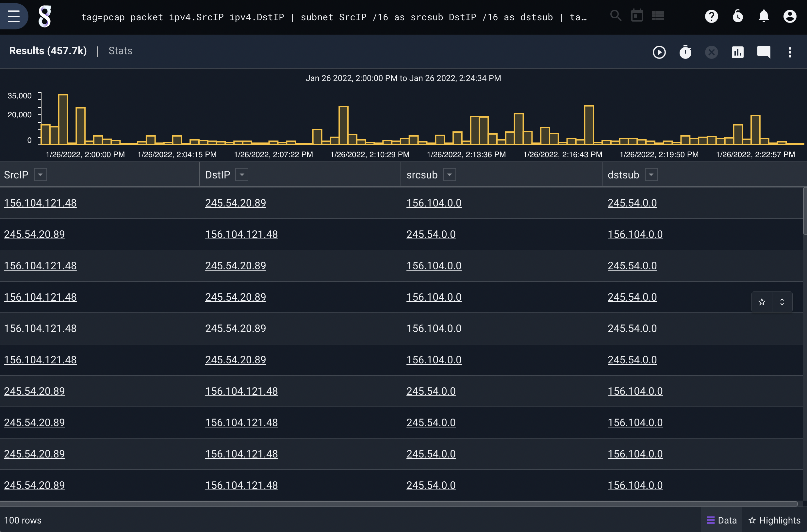

## Subnet

Subnet is designed to extract a subnet from an IP address.  This is useful for looking at values that only fall within a specific subnet, or for classifying attackers based on points of origin.  By default the subnet module assumes IPv4, but fully supports IPv6 via the `-6` flag. The subnet is by default extracted to an enumerated value named 'subnet', but the "as" flag allows you to specify a different target.

### Supported Options

* `-4`: Look for IPv4 subnets and IPs
* `-6`: Look for IPv6 subnets and IPs

### Example Usage

Charting failed SSH login attempts by origin subnet

```
tag=syslog grep sshd | grep "Failed password for" | regex "\sfrom\s(?P<ip>\S+)\s" | subnet ip /16 | count by subnet | chart count by subnet limit 64
```

Filtering failed SSH login attempts to only those from a specific subnet

```
tag=syslog grep sshd | grep "Failed password for" | regex "\sfrom\s(?P<ip>\S+)\s" | subnet ip /16 as attackersub | grep -e attackersub “34.22.1.0” | count by ip | sort by count desc | table ip count
```

Get the source and destination subnets from packets:

```
tag=pcap packet ipv4.SrcIP ipv4.DstIP | subnet SrcIP /16 as srcsub DstIP /16 as dstsub | table
```

