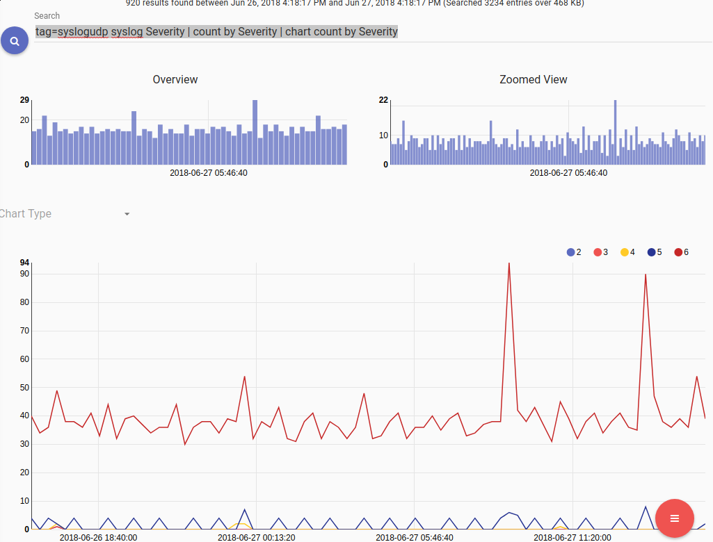

# Syslog

The syslog processor extracts fields from [RFC 5424-formatted](https://tools.ietf.org/html/rfc5424) syslog messages as ingested with the [Simple Relay ingester](#!ingesters/ingesters.md) (be sure to set the Keep-Priority flag on your listener, or it won't work).

## Supported Options

* `-e`: The “-e” option specifies that the syslog module should operate on an enumerated value.  Operating on enumerated values can be useful when you have extracted a syslog record using upstream modules.  You could e.g. extract syslog records from raw PCAP and pass the records into the syslog module.

## Processing Operators

Each syslog field supports a set of operators that can act as fast filters.  The filters supported by each operator are determined by the data type of the field.

| Operator | Name | Description |
|----------|------|-------------|
| == | Equal | Field must be equal
| != | Not equal | Field must not be equal
| < | Less than | Field must be less than
| > | Greater than | Field must be greater than
| <= | Less than or equal | Field must be less than or equal to
| >= | Greater than or equal | Field must be greater than or equal to

## Data Fields

The syslog module extracts individual fields from an RFC 5424-formatted syslog record. It makes a best-effort attempt to parse from left to right, meaning that if a field is missing, only those fields to the right of it will be available for a given record.

| Field | Description | Supported Operators | Example |
|-------|-------------|---------------------|---------|
| Facility | Numeric code indicating the facility from which the message originates | > < <= >= == != | Facility == 0
| Severity | Numeric code indicating the severity of the message, with 0 being the most severe and 7 the least | > < <= >= == != | Severity < 3
| Priority | The message priority, defined as (20*Facility)+Severity | > < <= >= == != | Priority >= 100
| Version | The version of the syslog protocol in use | > < <= >= == != | Version != 1
| Timestamp | A string representation of the timestamp provided in the log message | == != | |
| Hostname | The hostname of the machine which originally sent the syslog message | == != | Hostname != "myhost"
| Appname | The application which originally sent the syslog message, e.g. `systemd` | == != | Appname != "dhclient"
| ProcID | A string representing the process which sent the message, often a PID | == != | ProcID != "7053"
| MsgID | A string representing the type of message | == != | MsgID == "TCPIN"
| Message | The log message itself | == != | Message == "Critical error!" |
| StructuredID | A string containing the structured data ID for the first structured data element (see below) | == != | StructuredID == "ourSDID@32473"

Consider the following syslog record (sourced from [https://github.com/influxdata/go-syslog](https://github.com/influxdata/go-syslog)):

```
<165>4 2018-10-11T22:14:15.003Z mymach.it e - 1 [ex@32473 iut="3" foo="bar"] An application event log entry...
```

The syslog module would extract the following fields:

* Facility: 20
* Severity: 5
* Priority: 165
* Version: 4
* Timestamp: "2018-10-11T22:14:15.003Z"
* Hostname: "mymach.it"
* Appname: "e"
* ProcID: <nil> (not set)
* MsgID: "1"
* Message: "An application event log entry..."

### Structured Data

In the example record above, the portion `[ex@32473 iut="3" foo="bar"]` is the *Structured Data* section. Structured Data sections contain the structured value ID ("ex@32473", extracted with the `StructuredID` keyword) and any number of key-value pairs. To access a value using the syslog module, specify `Structured.key`: specifying `syslog Structured.iut` will extract an enumerated value named `iut` containing the value "3". Similarly, `syslog StructuredID Structured.foo` would extract `StructuredID` containing "ex@32473" and `foo` containing "bar".

Note that a single syslog message may contain multiple structured data sections, each with its own ID. If both sections define the same key, you may wish to explicitly specify which section to extract from. This can be done by inserting the Structured ID into the extraction: `syslog Structured[ex@32473].foo`. If you do not specify the ID, the module will extract a result from one of the sections with no guarantees as to which one.

Note: If multiple structured data sections exist, extracting the StructuredID field will return the ID of the first section. Filters will be checked against the IDs of all sections. For example, given an entry containing `[foo@bar a=b][baz@quux x=y]`, the entry will be dropped if you specify `StructuredID!="baz@quux"` *or* `StructuredID!="foo@bar"`. Specifying `StructuredID=="baz@quux"` will pass the example entry because *one* of the sections matches; it will only drop entries that don't have "baz@quux" as the ID of *any* section.

## Examples

### Number of events by severity

```
tag=syslog syslog Severity | count by Severity | chart count by Severity
```



### Number of events at each severity level by application

```
tag=syslog syslog Appname Severity | count by Appname,Severity | table Appname Severity count
```

