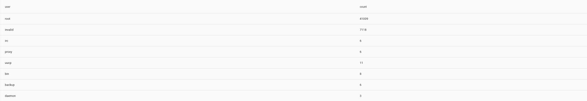
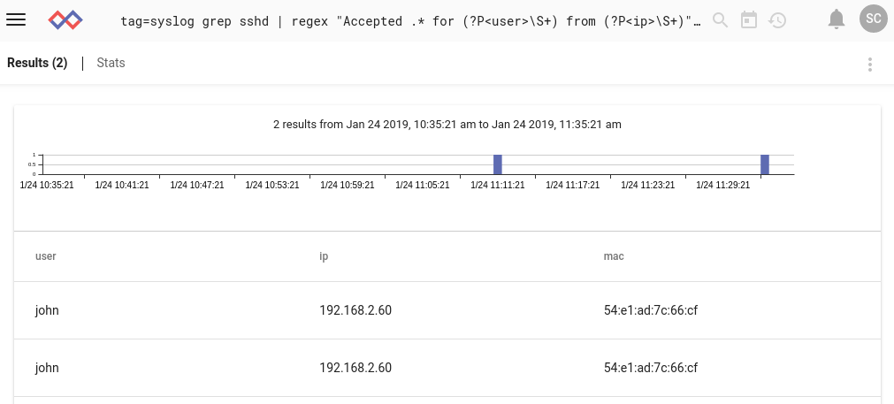
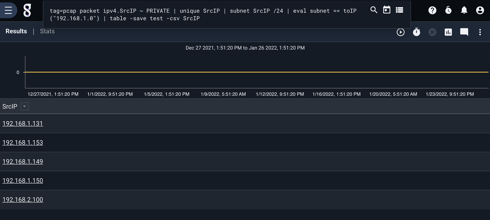
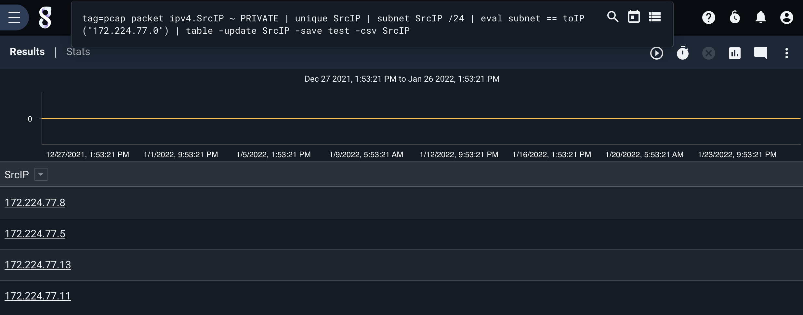

# Table

The table renderer is used to create tables. Building tables is done by providing arguments to the table renderer. Arguments must be enumerated values, TAG, TIMESTAMP, or SRC. Arguments will be used as the columns of the table.

Specifying no column arguments causes table to display all enumerated values as columns instead; this is useful for exploration.

## Supported options

* `-save <destination>`: save the resulting table as a resource for the [lookup module](#!search/lookup/lookup.md). This is a useful way to save the results of one search (say, extracting a MAC->IP mapping from DHCP logs) and use it in later searches.
* `-csv`: In conjunction with the -save flag, save the table in CSV format rather than the native Gravwell format (CSV is also compatible with the lookup module). Useful when exporting data.
* `-update <key>`: in conjunction with the `-save` flag, updates an existing table rather than overwriting it. This can be useful when using a scheduled search to maintain e.g. a list of all MAC addresses ever seen on the network. The columns of the existing lookup table must match the columns given as arguments. The "key" option is the name of one of the columns; when merging the old and new lookup tables, a row from the old table will only be included if the value in its keyed column does not exist in the new table.
* `-nt`: Put the table into non-temporal mode. This causes upstream math modules to condense results rather than having table do it. This can seriously speed up searches over large quantities of data when temporal sub-selection is not needed. It is also currently required when using the [stats module](#!search/stats/stats.md)

Note: When using the `-save` option, tables will by default be saved in Gravwell's native packed binary format. If you prefer to use CSV, specify the `-csv` flag. Be aware that the `-update` flag will happily overwrite a CSV resource with a binary table unless you specify `-csv`!

## Sample Queries

### Basic table use

Extract a few elements from a Netflow record, then have table automatically display them:

```
tag=netflow netflow Src Dst SrcPort DstPort | table
```

Find brute-force SSH attacks:

```
tag=syslog grep sshd | regex "authentication error for (?P<user>\S+)" | count by user | table user count
```



### Using the -nt option

In a situation with massive quantities of data, force table into non-temporal mode so the count module will condense results instead:

```
tag=jsonlogs json source | count by source | table -nt source count
```

### Using the -save option

Use DHCP logs to build a lookup table containing IP to MAC mappings:

```
tag=syslog regex "DHCPACK on (?P<ip>\S+) to (?P<mac>\S+)" | unique ip mac | table -save ip2mac ip mac
```

and then use the lookup table to find the MACs associated with SSH logins:

```
tag=syslog grep sshd | regex "Accepted .* for (?P<user>\S+) from (?P<ip>\S+)" | lookup -r ip2mac ip ip mac as mac |table user ip mac
```



### Using the -update option

In this example, we build a table containing IP addresses seen on the local network, then update it with more.

First, we construct a table that contains all unique private IPv4 addresses seen on the 192.168.2.0/24 network:

```
tag=pcap packet ipv4.SrcIP ~ PRIVATE | unique SrcIP | subnet SrcIP /24 | eval subnet == toIP("192.168.2.0") | table -save test -csv SrcIP
```



Downloading the resulting resource (named 'test') shows the expected table:

```
SrcIP
192.168.2.1
192.168.2.52
192.168.2.60
192.168.2.51
192.168.2.61
```

Next, we run another search to *add* IPs seen in the 192.168.0.0/24 subnet:

```
tag=pcap packet ipv4.SrcIP ~ PRIVATE | unique SrcIP | subnet SrcIP /24 | eval subnet == toIP("192.168.0.0") | table -update SrcIP -save test -csv SrcIP
```



Although the table that is *displayed* only shows the new IP addresses, the resource now contains the results of both searches:

```
SrcIP
192.168.0.50
192.168.0.60
192.168.0.1
192.168.0.71
192.168.0.30
192.168.0.2
192.168.0.73
192.168.0.70
192.168.0.42
192.168.0.72
192.168.2.1
192.168.2.52
192.168.2.60
192.168.2.51
192.168.2.61
```

We passed 'SrcIP' as the argument to -update. This is used for deduplication; any rows in the old table whose SrcIP match a row in the new table are not included in the updated resource.
