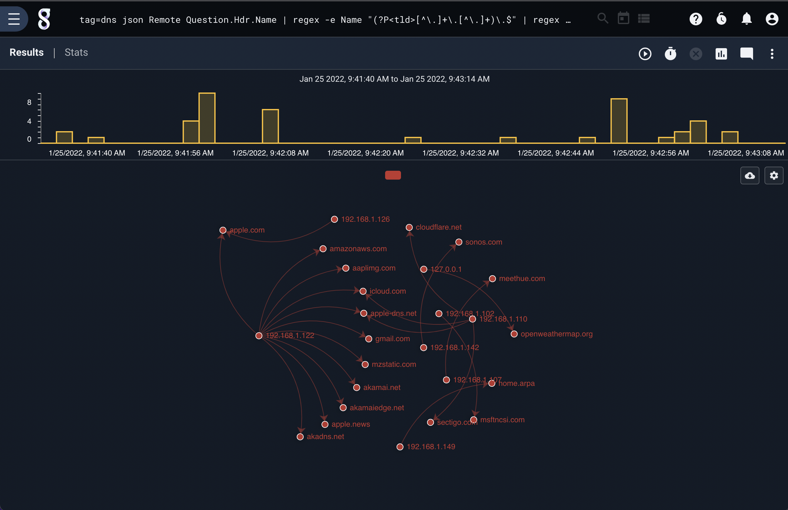
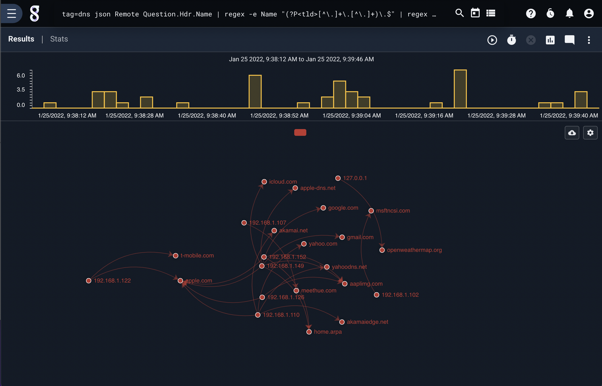

 
## Taint

The taint module is used for taint analysis and flow tracking.  The module can be used to specify known start points and then propagate "infections" forward.  Taint can also be used to specify infection endpoints and work backwards in time to identify origination points.  The taint module has the ability to reverse the direction of the search system.  For example, if taint is attempting to start with a known patient zero, it will force the search to start at the beginning of the time window and move forward in time.  However, if taint is starting with a known infection and working backwards to find patient zero, it will force the search to start at the end of the time window and move backwards.

Taint requires enumerated values to track tainted values from source to destination.  The source and destination arugments to taint can be any named enumerated value.  When moving forward in time (starting with a patient zero) the taint module will look for the enumerated value specified by the source argument and extract its value.  If the source value has been marked as tainted (either via a patient zero argument, or because of previous tainting) the destination value is then marked as tainted.

Taint tracking can also be performed in reverse, starting with some known infection point and working backwards in time using the -f flag.  The relationship of source to destination arguments is still preserved (source infects destination), so the source and destination enumerated value names should be reversed when using -f vs -pz.

The process of taint tracking is designed to propagate marks foward or backwards in time.  For example if we knew A was tainted, and we saw A touch B, then B touches C we would get a propagation of A->B->C whereby A, B, or C are all considered tainted and could then taint other enumerated values.

The taint module can be used to track network flow propagation, infection propagation, or movement of physical systems.  For example, if we were tracking ICMP propagation, the source enumerated value might be "SrcIP" and the destination argument might be the enumerated value "DstIP".

Gravwell presented research at the S4x18 conference in Miami which successfully tracked USB based infectors that [hopped air gaps](https://s4x18.com/sessions/using-force-directed-graphs-to-analyze-huge-event-datasets/).

Attention: Because taint can control the direction of the search, it is not advisable to combine it with the sort module.

### Syntax

The command syntax for the taint module is similar to a force directed graph.  We must specify a source and destination with flags designating whether flow is bidirectional.  A starting point is required, whether it be a patient zero (-pz) or a known infection (-f).

#### Starting with patient zero
```
taint -pz <known value> <src> <dest>
```

#### Starting with known endpoint
```
taint -f <known value> <src> <dest>
```

### Supported Options
* `-pz <arg>`: The -pz flag specifies the value for a patient zero (starting point).  Taint will look in the <src> enumerated values for the patient zero value to start tainting.
* `-f <arg>`: The -f flag specifies the value for a known infection.  Taint will look in enumerated values specified by <src> for the known-infected value and begin tracking taints.
* `-b`: The -b flag specifies that infections are bidirectional, and if either side has been tainted in the past, the taint is transferred to the other.
* `-a`: The -a flag specifies that all entries should pass through the taint module, meaning that the taint module will NOT drop entries that do not contain tainted values.

### Examples

If we were to assume that a vicious new infection vector was found which could arbitrarily infect DNS servers by embedding a payload in their lookup cache, we could use the taint module to identify which top level domain names may have been attacked.  The following search starts with a known patient zero, and generates a force directed graph showing all future ppropagation of tainted domains in a small network.

```
tag=dns json Remote Answer.Hdr.Name |  regex -e Name "(?P<tld>[^\.]+\.[^\.]+)\.$" | regex -e Remote "(?P<ip>[\d\.]+):\d+" | taint -b -pz 10.0.0.99 ip tld | fdg -b ip tld
```



Reversing the work flow, the following search shows how a hunter might start with a known infection and work backwards to a potential patient zero.

```
tag=dns json Remote Answer.Hdr.Name |  regex -e Name "(?P<tld>[^\.]+\.[^\.]+)\.$" | regex -e Remote "(?P<ip>[\d\.]+):\d+" | taint -b -f google.com tld ip | fdg -b ip tld
```


