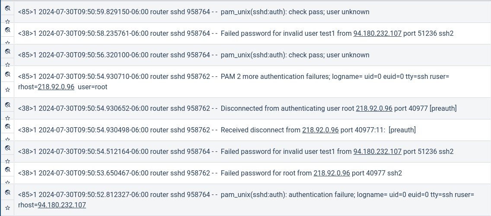
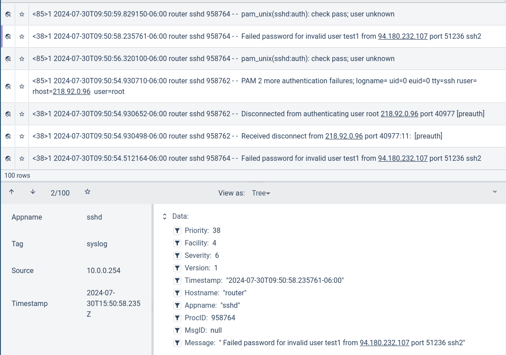

# Text

The text renderer is designed to show human readable entries in a text format. Any non-printable characters will be converted to the ‘.’ character. Text also fully supports Unicode and can render non-ASCII characters. Text is the default renderer and is applied if no renderer is specified.

The text renderer is also the main interface to [Data Explorer](/gui/data-explorer/de).

