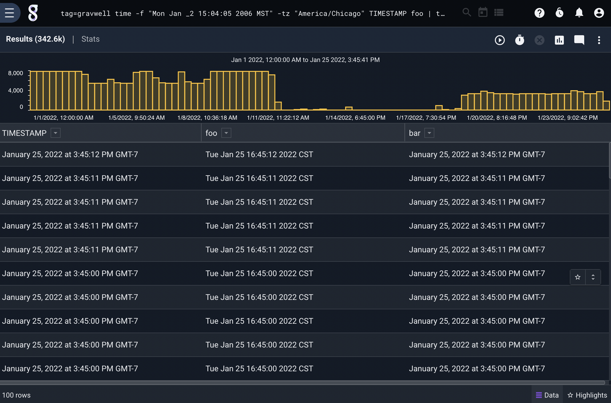

# Time

The time module is used to convert Timestamp enumerated values into formatted strings, and vice versa. For example, the following will print each entry's built-in timestamp value using the specified format and save the result as a string in a new enumerated value named "formattedTS":

```
time -f "Mon Jan _2 15:04:05 2006 MST" TIMESTAMP formattedTS
```

If the first enumerated value argument is a string rather than a timestamp, the module will instead attempt to parse the string as a time and save the output into a Timestamp enumerated value. Note that if no specific format is given, the module will use the `timegrinder` library to try many possibilities. The following will look at a string enumerated value named "tsString" and attempt to convert it to a timestamp, placing the result in "extractedTS" if successful.

```
time tsString extractedTS
```

## Supported Options

* `-f <format>`: Specifies the format to be used when printing timestamps or optionally when parsing strings. The format consists of a string representation of a specific time, "Mon Jan 2 15:04:05 MST 2006", as used by the [Go time library](https://golang.org/pkg/time/#pkg-constants). For instance, one may say `-f "Mon 3:04PM"` to get a very brief timestamp format. Refer to the linked documentation for more examples.
* `-tz <timezone>`: Specifies a time zone, in [tz database format](https://en.wikipedia.org/wiki/List_of_tz_database_time_zones), e.g. "America/Denver", "UTC", or "Atlantic/Reykjavik". This time zone will be used when *printing* timestamps (which do not have a time zone associated with them) and when *parsing* strings which do not contain a time zone specification.

## Examples

To print entry timestamps in a specific format and time zone:

```
tag=json time -f "Mon Jan _2 15:04:05 2006 MST" -tz "America/Chicago" TIMESTAMP foo | table TIMESTAMP foo
```


The output of the previous module invocation can be fed back in to the time module to convert back into timestamps:

```
tag=json time -f "Mon Jan _2 15:04:05 2006 MST" -tz "America/Chicago" TIMESTAMP foo | time -f "Mon Jan _2 15:04:05 2006 MST" -tz "America/Chicago" foo bar | table TIMESTAMP foo bar
```



Note that the fractional seconds are truncated in the final output, because the intermediate time format does not include them.