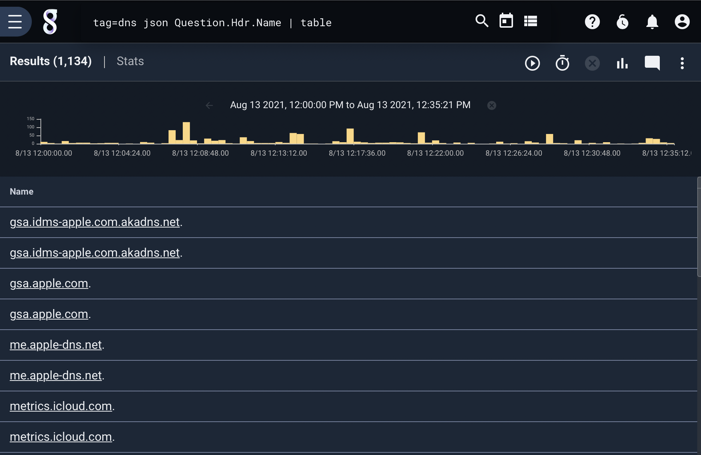
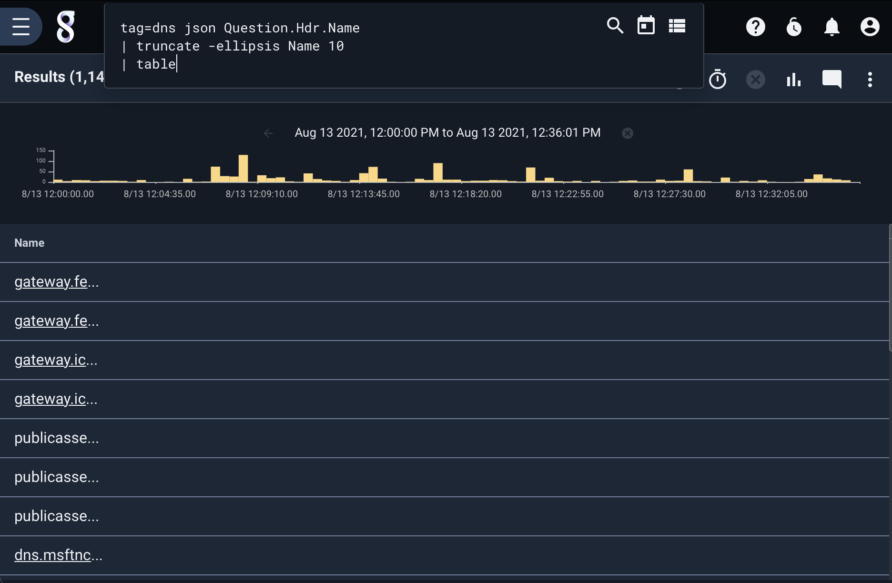

## truncate 

The `truncate` module preserves only the first N characters (or bytes when using binary mode) of enumerated values. For example, to truncate all but the first 20 characters of the EV "Message":

```
tag=data json IP Message | truncate -e Message 20 | table
```

`truncate` only operates on string and byte slice enumerated values and by default assumes data is UTF-8 encoded. You can override this behavior by using the `-binary` flag.

### Supported Options

* `-ellipsis`: Optional. Add an ellipsis (three period characters, "...") to the string *after* truncating, meaning all truncated values will be three characters longer than specified.
* `-binary`: Optional. Treat data as byte slices instead of UTF-8 strings.

### Example

In this example, we extract requests from DNS:

```
tag=dns json Question.Hdr.Name | table
```



We can truncate, and add back an ellipsis, using the `truncate` module: 

```
tag=dns json Question.Hdr.Name 
| truncate -ellipsis Name 10 
| table
```



