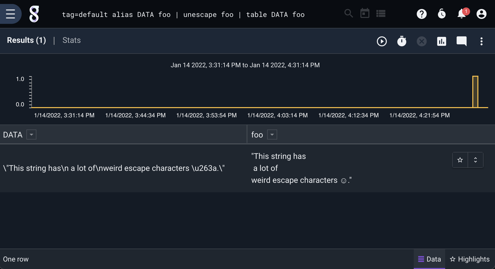

## Unescape

The unescape module converts escaped control characters, regular characters, and numeric escape sequences in strings into their unescaped representation. The unescape module has no flags. When invoked with no arguments, unescape processes the entry data. Optionally, you can pass any number of enumerated values as arguments to be unescaped. 

### Example Usage

This example unescapes a string "foo":

```
tag=default alias DATA foo | unescape foo | table DATA foo
```


