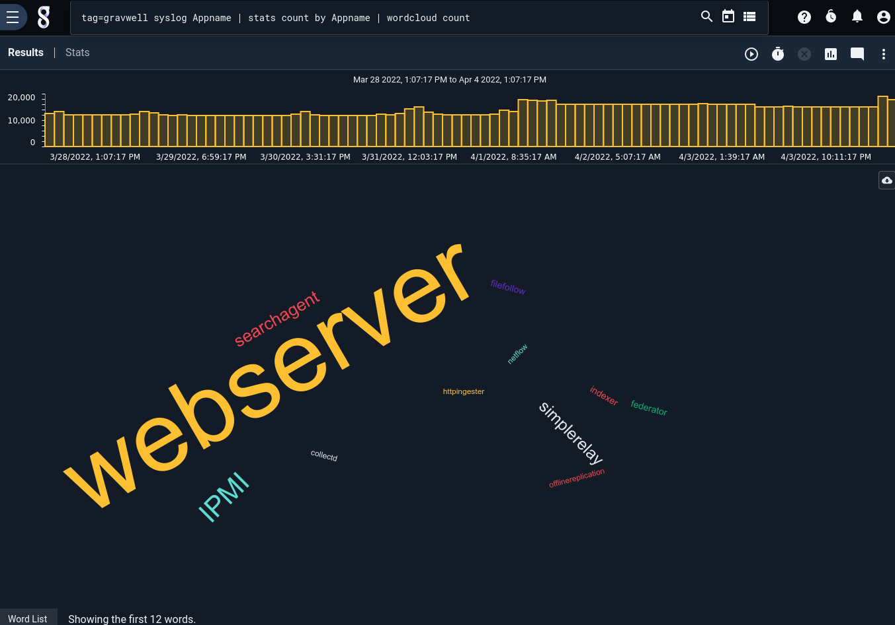
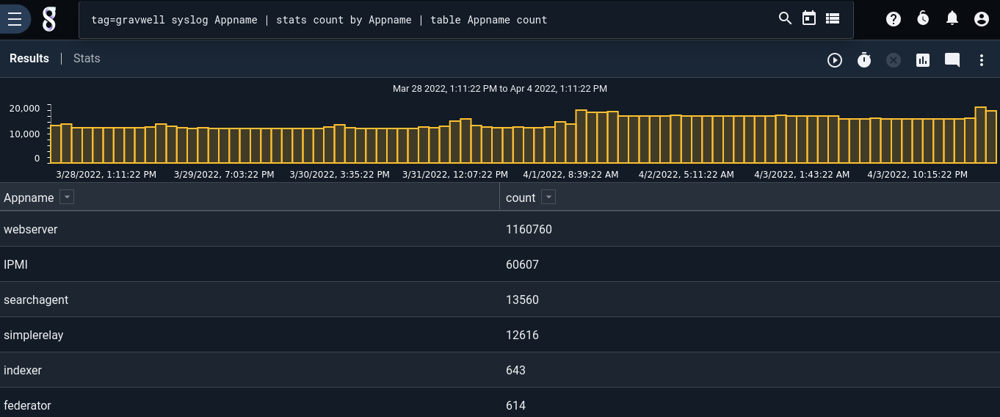
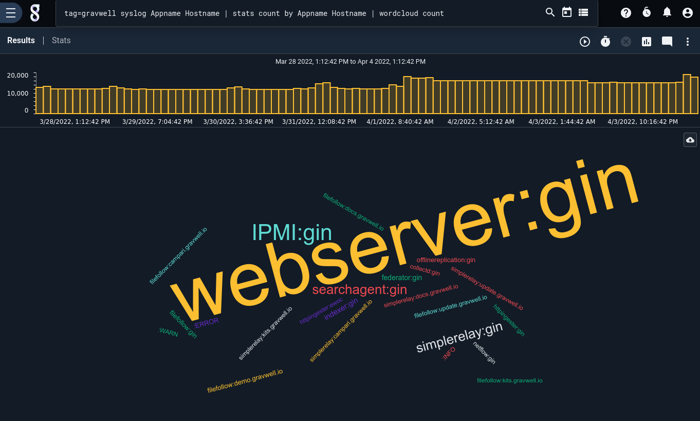
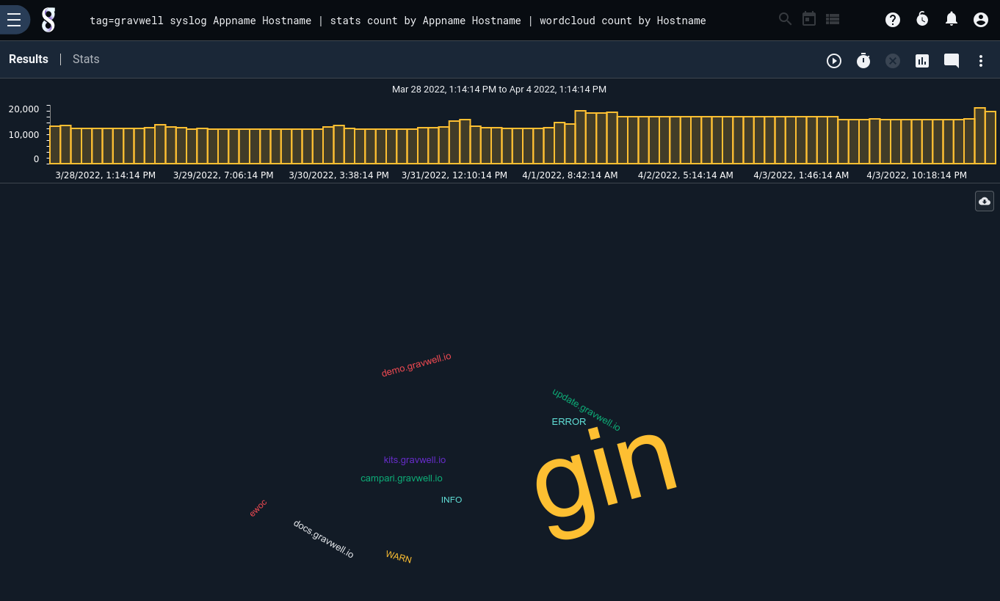

# Wordcloud

The wordcloud renderer displays a "word cloud" in which the size of a word depends on the magnitude of a stats operation.

## Basic Usage

The wordcloud renderer takes a single magnitude enumerated value as its argument. This E.V. should be *condensable* and *keyed*, as generated by the [stats module](/search/stats/stats) module. For example, the following query counts the number of log entries from each Gravwell component (the Appname field), then passes the `count` E.V. to wordcloud:

```gravwell
tag=gravwell syslog Appname | stats count by Appname | wordcloud count
```



Because we counted *by* `Appname`, the `count` enumerated value is considered "keyed" on `Appname`. The renderer pulls the *word* from `Appname` and determines the *size* of the word by the `count` value. If we send the results to the table renderer instead, the relation becomes clear:

```gravwell
tag=gravwell syslog Appname | stats count by Appname | table Appname count
```



## Advanced Keying & Re-Condensing

If multiple keys are specified in the stats operation, the wordcloud renderer will join the keys together:

```gravwell
tag=gravwell syslog Appname Hostname | stats count by Appname Hostname | wordcloud count
```



Although it is not typically required, you can manually specify a subset of the keys to force the renderer to re-condense the results. For instance, the following query does a count by Appname and Hostname, but then re-condenses the results in the *renderer* so as to count only by Hostname:

```gravwell
tag=gravwell syslog Appname Hostname | stats count by Appname Hostname | wordcloud count by Hostname
```


