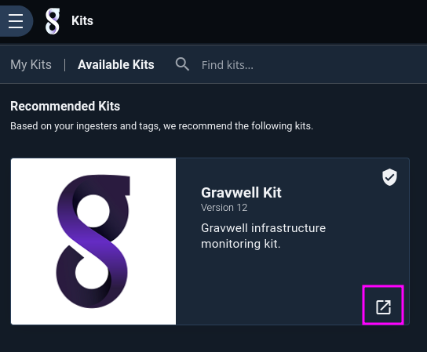
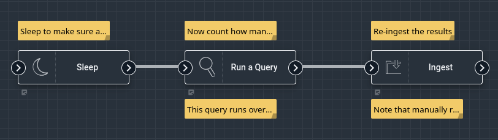
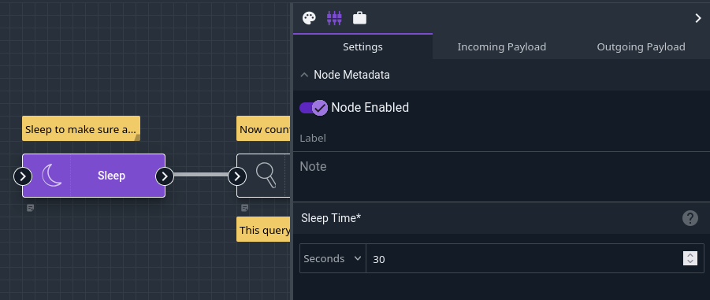
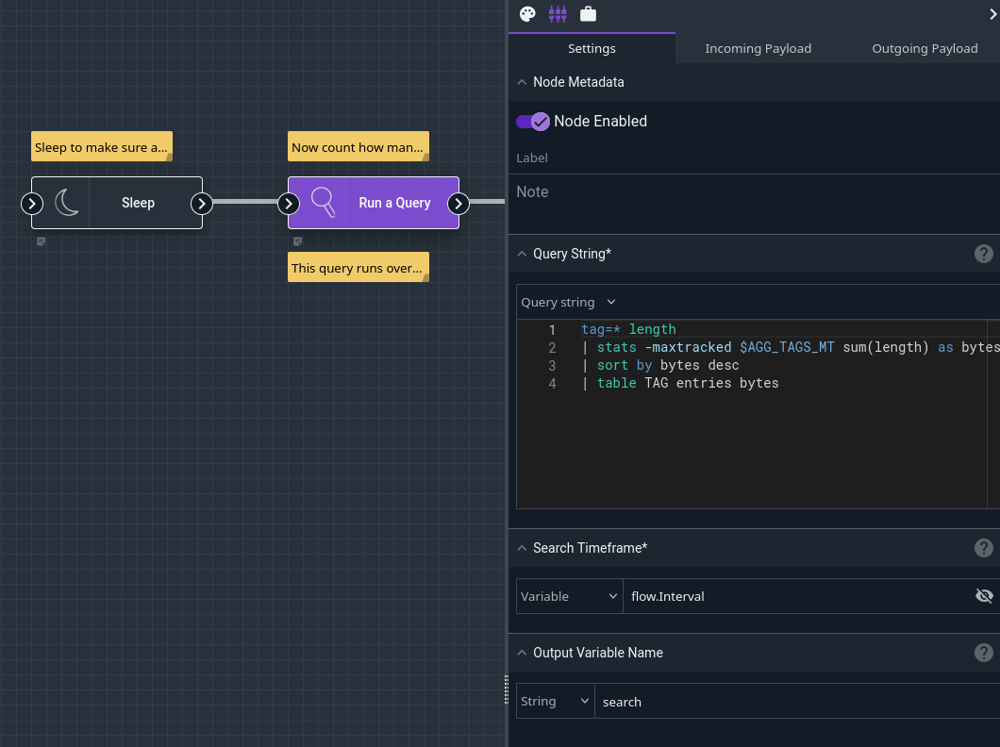
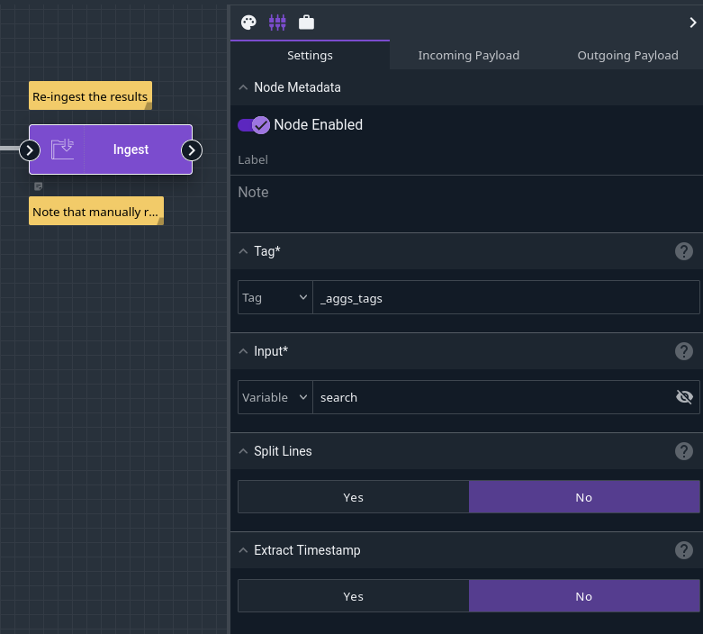
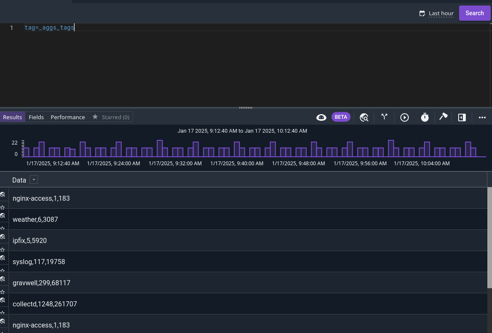
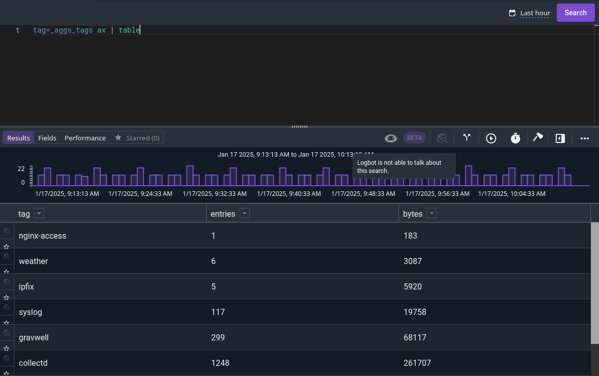
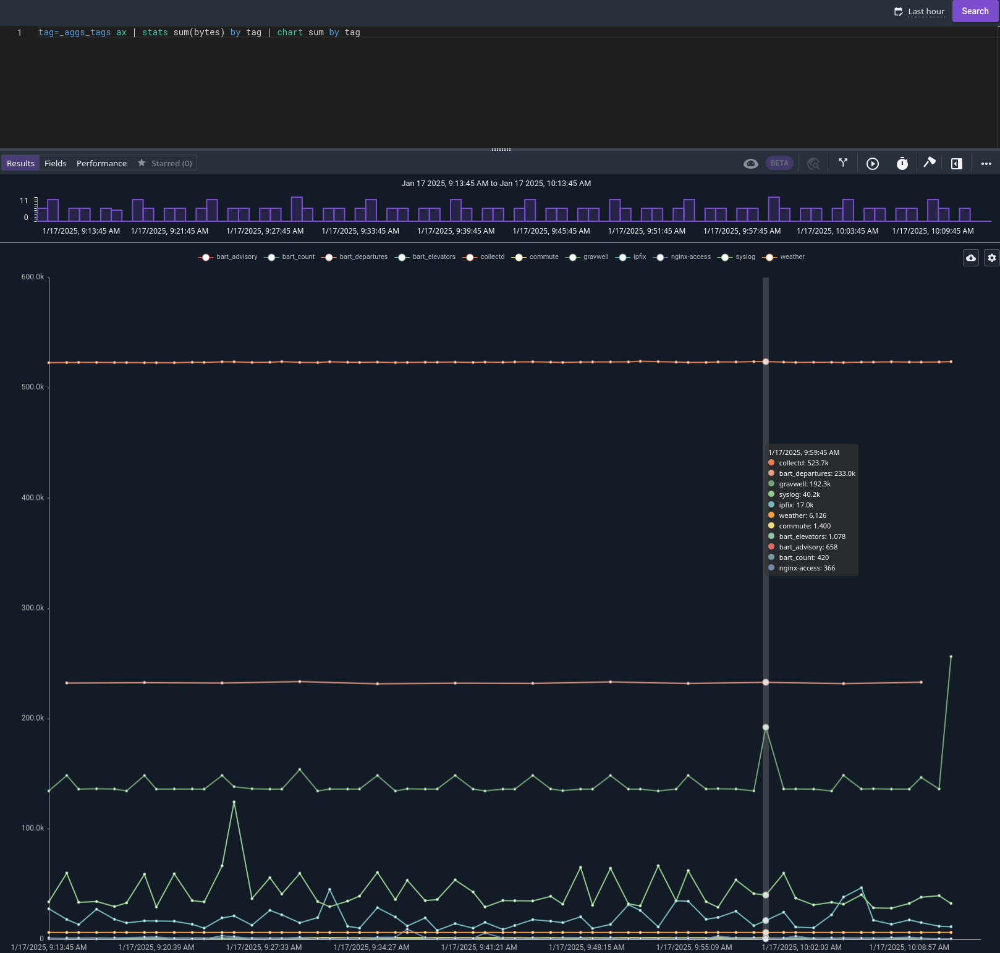
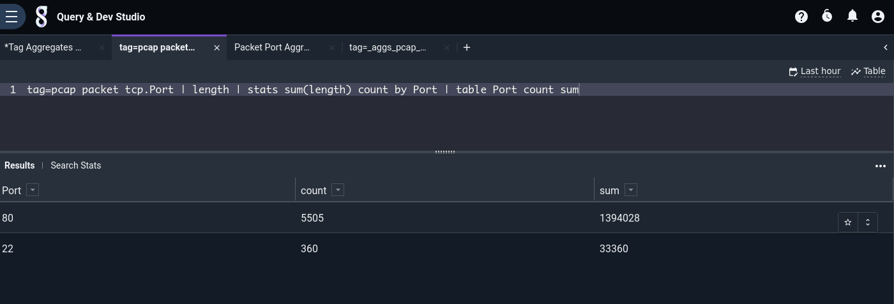
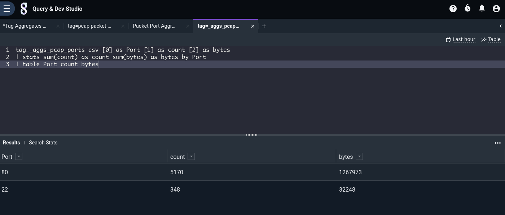

# Data Aggregation

Although Gravwell queries are fast, some questions, like "how much data did we ingest into each tag over the last year", can take a while to answer due to the massive quantities of data involved. If you have to pull 150 TB of entries off the disk in order to tally up sizes per tag, it may take a while!

Our recommended solution? Ingest some more stuff; specifically, ingest periodic *statistics* about your data. We call these "aggregates", or just "aggs". The Gravwell [kit](/kits/kits) includes a pre-built aggregate [flow](/flows/flows) which does basic aggregation with zero configuration required on the user's part; using this as an example, you can build your own flows to generate custom aggs. This page shows how to deploy the pre-built aggregate flow, how to query aggs, and gives some hints on building your own agg flows.

```{note}
By convention, aggregates are ingested into tags beginning with `_aggs`, e.g. `_aggs_tags`, `_aggs_userstats`, etc. The default `gravwell.conf` configuration includes a separate well specifically for aggregates for the sake of performance and retention.
```

## The pre-built agg flow

To get the pre-built aggregates flow, install the Gravwell kit by selecting "Kits" in the main menu, then clicking the "Available Kits" tag and deploying the Gravwell kit:



The kit installs a flow named "Tag Aggregates". Note that there should only be one instance of this flow installed per system, or you will generate duplicate aggs!

The flow will begin running automatically. By default, it runs every minute, generating statistics about the number and size of entries in each tag and ingesting those statistics into the `_aggs_tags` tag.

Now that the flow is running and generating aggs, it is instructive to take a look at what it actually *does*. The flow is composed of 3 nodes: Sleep, Run Query, and Ingest.



The [Sleep](/flows/nodes/sleep) node makes execution of the flow pause for 30 seconds. This allows any "late" entries to get fully ingested so they can be properly counted.



The [Run Query](/flows/nodes/runquery) node runs the following Gravwell query over the interval of the flow--the last hour, the last 5 minutes, etc. Critically, it runs the search up until the time the flow was *scheduled to begin* execution, not the current time, so statistics will be properly bounded:

```gravwell
tag=* length
| stats sum(length) as bytes count as entries by TAG 
| sort by bytes desc 
| table TAG entries bytes
```



The query is pretty simple: it pulls all entries from all tags and computes their length. It then sums up the lengths and counts the number of entries, maintaining separate totals for each tag. It then sorts those results to place the biggest sum first, and outputs the results in a table.

Finally, the [Ingest](/flows/nodes/ingest) node is configured to ingest the results of that search into the `_aggs_tags` tag. Each row in the table (consisting of a tag name, an entry count, and a byte total) becomes a separate entry.



## Querying aggregates

The basic per-tag aggregates end up in the Gravwell tag named `_aggs_tags`. The raw entries are in CSV format:



The Gravwell kit includes a predefined [autoextractor](/search/ax/ax) definition for the `_aggs_tags` tag:

```gravwell
tag=_aggs_tags ax | table
```



Each row in the table represents totals for that tag over a 5-minute period. By invoking the [stats](/search/stats/stats) module, we can generate sums suitable for use in a chart:

```gravwell
tag=_aggs_tags csv [0] as tag [1] as count [2] as bytes | stats sum(bytes) by tag | chart sum by tag
```



```{note}
The aggregated entries *must* pass through the stats module before being charted. Consider the table of `_aggs_tags` results shown earlier; it contains 5-minute counts for each different tag. Each of these counts must be summed (using the stats module) in order to get valid results.
```

## Building your own aggs

The same pattern used in the pre-built aggregates flow (run a query, ingest the results) can be applied to generate summarized statistics for other purposes, too. By building a few well-thought-out aggregate flows and basing dashboards on *those* rather than on the raw data, you can significantly improve performance for commonly-used queries.

For instance, suppose we frequently want to check which TCP ports are seeing the most traffic. We can compute the number of packets and number of bytes sent using this query:

```gravwell
tag=pcap packet tcp.Port 
| length 
| stats sum(length) count by Port 
| table Port count sum
```



However, if we're doing full packet capture, there may be *huge* quantities of packets involved, and the query could take quite a while. If we wish to include this information in a dashboard and refer to it often, it makes sense to craft a custom agg flow. We can actually base it on the same pre-built flow as before (select the 3-dot menu on the Tag Aggregates flow & click "Duplicate", but be sure to disable the flow until you've modified it!), we just need to make a few tweaks:

* Rename the flow to something like "Packet Port Aggregates".
* Change the Run Query node's query to match the one above instead of the default.
* Change the Ingest node so it ingests into a different tag, e.g. `_aggs_pcap_ports`.

Once the flow is running, we can use the csv module to generate a table like the one seen above (we have not yet defined an appropriate AX definition for this new tag, so we use csv manually).

```gravwell
tag=_aggs_pcap_ports csv [0] as Port [1] as count [2] as bytes 
| stats sum(count) as count sum(bytes) as bytes by Port 
| table Port count bytes
```



## Agg caveats

Keep in mind that, since aggregates are built up by periodically executing a flow which runs Gravwell queries and re-ingests the results, there are several cluster problems which could cause the flow's execution to fail, meaning aggregates are not generated for a given time period:

* Search agent service is down / cannot communicate with webserver and backfilling is not enabled.
* Webserver goes down.
* Indexer(s) are down / inaccessible to the webserver (this may cause partial results).

Also note that if multiple users instantiate the same agg flow, **duplicate aggregate entries will be ingested!** Queries which use duplicate aggs will have incorrect results. For this reason, in a multi-user Gravwell installation we recommend restricting ingest permissions to admin users only (see `Webserver-Ingest-Groups` in [the configuration page](/configuration/parameters)) and coordinating with other admin users to ensure duplicate flows are not in use.
