# Joins

Joining data is a powerful way to bring together multiple datasets, enrich data based off of summarizations of other data sets or parse a single dataset multiple times with a single output. While joins are flexible, keep in mind that every joined query will act as a full execution of a query. 


## Example 1 - Enriching data with Compound Search

For this example we want to use the intel data below to filter our web login data to see if any of the logins were from risky IPs. Normally we would have a resource to pull from but this data changes so rapidly that we have ingested it and need to query to find the latest risk.

Below is a basic query of the data:

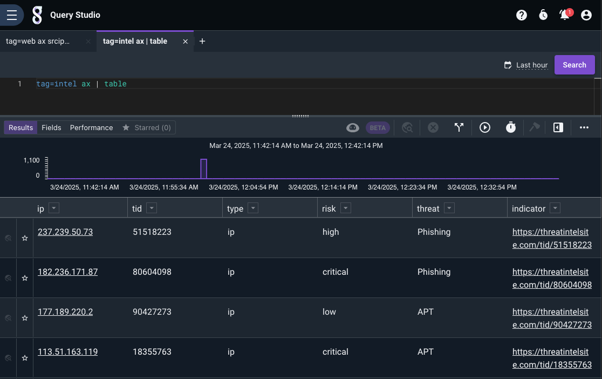

This query will give us the latest by IP and show us the fields we want to work with:

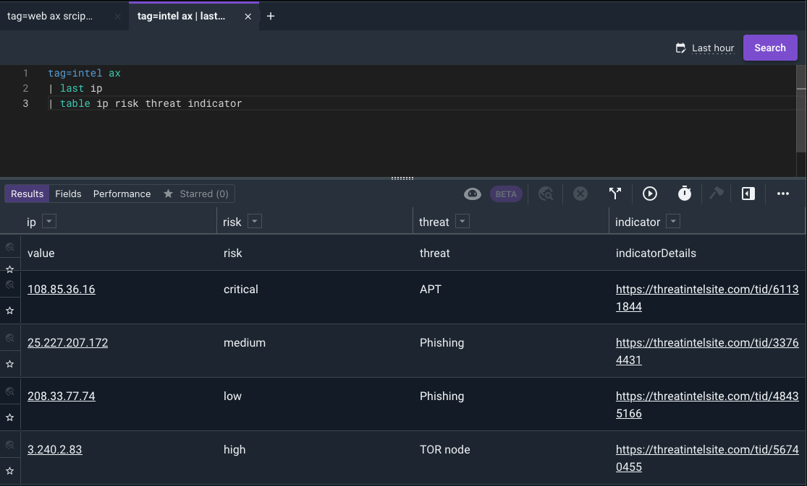

Below is the web login data:

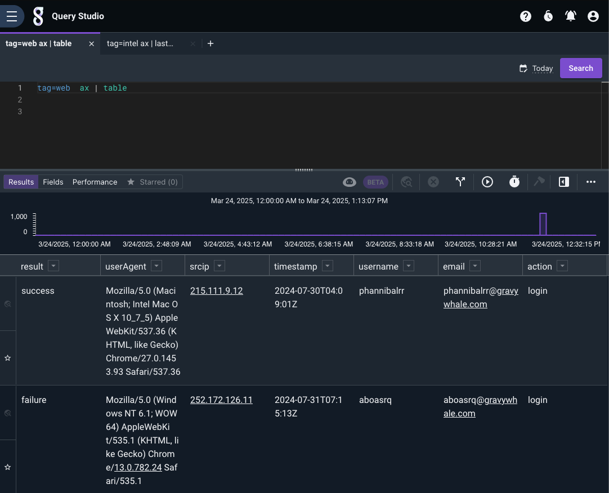

Now we can use a compound query to find the latest IP risk from the intel data and join it to the web login data.  If there are any matches they will show data in the `risk` `threat` and `indicator` columns. Check out [compound queries](https://docs.gravwell.io/search/spec.html#compound-queries) to read up on syntax and flags. 


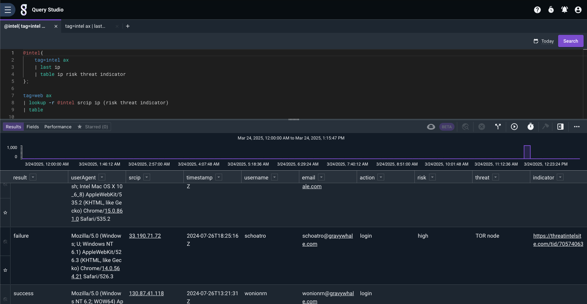

The above query shows all records, including those that didn't match any thread intel data. Now let's filter out those records. For this we can add the `-s` flag to make the lookup strict, which would require the match to be successful to show. 

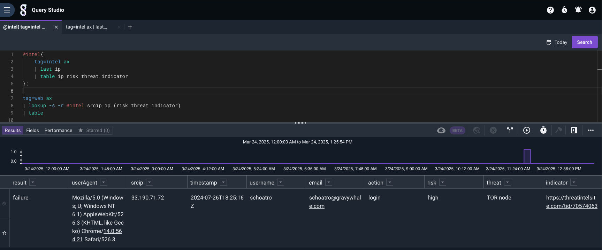

### Final Query
```
@intel{
	tag=intel ax
	| last ip
	| table ip risk threat indicator
};

tag=web ax
| lookup -s -r @intel srcip ip (risk threat indicator)
| table
```

## Example 2 - Multiple Data Sets

Lets build off the data from the last example. Let's see what happened after a user connected to the risky IP.

If we look at the proxy logs and compare them to the threat intel from our previous example it looks like we have one hit. The user is `drevil` and the internal ip is `192.168.5.25`.

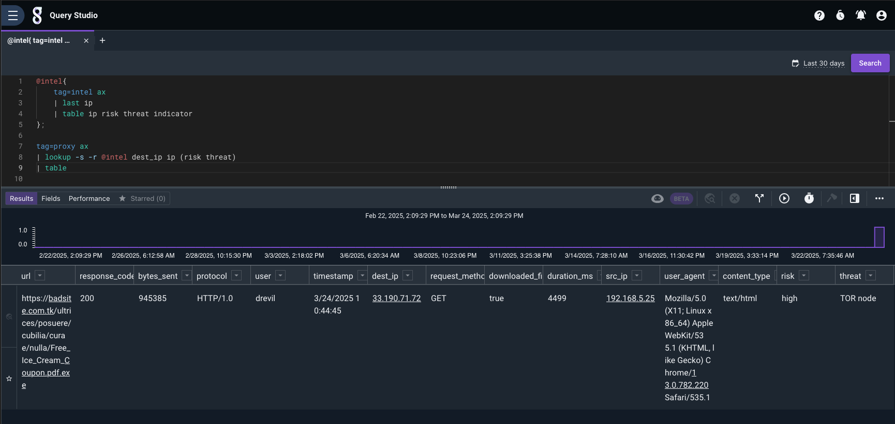

Since that event show that a file was downloaded lets see if there is any activity in the AV tag from that IP. Since we can use compound searches we can keep movething them up the query.

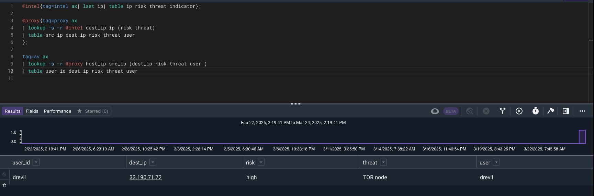

We can see from the results that `drevil` is showing up in a few places lets expand our search to other datasources and match on `IP` or `username`.

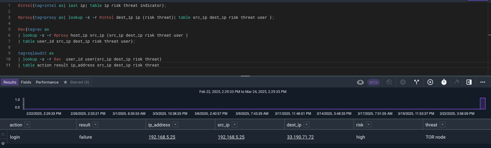

With this result it looks like the user could not get in with the `drevil` credentials. What if they tried more than one username?

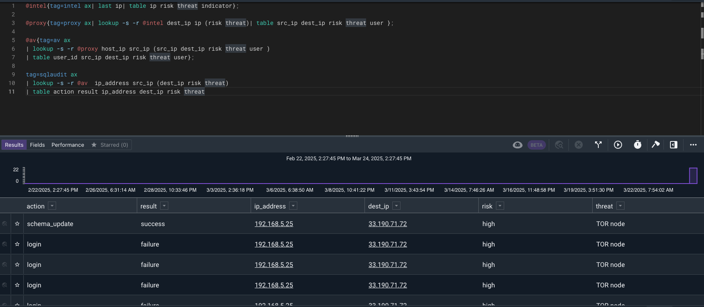

It looks like they use a password spray attack to find an account and performed some SQL table actions. Lets find what they did.

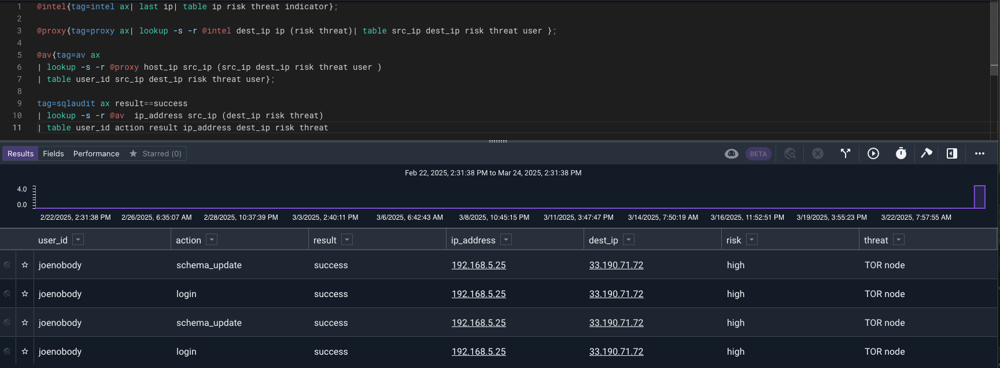

The attacker successfully logged in and performed a schema_update with the joenobody account. 

## Example 2 - Enriching data with Resource

In this example we will create a scheduled search that will keep a threat intel resource up to date and create a query that uses that resource to look for matches between web proxy logs and threat intel. 

Part 1 - Creating a Resource from Log Data

Let's start off with a query on the intel data to pull the latest lastSeen where the indicator has been seen in the last week by value 

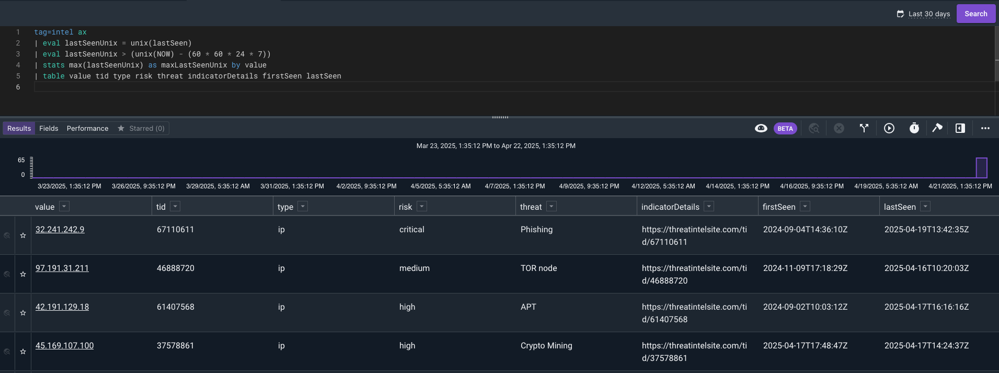

Now let's save this to a resource. We will use the `-save` and `-csv` flags to save the results as a CSV resource.

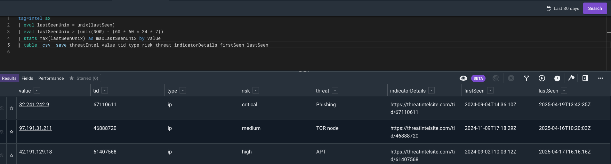

Now we can create a scheduled search to keep the lookup up to date. We've used a naming pattern that identifies it is a `Generator` scheduled search and has a lookup resource as a result. 

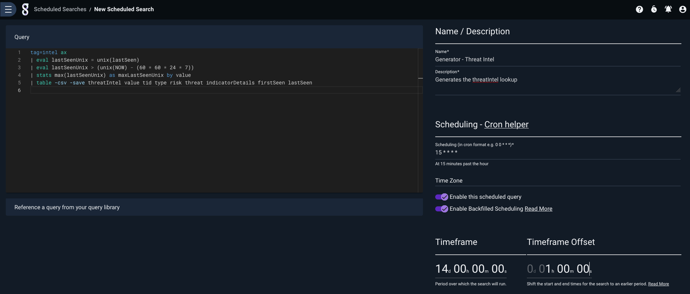

Now we need to set the permissions on the scheduled search and the resource it generates. 


### Utilizing the Generated Lookup

Now we will query our proxy logs to see if there were any matches with the threat intel data.  Using the -s flag with the `lookup` module allows only entries with a match through.

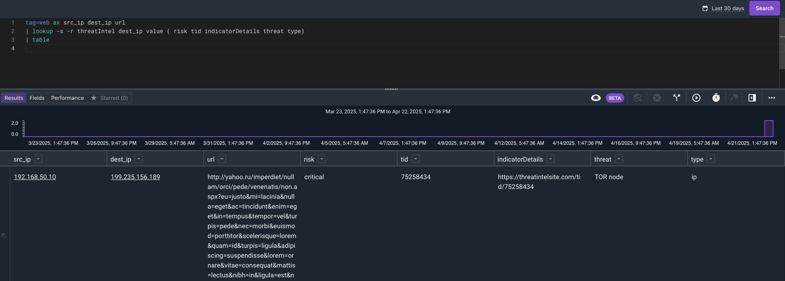

