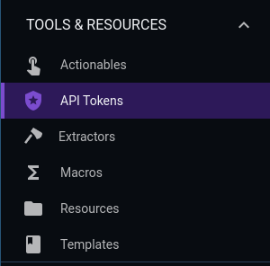
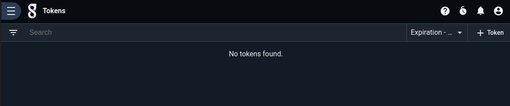
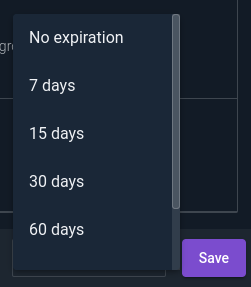
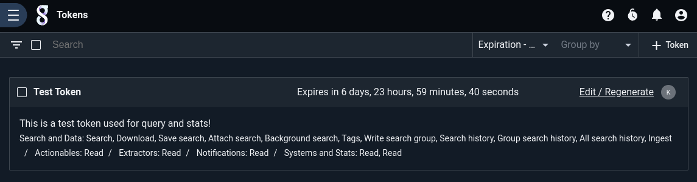
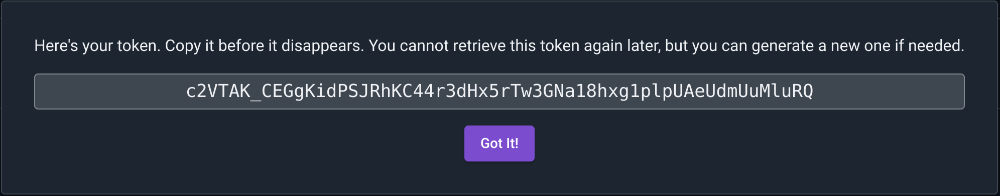

# API Tokens System

The Gravwell API Token system is designed to allow users to create restricted tokens that can be used to access specific APIs in Gravwell without requiring a full login cycle.  This means that a user can generate a token and use it to access a restricted set of APIs in scripts, command line applications, and 3rd party programs that may not have direct Gravwell integration.  API tokens consist of a randomly generated authentication token, a set of access allowances, and an optional expiration.  All users have access to the tokens API; admins can disable access to tokens API for non-admin users using the Gravwell ABAC system.

The Tokens API interface is located in the "Tools & Resources" navigation section.



The default interface of the Tokens API page shows all the currently constructed tokens, both expired and not.



When creating a new token you will need to provide a name, description, set of permissions, and an optional expiration date.



Permissions can be selected in groups or as fine controls.  For example, you can select the "Search and Data" group which will automatically fill in all the API permissions required to interact with the search system.  This includes executing searches, getting the search history, downloading, saving, and attaching to searches.  It is also possible to pick specific functionality within search groups such as the ability to read actionables but not write them.  This example shows a token that is subscribed to the "Search and Data" group and also allows for reading Actionables and Extractors but cannot write to either.



Once appropriate permissions are selected go to the bottom of the permissions page and select an optional expiration; you can pick a relative date or a specific timestamp.  After that timestamp the token will still be available in the API Tokens interface but it will not be usable.  This means you can optionally refresh the token and extend its expiration or delete it at your leisure.

After populating your new token with a name, description, permissions, and an optional expiration it is time to actually make the token by clicking the `Generate` button.  At this point Gravwell will create the token and provide it to you.



```{note}
Make sure to record the token, Gravwell will never again provide that token to you, this is your one and only chance to record it.
```

## Token Permissions

Token permissions are defined using specific allowances, you select exactly which functionality a given token is allowed to perform.  The Gravwell user interface provides some nice features to let you select groups of permissions that might be logically related, but in the end each token must declare exactly what APIs and systems it is allowed to access.  Most permissions are divided into read/write components.  This means that you can create a token that can read resources but not write them, or a token that can read the state of automation scripts but not create, update, or schedule them.

Permissions on tokens are an overlay on the users existing permissions.  This means that if the current user cannot access an API or feature, then the token cannot either.  Tokens can only restrict access, they cannot grant access that a user does not currently have.

```{note}
The `Token write` permission can be particularly dangerous. If you grant a token the ability to write to the token API it can create new tokens with any permission it wants.  Token permissions are not transitive, tokens that create other tokens do not inherit their parent's permission set.
```

## Restrictions

The token system only provides access to user-level APIs and cannot be used by admins to access admin-level APIs.  An admin can still create and use tokens, but they cannot access APIs that require admin permissions.  For example, an admin cannot use a token to create users or update a license.

Tokens can only be restrictive, this means that a token cannot grant more privileges than a user currently has.  If a user does not have access to the ingest API, the user cannot create a token to access the ingest API.  Token privileges are overlaid onto the users existing privileges, if a user loses access to an API all tokens immediately also lose access to the API.

## Token Usage

The token system is leveraged by providing the token in the `Gravwell-Token` header for all HTTP API requests.  For example, if we had a token with the value `rQ_e-7I8xRgeFYJpWzqMdEu391HCTC0QYvvJl_fp9YNXNquAcopy` we could use the [curl](https://curl.se/) tool to access APIs with the following snippet:

```
curl --header "Gravwell-Token: rQ_e-7I8xRgeFYJpWzqMdEu391HCTC0QYvvJl_fp9YNXNquAcopy" https://gravwell.system.com/api/notifications
```

### Examples

This section is by no means exhaustive in the set of Gravwell APIs that can be accessed by tokens.  Executing queries requires a slightly more elaborate API interaction, for more information checkout the [Direct Query API](/search/directquery/directquery) section.

#### Get Tags

```
curl --header "Gravwell-Token: rQ_e-7I8xRgeFYJpWzqMdEu391HCTC0QYvvJl_fp9YNXNquAcopy" https://gravwell.system.com/api/tags
```

```
["default","gravwell","syslog","apache","ipfix","netflow"]
```

#### Get Search History

```
curl --header "Gravwell-Token: rQ_e-7I8xRgeFYJpWzqMdEu391HCTC0QYvvJl_fp9YNXNquAcopy" https://gravwell.system.com/api/searchhistory
```

```
[
  {
    "UID": 1,
    "GID": 2,
    "UserQuery": "tag=zeek* stats count by TAG | table",
    "EffectiveQuery": "tag=zeek* stats count by TAG | table",
    "Launched": "2022-03-27T17:26:01.88726136Z",
    "Synced": true
  },
  {
    "UID": 1,
    "GID": 2,
    "UserQuery": "tag=netflow",
    "EffectiveQuery": "tag=netflow",
    "Launched": "2022-03-25T21:41:03.199249724Z",
    "Synced": true
  },
]
```

#### List Search States

```
curl --header "Gravwell-Token: rQ_e-7I8xRgeFYJpWzqMdEu391HCTC0QYvvJl_fp9YNXNquAcopy" https://gravwell.system.com/api/searchctrl
```

```
[
  {
    "ID": "43540315939",
    "UID": 1,
    "GID": 2,
    "State": "DORMANT",
    "AttachedClients": 0,
    "StoredData": 1490
  },
  {
    "ID": "8949003950",
    "UID": 1,
    "GID": 2,
    "State": "DORMANT/SAVED",
    "AttachedClients": 0,
    "StoredData": 2110
  },
  {
    "ID": "81474576548",
    "UID": 1,
    "GID": 2,
    "State": "ACTIVE",
    "AttachedClients": 1,
    "StoredData": 660259
  }
]
```

#### Get Indexer Up/Down Status

```
curl --header "Gravwell-Token: rQ_e-7I8xRgeFYJpWzqMdEu391HCTC0QYvvJl_fp9YNXNquAcopy" https://gravwell.system.com/api/stats/ping
```

```
{
  "indexer1:9404": "OK",
  "indexer2:9404": "OK",
  "indexer3:9404": "OK",
  "webserver": "OK"
}
```

#### Get System Descriptions

```
curl --header "Gravwell-Token: rQ_e-7I8xRgeFYJpWzqMdEu391HCTC0QYvvJl_fp9YNXNquAcopy" https://gravwell.system.com/api/stats/sysDesc
```

```
{
  "indexer1:9404": {
    "VirtSystem": "docker",
    "VirtRole": "guest",
    "CPUCount": 16,
    "CPUModel": "AMD Ryzen 7 1700 Eight-Core Processor",
    "CPUMhz": "3000",
    "CPUCache": "512",
    "TotalMemoryMB": 64435,
    "SystemVersion": "4.19.0-18-amd64"
  },
  "indexer2:9404": {
    "VirtSystem": "docker",
    "VirtRole": "guest",
    "CPUCount": 16,
    "CPUModel": "AMD Ryzen 7 1700 Eight-Core Processor",
    "CPUMhz": "3000",
    "CPUCache": "512",
    "TotalMemoryMB": 64435,
    "SystemVersion": "4.19.0-18-amd64"
  },
  "indexer3:9404": {
    "VirtSystem": "docker",
    "VirtRole": "guest",
    "CPUCount": 16,
    "CPUModel": "AMD Ryzen 7 1700 Eight-Core Processor",
    "CPUMhz": "3000",
    "CPUCache": "512",
    "TotalMemoryMB": 64435,
    "SystemVersion": "4.19.0-18-amd64"
  },
  "webserver": {
    "VirtSystem": "docker",
    "VirtRole": "guest",
    "CPUCount": 16,
    "CPUModel": "AMD Ryzen 7 1700 Eight-Core Processor",
    "CPUMhz": "3000",
    "CPUCache": "512",
    "TotalMemoryMB": 64435,
    "SystemVersion": "4.19.0-18-amd64"
  }
}
```
