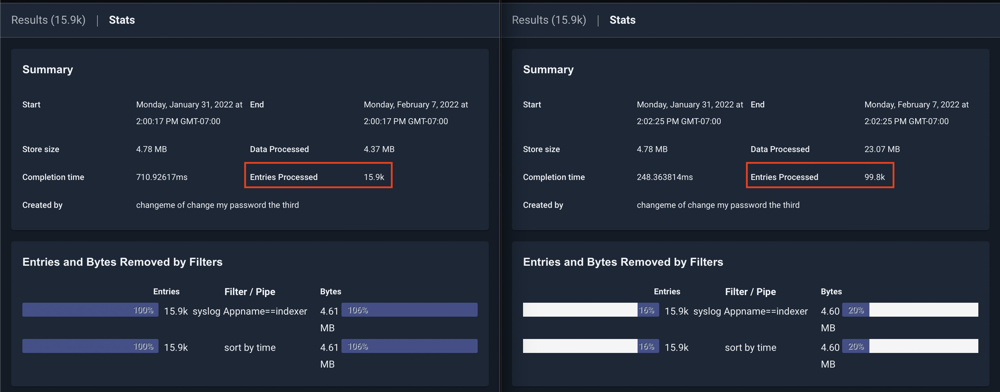

# Performance Tuning

Gravwell is capable of taxing the disk, network, and CPU resources of even the most performant systems. Gravwell is optimized to work well on a variety of hardware and software configurations. That said, there are a number of query optimizations, configuration options, and Linux system parameters that can dramatically improve ingest and search performance. 

## Query Tuning

A Gravwell query, when read left to right, represents the flow of data from one module to the next. For example:

```
tag=gravwell syslog Severity Message | count Message by Severity | chart count by Severity
```

This query has four components:

* `tag=gravwell` - Read from the "gravwell" tag, which resides in a well on disk based on your configuration.
* `syslog Severity Message` - Extract from entries read from the "gravwell" tag the "Severity" and "Message" fields, asserting that the data is syslog.
* `count Message by Severity` - Create a count of entries, grouped by the "Severity" EV generated in the previous module.
* `chart count by Severity` - Create a chart of the count created in the previous module.

The most important observation when creating a query is that *all* data emitted by a module is seen by the next module in the pipeline. If we can limit or filter data early in a pipeline, we can dramatically improve the performance of the overall pipeline simply by removing the amount of data processing required. For example:

```
tag=* grep bar | alias DATA myData | json -e myData foo==bar baz | stats count(foo) | table count
```

NOTE: This is an intentionally bad query meant to force poor performance for illustrative purposes.

This query counts the number of entries that are valid JSON with a member "foo" that contains the contents "bar". There are a number of things about this query that decrease performance:

* `tag=*` - This reads from all tags on the system. You likely do not need to do this. Instead, make sure you only query tags you expect to extract data from (such as `tag=json`).
* `grep bar | alias DATA myData` - These two modules filter data down to just those that have the bytes "bar" anywhere in the DATA portion, and then alias the DATA to an enumerated value. The filter in the following JSON module already does this, and can take advantage of indexer acceleration if simply used directly (and without the `-e` flag). Additionally, the `grep` module does not support acceleration. 
* `json -e myData foo=bar baz` - The JSON module extracts "baz", but that field is never used. This is an optimization that Gravwell can detect and simply remove for you, but depending on your usage, you could still incur an extraction performance penalty for doing so. Avoid unused extractions.

A much faster and equivalent query could be:

```
tag=jsonData json foo==bar | stats count(foo) | table count
```

In this rewritten version, two key optimizations take place. First, the JSON module can hint to the indexer that it is looking for the keyword "bar". If the indexer has acceleration data for that tag, only entries containing "bar" will be sent to the pipeline. This greatly reduces pipeline processing overhead. Second, only data intended for processing and rendering is sent down the pipeline. By removing the "baz" extraction, less data is being needlessly transmitted.

The following subsections describe in greater detail additional query optimizations you can employ to maximize performance.

### Acceleration

Gravwell stores data in "wells", logical groupings of data, on disk according to your configuration. A typical well declaration looks like:

```
[Storage-Well "syslog"]
	Location=/opt/gravwell/storage/syslog
	Tags=syslog
	Tags=gravwell
```

This declaration creates a well named "syslog" that in turn stores data belonging to both the "syslog" and "gravwell" tags. When issuing a search on a tag, Gravwell will read from the well containing the given tag(s) and read from it. If you were using the declaration above and issued the following query:

```
tag=gravwell syslog Appname==indexer
```

Gravwell would have to read all entries in the given timeframe and send them to the syslog module to be filtered. Gravwell can accelerate data by _indexing_ entries in wells. Acceleration is a complex topic, and a detailed description of how to configure acceleration can be found in the [Acceleration documentation](#!configuration/accelerators.md).

For now though, let's rewrite the configuration to simply perform "fulltext" acceleration on this data:

```
[Storage-Well "syslog"]
	Location=/opt/gravwell/storage/syslog
	Tags=syslog
	Tags=gravwell
	Accelerator-Name=fulltext 
```

By enabling acceleration, Gravwell creates an index of all text fragments in the ingested data, with references to where in the well that fragment can be found. Let's look at the query again:

```
tag=gravwell syslog Appname==indexer
```

With acceleration enabled, the syslog module can tell the indexer when the query starts that it is looking for entries where Appname equals "indexer". The indexer can use this "hint" to look into the index for references to "indexer". From there, it can use those references to go to the exact location on disk where that data is. Only entries containing the fragment "indexer" end up getting put on the pipeline. 



In the screenshot above, you can see the same query issues on two systems. The one on the left has acceleration enabled, and the one on the right does not. The one on the right had to process nearly 100k entries to get the same result, while the one on the left only had to process the entries containing the search filter "indexer". 

Using acceleration can improve query performance by several orders of magnitude and is the most important optimization you can make when configuring your Gravwell system.

### Minimize Extractions

Consider the query:

```
tag=pcap packet eth.SrcMAC eth.DstMAC eth.Type ipv4.IP ipv4.Payload tcp.Port | max Port | table max
```

The above query uses the packet module to extract 6 fields and only uses one (Port). Gravwell performs a best effort optimization at parse time to eliminate unused extractions in modules, but there are several scenarios where the extractions may still take place. In order to reduce burden on the packet module, which in this example not only has to extract the packet data, but also perform type assertions on MAC addresses, IP addresses, and integers, you can rewrite the query with *just* the necessary extractions for the end result:

```
tag=pcap packet tcp.Port | max Port | table max
```

### Filter Early

Consider the query:

```
tag=default json UUID foo | lookup -r data foo bar baz | eval UUID=="cd656e75-d54d-4e80-ac13-bc77abdde0ad" | table
```

The above query extracts json data, performs some processing on every instace of "foo", and then filters the data down to just those entries with a specific UUID that was extracted in the first module. This query is potentially very costly, as the indexer must retrieve every record in the "default" tag for the given timeframe, and the lookup module must perform additional data lookups. If we moved the filter to the json module instead, we could reduce the overhead considerably, especially if acceleration is enabled on the default tag. By moving the filter to the beginning of the query, we allow the indexer to perform retrieval optimizations on disk, and we minimize the number of entries sent down the pipeline.

```
tag=default json UUID=="cd656e75-d54d-4e80-ac13-bc77abdde0ad" foo | lookup -r data foo bar baz | table`
```

### Condensing Modules

NOTE: This subsection applies only to Gravwell deployments with multiple indexers. 

Some modules require knowledge of all data passing through that portion of a pipeline in order to function. For example:

```
tag=default json value | table value
```

This query simply asks all indexers to extract "value" from JSON data and show it on a table. This is a simple operation to perform in parallel because the indexers don't need to coordinate or share any data -- they simply send their results to the webserver to be rendered. 

Now consider:

```
tag=default json value subxml | stats mean(value) | xml -e subxml Name | stats unique_count(Name) | table mean unique_count
```

This query performs a mean operation on "value" early in the pipeline. In order to calculate the mean, the stats module must have all instances of "value". This causes the query to "condense" at the stats module, meaning that the indexers no longer run in parallel, but instead send their data to the webserver after extraction, and the remaining query is performed on the webserver. It is best to put condensing modules as late in a query as possible so that indexers can continue to run in parallel. Since no other modules except for table depend on the mean, we can simply rearrange this query. Additionally, the stats module can perform multiple operation in a single invocation:

```
tag=default json value subxml | xml -e subxml Name | stats mean(value) unique_count(Name) | table mean unique_count
```

In this form of the query, the indexers perform the extractions locally at each indexer, and then send the data to the webserver to perform the stats operations.

## Tuning Options for Gravwell Indexers

As the main storage and search component of a Gravwell deployment, indexers can require significant system resources in order to operate at peak performance. While Gravwell is optimized to run well on most Linux systems, there are various Gravwell configuration and Linux system options that can be used to fine tune your system. 

### Gravwell Configuration

NOTE: See the [Detailed configuration document](#!configuration/parameters.md) for a list of all Gravwell configuration options.

#### Global Configuration Options

##### Search-Scratch

Example: `Search-Scratch=/tmp/path/to/scratch`

The Search-Scratch parameter specifies a storage location that search modules can use for temporary storage during an active search. Some search modules may need to use temporary storage due to memory constraints. For example, the sort module may need to sort 5GB of data but the physical machine may only have 4GB of physical RAM. The module can intelligently use the scratch space to sort the large dataset without invoking the host's swap (which would penalize all modules, not just sort). At the end of each search, scratch space is destroyed. 

`Search-Scratch` should point to high speed storage, if available, in order to improve query performance.

##### Render-Store

Example: `Render-Store=/tmp/path/to/render`

The Render-Store parameter specifies where renderer modules store the results of a search. Render-Store locations are temporary storage locations and typically represent reasonably small data sets. When a search is actively running or dormant and interacting with a client, the Render-Store is where the renderer will store and retrieve its data set. Like `Search-Scratch`, `Render-Store` should be on high speed storage to improve query performance.

##### Search-Pipeline-Buffer-Size

Example: `Search-Pipeline-Buffer-Size=8`

The Search-Pipeline-Buffer-Size specifies how many blocks can be in transit between each module during a search. Larger sizes allow for better buffering and potentially higher throughput searches at the expense of resident memory usage. Indexers are more sensitive to the pipeline size, but also use a shared memory technique whereby the system can evict and re-instantiate memory at will; the webserver typically keeps all entries resident when moving through the pipeline and relies on condensing modules to reduce the memory load. If your system uses higher latency storage systems like spinning disks, it can be advantageous to increase this buffer size.

Increasing this parameter may make searches perform better, but it will directly impact the number of running searches the system can handle at once! If you know you are storing extremely large entries like video frames, PE executables, or audio files you may need to reduce the buffer size to limit resident memory usage. If you see your host kernel invoking the Out Of Memory (OOM) firing and killing the Gravwell process, this is the first knob to turn.

##### Search-Relay-Buffer-Size

Example: `Search-Relay-Buffer-Size=8`

The Search-Relay-Buffer-Size parameter controls how many entry blocks the webserver will accept from each indexer while still waiting for outstanding blocks from another indexer. As search entries flow in temporally, it is possible that one indexer may still be processing older entries while another has moved ahead to more recent entries. Because the webserver must process entries in temporal order, it will buffer entries from the indexer which is "ahead" while waiting for the slower indexer to catch up. In general, the default value will help prevent memory problems while still providing acceptable performance. On systems with large amounts of memory, it may be useful to increase this value.

##### Prebuff-Block-Hint

Example: `Prebuff-Block-Hint=8`

The Prebuff-Block-Hint specifies in megabytes a soft target that the indexer should shoot for when storing blocks of data. Very high-throughput systems may want to push this value a little higher, where memory constrained systems may want to push this value lower. This value is a soft target, and indexers will typically only engage it when ingest is occurring at high rates.

##### Prebuff-Max-Size

Example: `Prebuff-Max-Size=128`

The Prebuff-Max-Size parameter controls the maximum data size in megabytes the prebuffer will hold before forcing entries to disk. The prebuffer is used to help optimize storage of entries when source clocks may not be very well synchronized. A larger prebuffer means that the indexer can better optimize ingesters that are providing wildly out of order values. Each well has its own prebuffer, so if your installation has 4 wells defined and a Prebuff-Max-Size of 256, the indexer can consume up to 1GB of memory holding data. The prebuffer max size will typically only engage in high-throughput systems, as the prebuffer is periodically evicting entries and pushing them to the storage media all the time. This is the second knob to turn (after Search-Pipeline-Buffer-Size) if your host system's OOM killer is terminating the Gravwell processes.

##### Prebuff-Max-Set

Example: `Prebuff-Max-Set=256`

The Prebuff-Max-Set specifies how many one-second blocks are allowed to be held in the prebuffer for optimization. The more out of sync the timestamps are on entries provided by ingesters the larger this set should be. For example, if you are consuming from sources that might have as much as a 2 hour swing in timestamps you might want to set this value to 7200, but if your data typically arrives with very tight timestamp tolerances you can shrink this value down as low as 10. The Prebuff-Max-Size controls will still engage and force prebuffer evictions, so setting this value too high hurts less than setting it too low.

##### Prebuff-Tick-Interval

Example: `Prebuff-Tick-Interval=4`

The Prebuff-Tick-Interval parameter specifies in seconds how often the prebuffer should engage an artificial eviction of entries located in the prebuffer. The prebuffer is always evicting values to persistent storage when there is active ingestion, but in very low-throughput systems this value can be used to ensure that entries are forcibly pushed to persistent storage. Gravwell will never allow data to be lost when it can help it; when gracefully shutting down indexers the prebuffer ensures all entries make it to the persistent storage. However, if you don’t have a lot of faith in the stability of your hosts you may want to set this interval closer to 2 to ensure that system failures, or angry admins, can’t pull the rug out from under the indexers.

##### Prebuff-Sort-On-Consume

Example: `Prebuff-Sort-On-Consume=true`

The Prebuff-Sort-On-Consume parameter tells the prebuffer to sort blocks of data prior to pushing them to disk. The sorting process is only applied to the individual block, and does NOT guarantee that data is sorted when entering the pipeline. Sorting blocks prior to storage also incurs a significant performance penalty in ingestion. Almost all installations should leave this value as false.

##### Max-Block-Size

Example: `Max-Block-Size=8`

The Max-Block-Size specifies a value in megabytes and is used as a hint to tell indexers the maximum block size they can generate when pushing entries into the pipeline. Larger blocks reduce pressure on the pipeline, but increase memory pressure. Large memory and high throughput systems can increase this value to increase throughput, smaller memory systems can decrease this size to reduce memory pressure. The Prebuff-Block-Hint and Max-Block-Size parameters intersect to provide two knobs that tune ingest and search throughput. At Gravwell, on the 128GB nodes, the following is achieved: a clean 1GB/s of search throughput; a 1.25 million entry per second ingest with a Max-Block-Size of 16; and a Prebuff-Block-Hint of 8 is achieved.

#### Well configuration options

##### Disable-Compression, Disable-Hot-Compression, Disable-Cold-Compression

Example: `Disable-Compression=true`

These parameters control user-mode compression of data in the wells. By default, Gravwell will compress data in the well. Setting `Disable-Hot-Compression` or `Disable-Cold-Compression` will disable it for the hot or cold storage, respectively; setting `Disable-Compression` disables it for both.

##### Enable-Transparent-Compression, Enable-Hot-Transparent-Compression, Enable-Cold-Transparent-Compression

Example: `Enable-Transparent-Compression=true`

These parameters control kernel-level, transparent compression of data in the wells. If enabled, Gravwell can instruct the `btrfs` filesystem to transparently compress data. This is more efficient than user-mode compression. Setting `Enable-Transparent-Compression` true automatically turns off user-mode compression. Note that setting `Disable-Compression=true` will disable transparent compression.

Additionally, transparent compression also has performance benefits by taking advantage of memory de-duplication, if you need the best possible performance from Gravwell, combining transparent compression with a well tuned BTFS file system is the best way to achieve it.

##### Acceleration

As mentioned above, utilizing well acceleration can dramatically improve performance. See the [Acceleration documentation](#!configuration/accelerators.md) for more information.

### Linux Kernel and System Tuning

#### MMAP settings

Gravwell uses the `mmap()` syscall to map data into Gravwell's memory space. The default Linux settings for the maximum number of allowed mmap regions for a single process is often too low for a busy indexer. This can result in out of memory (OOM) events. 

In order to increase the mmap limit, set the `vm.max_map_count` setting using `sysctl`:

```
sysctl -w vm.max_map_count=300000
```

## Tuning Options for Gravwell Ingesters

Like indexers, Gravwell ingesters are optimized to perform well on a wide variety of systems and networks. However, remote nodes that may be running ingesters, slow or unreliable network connections, and other distributed system artifacts can greatly impact the performance of the Gravwell ingest dataflow. A number of global and ingester specific configuration parameters are available to fine tune Gravwell ingesters to run best in the environment they are deployed in.

### Caching

Each ingester can be configured with a local cache for ingested data. When enabled, ingesters can cache locally when they cannot forward entries to indexers. The ingest cache can help ensure you don't lose data when links go down or if you need to take a Gravwell cluster offline momentarily. Additionally, the cache can be configured to always be enabled, allowing it to "absorb" bursts of activity that momentarily exceed the available network throughput to the indexer.

The cache is configured with four flags:

- `Ingest-Cache-Path`: The path to the ingest cache for this ingester. The ingester will create a directory with several files in it.
- `Max-Ingest-Cache`: The maximum size of the cache in megabytes.
- `Cache-Depth`: The maximum number of entries to hold in memory before committing data to the cache on disk. This is simply an in-memory buffer to reduce disk I/O.
- `Cache-Mode`: Cache-Mode sets the behavior of the backing cache (enabled by setting Ingest-Cache-Path) at runtime. Available modes are "always" and "fail". In "always" mode, the cache is always enabled, allowing the ingester to write entries to disk any time the in-memory buffer (set with Cache-Depth) is full. This can occur on a dead or slow indexer connection, or when the ingester is attempting to push more data than is possible over the connection it has to the indexer. By using "always" mode, you ensure the ingester will not drop entries or block data ingest at any time. Setting Cache-Mode to "fail" changes the cache behavior to only enable when all indexer connections are down.

#### Example

```
[Global]
	Ingest-Cache-Path=/opt/gravwell/cache/simplerelay
	Max-Ingest-Cache=1024
	Cache-Depth=128
	Cache-Mode=always
```

### Ingester Specific Tuning

Some ingesters have specific flags for tuning performance related to the type of data they ingest.

#### File Follower

The File Follower ingester has an additional global parameter `Max-Files-Watched` that allows you to set the maximum number of open file handles to keep at any point. When files are updated or new files are created, the ingester maintains a least-recently-updated queue of file handles. By setting this parameter too low you can induce frequent file open/close behavior which can have a negative impact on performance. Conversely, setting this value too high can induce significant memory overhead. The default value is 64.

#### Kafka Consumer

The Gravwell Kafka ingester can subscribe to multiple Kafka topics and even multiple Kafka clusters. Each consumer definition can be performance tuned with the following options:

- `Rebalance-Strategy`: Sets the Kafka-specific read rebalance strategy. The default is `roundrobin`. `sticky` and `range` are also available options. See the Kafka documentation for more information on how these rebalance strategies work.
- `Synchronous`: Force the ingester to synchronize writes to the indexer after every Kafka batch is processed. The default is false. Enabling this can lower performance but improve reliability.
- `Batch-Size`: Set the number of entries to read from Kafka before writing to the indexer. The default is 512.

#### Network Capture

The Network Capture ingester can be tuned in two ways -- limit the amount of data captured and filter the data being captured in the first place:

- `Snap-Len`: Sets the maximum capture size, in bytes, per packet.
- `BPF-Filter`: Sets a BPF filter on all input data. For example: `not port 4023`. 

These flags map to the equivalent tuning parameters in most packet capture programs. 

## Throttling Considerations

So far this document has focused on increasing performance (ingest rate, search speed, etc.). By default, Gravwell will use any available resources when needed in order to run as quickly as possible. It is easy to exaust the disk, CPU, and memory resources on indexer and ingester nodes, as well as saturate network links with busy ingesters. The rest of this document focuses on *throttling* Gravwell resource utilization in order to reduce contention.

### The `Rate-Limit` flag

The Rate-Limit parameter sets a maximum bandwidth which the ingester can consume. This can be useful when configuring a "bursty" ingester that talks to the indexer over a slow connection, so the ingester doesn't consume all the available bandwidth when it is trying to send a lot of data.

The argument should be a number followed by an optional rate suffix, e.g. 1048576 or 10Mbit. The following suffixes exist:

- kbit, kbps, Kbit, Kbps: "kilobits per second"
- KBps: "kilobytes per second"
- mbit, mbps, Mbit, Mbps: "megabits per second"
- MBps: "megabytes per second"
- gbit, gbps, Gbit, Gbps: "gigabits per second"
- GBps: "gigabytes per second"

### Using Linux cgroups to reduce resource contention

Linux Control Groups (cgroups) are a Linux kernel feature designed to restrict the memory, CPU, I/O, and other subsystems for groups of processes. It is possible to place Gravwell components (including indexers) in cgroups to control overall resource utilization. There are several ways to setup cgroups, and you should refer to the distribution specific guidelines for your Linux distribution. 

Most Linux systems today use `systemd`, which indepentently controls cgroups. If your system uses `systemd`, you can use the `systemctl set-property` command to set cgroup properties for running processes. See the [systemctl](https://www.freedesktop.org/software/systemd/man/systemctl.html) and [resource control](https://www.freedesktop.org/software/systemd/man/systemd.resource-control.html) documentation for systemd.

Additionally, if you are using docker to deploy Gravwell services, you can specify [resource restrictions](https://docs.docker.com/config/containers/resource_constraints/) directly in docker.
]s
